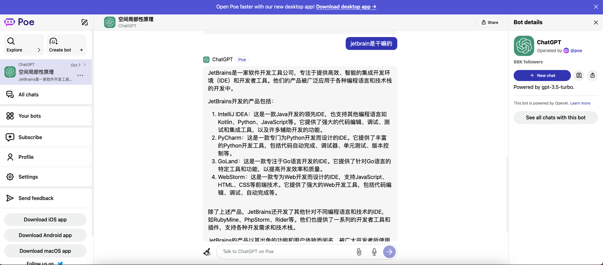
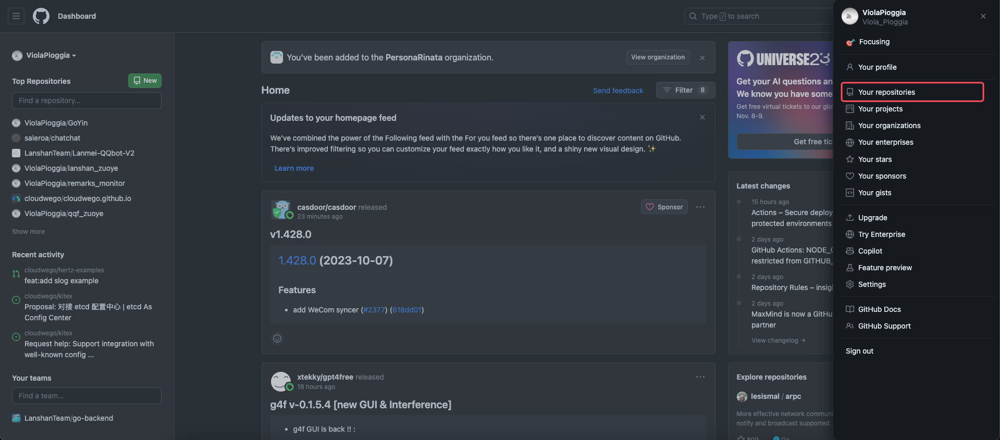
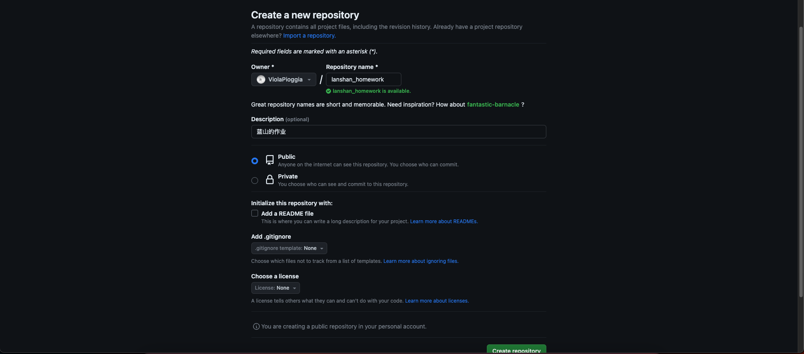
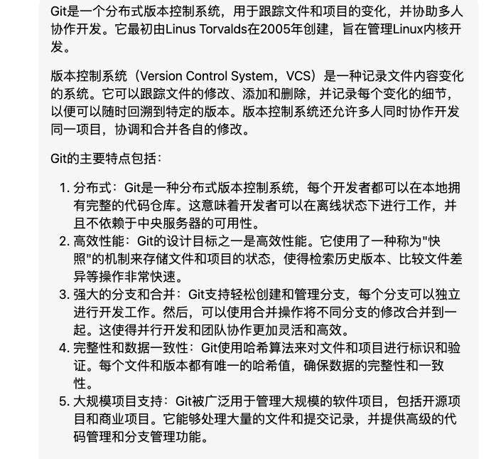
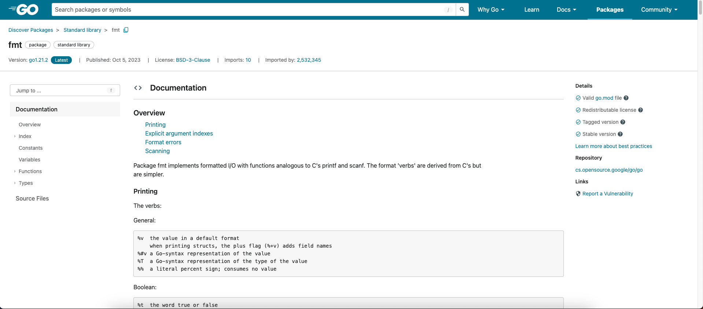

# 从 0 开始学 Go

接下来我会教大家如何成为一个入门级别的 Go 软件工程师，这个教程里面不会包含如何敲代码，但是包括了一些软件工程师的基本素养（很多都是代代相传的

因为是面向 0 基础写的教程，所以很多地方比如说安装软件我会写的很细，以后的课程中可能就不会有这么细了

不论你是否有基础相信都能有所收获

## 前言

如果你想问我想学好互联网开发，当一个成功的码农最重要的是什么

我觉得首先很重要的是**探索精神**

1. 好奇心：探索精神源于好奇心，即对世界和知识的渴望。好奇心驱使人们主动寻求新的经验、知识和理解，不满足于现有的答案和常规的思维模式。它激发人们对问题的提出、现象的解释和现实的改变。
2. 探索未知：探索精神鼓励人们主动面对未知领域和挑战。它推动人们跨越舒适区，积极探索新的领域、新的观点和新的经验。探索者愿意接受风险和不确定性，勇于面对失败和困难，以获取新的知识和发现。
3. 创新思维：探索精神促使人们采用创新的思维方式来解决问题和应对挑战。它鼓励人们打破传统的思维模式，尝试新的方法和观点，挖掘新的可能性。创新思维涉及跳出传统边界、建立连接和寻找新的解决方案。
4. 持续学习：探索精神与持续学习密切相关。探索者认识到知识和经验的不断积累对于个人成长和发展的重要性。他们愿意持续学习新的技能、学科和领域，并将学习应用于实践中，以推动个人和社会的进步。

是不是想起了玩游戏🎮时的经历？ YES！你完全可以带入到开发学习中

> "程序员贪婪又懒惰"——《Unix编程艺术》（The Art of Unix Programming）

然后最重要的是 **坚持** ✊

还记得每次上课都听的迷迷糊糊的，这里为什么会报错？并发为什么每次效果不一样？`interface` 有什么用？`Context.context`是干啥的？为什么一开始要写个 `r.Register()`?会在学习的过程中遇到数不清的问题，跳进数不清的坑。但是只要坚持你回过来看发现其实都很简单，每个大佬也都是从 rookie 开始的嘛

碰到问题不可怕，找到解决问题的方式是关键，于是就引入了下一小节——**提问的智慧**

## 提问的智慧

详见 https://github.com/ryanhanwu/How-To-Ask-Questions-The-Smart-Way/blob/main/README-zh_CN.md

> 直接引用 21 级学长写的文档 🙏

你们或许在提问题的时候觉得我们很傲慢？

### 🐂🐎问题

- 手机拍代码
- 只说一个笼统的问题，不说细节
- 夺命连环问

### 例子

**你以为的傲慢**：

- 学弟：学长我vscode装不上了怎么办？
- 学长：你到官网下载安装包下载完双击它，一直点下一步就安装好了
- 学弟：官网是什么
- 学长：https://code.visualstudio.com/
- 学弟：下载按钮在哪？
- 学长：（截图）
- 学弟：好了，下载到了，然后呢？
- 学长：这个都不会还是别学了
- 学弟：（感觉学长很傲慢）...

**实际上的傲慢：**

- 学弟：学长我的电脑是64位的windows 10，我在vscode官网下载 了对应版本，在我安装过程中出现了这个问题，使用百度搜索后还是没有办法解决，你能帮我看看吗？谢谢。（同时
- 贴上安装失败的图片）
- 学长：这个都不会还是别学了

**再举个🌰**

某论坛

- A：有人有赛博朋克2077游戏资源吗？
- B：有，给https://pan.baidu.com/xxxxxxxxxx
- A：为啥要用百度网盘啊，我没用过
- B：只有这个
- A：点击哪里下载啊
- B：（截了个图）
- A：哦哦
- 过了几个小时
- A：为什么下下来不能直接玩？
- B：这是个压缩包，你要解压
- A：唉，我玩个游戏也太麻烦了，有什么方式能解压吗

是不是能理解了呢😄

### 我们为什么对你们提的问题感到厌烦？

- 提的问题“过于简单“
- 提问题的方式不对
- 遇到问题就提问

### 问问题要讲究策略

你可以根据以下顺序尝试解决你的问题：

1. 百度/Google
2. 问 chatgpt
3. 项目使用文档、API使用说明
4. CSDN/Stack Overflow
5. 尝试分析源码

### 怎么问问题？

- 精确地描述问题并言之有物

  - 仔细、清楚地描述你的问题或者Bug的症状
  - 描述问题发生的环境
  - 描述在提问前你是怎样去研究和解决这个问题的
  - 描述在提问前你为了确定问题而采取的诊断步骤
  - 尽可能地提供一个可以`重现这个问题的可控环境`的方法

- 话不在多，在于精

  你需要提供精确有内容的信息

  这并不是要求你简单的就把成堆的错误代码或者资料完全放在你的提问中，如果你的问题是一个很大的是程序挂掉的这样一个代码运行环境，尽量把它剪裁得越小越好。

  这样做的好处至少有三点：

  - 第一，表现你为简化问题付出了努力，这可以使你得到回答问题的概率增加
  - 第二，简化问题使你更有可能得到有用的答案
  - 第三，在精炼你的 bug 报告的过程中，你很可能就自己找到了解决方法或者权宜之计

- 清楚明确地表达你的需求

  漫无边际的提问是近乎无休无止的时间黑洞。

  最有可能最有能力给你有用答案的人通常也是最忙的人（他们忙是因为要亲自完成大部分工作）。所以我们对这样无休止无节制的时间黑洞是相当厌恶的。

  所以，请界定一下你的问题，使我们花在辨识你的问题和回答所需要付出的时间减到最少。

- 询问有关代码的问题时

  千万不要动辄就要求别人帮你去调试有问题的代码，而且也不提示一下应该从何入手。

  张贴几百行的代码，然后说一声：`这段代码有问题`，我们可能完全会忽略这样的问题，而且回都不想回

  相比于这个，只贴几十行的代码，然后说一句：`在第七行代码之后，我觉得程序会输出xxx，但实际出现的xxx`更有可能让你得到回应

  最有效描述程序代码问题的方法就是提供一段最精简的 Bug 展示的测试用例。

  什么是最精简的测试用例？那是问题的缩影；就是一小个代码片段能够刚好的展示出程序的异常行为，而不包含其他令人分散注意力的代码的内容。

  怎么才能找出最精简的测试用例？如果你知道哪一行或者哪一段代码会造成异常的行为，复制下来并且加入能够重现这个状况的代码（能让这段异常的代码正常运行）。如果你无法将问题缩减到一个特定区块，就复制一份代码并移除不影响产生问题行为的部分。总之，你发出的测试用例（或代码）越少越好。

- 截图的方式

  不要手机拍照！不要手机拍照！不要手机拍照！

- 有礼貌地提问

  多用`请`和`谢谢你的回答`，让回答者知道你对他们能够花费掉自己宝贵地时间来对你提供帮助心存感激。

当然，对于很多问题大家都是 0 基础，问很正常，我们还是很乐意大家提问的

## 安装软件以及一些工具的使用

### 一些懂的都懂的东西

为什么我 github 只能看运气进？为什么我 git 老是推不上去？为什么我项目拉不下来？

这些问题都是懂得都懂的，除了换镜像源之外该怎么解决呢？挂加速器也只能解决一时之需

> 声明：我并不知道下面链接有什么用，只是在网上冲浪的时候顺便复制粘贴到这里的，如果有什么问题请联系作者删除，出现什么问题概不负责

https://xn--4gq62f52gdss.com/#/dashboard

### 学会使用 ChatGPT

ChatGPT 在22年12月初才正式进入公众视野，23年初才广为人知，但是可以说已经给程序员带来了天翻地覆的影响

除了可以用来完成水课作业，还可以对初学者起到非常大的帮助，我觉得应该可以解决 90% 的问题吧

首先选择一个环境，我其实不太推荐官网，因为官方注册账号有门槛，很多节点被墙，经常抽风。所以我比较推荐一些镜像源网站比如[这个](https://poe.com/)

登上这个网站只需要任意一个梯子就行，其次 gpt-3.5 模型是免费的，还支持其他的很多模型

像这样，你可以向它提出问题，也可以喊它给出某个功能的代码，也可以直接复制粘贴报错信息看是什么原因

但是切记不可依赖 gpt，你会发现它很多时候还是很蠢的（比如学校的题很多都做不起），可以拿来提高效率但是不能让它替代你的工作

### Github

什么是 github ？

GitHub是一个面向开发者的基于Web的版本控制和代码托管平台。它提供了一个集中存储、管理和协作开发代码的平台，使开发者能够更好地进行团队协作、版本控制和代码管理。

GitHub的主要功能包括：

1. 代码托管：开发者可以将他们的代码库（仓库）上传到GitHub上进行存储和管理。这样可以确保代码的备份和安全，并且可以方便地与其他开发者共享和协作。
2. 版本控制：GitHub使用Git作为其主要的版本控制系统。Git可以追踪代码的修改历史，并提供了分支（branch）和合并（merge）等功能，使得多人协作和代码管理更加灵活和高效。
3. 协作开发：GitHub提供了丰富的协作功能，开发者可以通过提出问题（issue）、进行讨论、提交请求（pull request）等方式与团队成员交流和合作。这使得多人协作开发更加便捷和透明。
4. 社交网络：GitHub具有社交网络的特性，开发者可以关注其他开发者、关注和点赞感兴趣的项目，以及参与开源社区的活动。这种社交互动促进了知识共享、技术交流和合作机会。
5. 自动化工具：GitHub支持与其他开发工具和服务的集成，例如持续集成（Continuous Integration）和部署（Deployment）工具，可以通过自动化流程来构建、测试和部署软件。

GitHub在开源社区和商业开发中都非常受欢迎。许多开源项目都托管在GitHub上，使得开发者可以共享代码、解决问题和贡献代码。同时，许多企业也使用GitHub作为内部代码托管和团队协作的平台，提高了开发效率和代码质量。

现在让我们打开 github https://github.com/

点击右上角 Sign up 创建一个账户

填写自己的邮箱、密码、用户名等信息，然后用邮箱验证即可完成。

是不是全是英文感觉看不懂🥺

我的建议是，习惯就好🤣，以后会经常碰到英文文档的

然后点击右上角头像之后点击仓库

点击这里新建你的第一个仓库

这些先简单填一点，开源证书什么的可以暂时不用管，然后点击创建仓库，那么以后就可以在把你的作业代码交到这个仓库里啦

### JetBrains

JetBrains是一家软件开发工具公司，专注于提供高效、智能的集成开发环境（IDE）和开发者工具。他们的产品被广泛应用于各种编程语言和技术栈的开发中。

除了马上会提到的 Goland，像 C语言可以用 Clion，Python 可以用 PyCharm，java 可以用 IntelliJ IDEA

如何下载？

看看下面的博客👇里面提到的学生认证可以不用急着弄

https://blog.csdn.net/qq_25887493/article/details/124106216?ops_request_misc=&request_id=&biz_id=102&utm_term=%E5%AE%89%E8%A3%85%20jetbrains&utm_medium=distribute.pc_search_result.none-task-blog-2~all~sobaiduweb~default-1-124106216.142^v95^chatgptT3_1&spm=1018.2226.3001.4187

### Goland

可能有同学会问，为啥用 JetBrains 的 Goland ，不用 vscode

我直接粘贴 chatgpt 了

可以在 JetBrains 里的 ToolBox 里直接快速安装

想直接下载？

看看下面的博客👇

https://blog.csdn.net/Cappuccino_jay/article/details/129466743?ops_request_misc=&request_id=&biz_id=102&utm_term=%E5%AE%89%E8%A3%85%20goland&utm_medium=distribute.pc_search_result.none-task-blog-2~all~sobaiduweb~default-0-129466743.142^v95^chatgptT3_1&spm=1018.2226.3001.4187

### Git

省流：Git 是目前世界上最先进的分布式版本控制系统，用来团队协作很方便。就不用每次上传代码都靠手动 upload files 了

安装教程看这个👇

https://blog.csdn.net/Passerby_Wang/article/details/120767020?ops_request_misc=%257B%2522request%255Fid%2522%253A%2522169673342216800182730025%2522%252C%2522scm%2522%253A%252220140713.130102334..%2522%257D&request_id=169673342216800182730025&biz_id=0&utm_medium=distribute.pc_search_result.none-task-blog-2~all~sobaiduend~default-4-120767020-null-null.142^v95^chatgptT3_1&utm_term=%E5%AE%89%E8%A3%85%20git&spm=1018.2226.3001.4187

然鹅我们在用 git 的时候基本上不会在 git 的客户端里敲命令，要么用 IDE 的图形化工具要么用 IDE 的命令行

使用教程后面第二节课会详细讲，感兴趣的同学可以先看下面这个教程👇

https://blog.csdn.net/weixin_55387973/article/details/123849753?ops_request_misc=%257B%2522request%255Fid%2522%253A%2522169673357916800226593163%2522%252C%2522scm%2522%253A%252220140713.130102334..%2522%257D&request_id=169673357916800226593163&biz_id=0&utm_medium=distribute.pc_search_result.none-task-blog-2~all~top_positive~default-1-123849753-null-null.142^v95^chatgptT3_1&utm_term=goland%20git&spm=1018.2226.3001.4187

感觉教程看不懂？那来玩下 git 闯关小游戏吧👇

https://learngitbranching.js.org/?demo=&locale=zh_CN

### Typora

#### 什么是markdown？

Markdown是一门标记语言。假如你们知道HTML的话，Markdown和HTML可以认为是同类事物。简而言之，就是用纯文本的代码描述带格式文本的一种方法。

那么有了HTML，要Markdown有何用？最简单的答案是：HTML太难写了！

这样对于关注内容的作者而言友好了很多，而且即使是Markdown代码也有相当强的可读性。

于是写好Markdown后，如何将其显示成我们想要的格式呢？通常的做法是将Markdown编译为HTML。其实一些网站已经自带了这样的编译器，输入Markdown代码后直接将其转化为HTML，就可以交给浏览器渲染了。GitHub上的README以及各种.md格式文件的预览功能就是最典型的例子。

Markdown 编写的文档后缀为 `.md`, `.markdown`

#### 什么地方会用到markdown？

Markdown可以广泛用于文档、博客、论坛等带格式文本内容的创作，习惯后使用起来会比所见即所得的HTML编辑器更加方便快捷，较Word等格式又有纯文本这一优势。

#### typora又是啥

而 typora 就是一款非常方便的支持 md 格式的笔记软件，有很多功能：实时预览、数学公式、代码高亮、表格、支持HTML、流程图等等

这份文档就是在 typora 里敲出来的，反正我个人大多数情况下觉得比 word 好用多了

官网下载就完事了https://typora.io/

## 如何高效学习

> 我除了跟着学长学姐学习之外还能在哪里自学呢？

有这种自学的意识是非常好的，到了大学之后自驱力是成为强者的必要特质

接下来我会介绍一些学习心得

### 入门 Go 的一些资源

贪多嚼不烂，先推荐一些基础的：

[李文周的博客](https://www.liwenzhou.com/posts/Go/golang-menu/)

[go 语言圣经](https://books.studygolang.com/gopl-zh/)

还有一本难度很大的书，推荐学过数据结构，操作系统之后再来看

《Go 程序设计语言》

### Coding 能力

#### 网站资源

这个是覆盖面积最广的，也是质量最参差不齐的

首先是 [**CSDN**](https://www.csdn.net/)，这个东西很抽象，应该是国内最老牌的技术交流网站，但是正因如此质量参差不齐，有很多灌水，缝合，抄袭的文章。所以说在上面找资源等于   *里掏金，当然对于初学者而言还是很有帮助的

然后是字节搞的[稀土掘金](https://juejin.cn/)，观感比CSDN好多了，但是也有缺陷就是有时候想搜的内容在上面搜不到

比较推荐的是 [stackoverflow](https://stackoverflow.com/)，全世界知名的技术交流论坛，但是对英语能力有一定要求

然后可能有同学想看视频资源，b站也是个不错的选择，但是质量更是参差不齐，我觉得大部分看文档就能理解没必要去浪费时间看视频，除非视频资源真的讲的很好。其他诸如极客时间等等就不一一介绍了

#### 学会看官方文档

官方文档其实可以说是了解一个组件最高效的方式，在有一定编程基础后看官方文档入门是不二之选

以下图为例，这是 go 的官方文档，介绍了包含的所有官方库以及其他功能

很多组件是国外开发的，因此也是英文的，看懂其实并不难，只是一开始会有畏难情绪，能过四级就没多大阅读障碍了

如果实在看起觉得恼火可以找找有没有中文镜像站或者直接整页翻译

#### 学会看源码

这个估计已经是很高级的能力了，与 Java 能用到退休的教程和生态相比，Go虽然也不是很年轻了，但是肯定也是会遇到没有教程的时候。

这时候咋办？看源码！

而且看源码还能提高你的 Coding 能力，在找工作面试的时候面试官也很有可能问到 go 的一些常见底层实现。例如看到某个库的教程觉得讲的太烂了，这个时候就可以去看看相应的源码

除此之外学习也是从“抄袭”开始的，抄的是代码逻辑，排版风格...然后把这些东西融会贯通贯通成为自己的，GitHub上就有很多开源项目供大家学习

### 时间管理能力

> 觉得上了大学之后没有想象中那么轻松？觉得一周里课太多？觉得事情很多忙不过来？

这也是很多同学大一时会犯的通病

首先我们需要明确一个前提：**靠学校教的东西以后出去吃不了饭**

> 如果你的目标是本科毕业直接就业，那么你绝对需要自己好好规划时间

首先说本科毕业就业，那么你对绩点就不需要那么看重了，每科能过就行

就大一上而言，需要重视的就是高数和线代。难道C语言就不重要了吗？当然很重要，重要的是它是很多人接触的第一门编程语言，能培养编程思维。说C语言不需要重视是因为学校里教的很水，拿我自己举例子，我暑假学了一点C，上课一节课没听最后期末总成绩都能上90。也就是说有这时间听老师上课讲不如自己自学。高数和线代要好好学，要不然期末突击也不太好过。

因此可以得出除了高数和线代都是水课，一周加起来也才五节课，这么来看是不是就轻松很多了呢。其他时间可以狠狠地拿来学编程了，老师管的严的把电脑搬到最后一排坐着；管的不严的emm。。你懂的

> 那我想保研或者考研咋办呢

考研的话其实和上面差别不大，只是不能抱着只是为了通过考试的心态了，要正儿八经好好学**想考专业的专业课**。

但是保研的话就不一样了，我反正觉得挺坐牢的😭，每门课你都得认真对待，平时分考试分都不能落下。上课该回答问题就回答问题🙋

#### 竞赛

以下仅代表我个人观点

竞赛的重要性排序依次是：保研>考研>工作，但是并不绝对

保研你没有拿的出手的东西估计只有保本校了，工作的话很多奖人家不是很看重，只是锦上添花。

然后我们再来谈谈种类，我**个人**比较倾向于分为这几类：**计算机设计类、算法类、创新创业类、数模、其他类**

##### 计算机设计类

这个我觉得对于我们搞开发的是最好打的，几个人组个小队，搓个项目，碰到比赛交上去就行。

有学长拿他们的项目打了很多比赛都取得了很好的成绩

##### 算法类

这个东西下限差不多就是蓝桥杯的水平，上限应该是ACM的水平

平时没事多练习蓝桥杯还是很好拿奖的。但是ACM就非常有难度了，需要投入大量精力并且可能对天赋也有一定要求，没有专门训练过就是去送

##### 创新创业类

就是大创、互联网+之类的。比赛周期比较长，跟开发关联其实不是很大，PPT制作、项目策划书以及答辩比较重要。如果真要搞这个建议找靠谱的老师组个团队带你打

##### 数模类

跟算法类比较相似，也有一定门槛。想拿奖也需要投入精力时间

##### 其他类

像什么大数据、物联网、嵌入式、机器人、邮政、医疗等等就不一一介绍了，关联度不是很大

## 后记

​	**选择大于努力**

That's all

