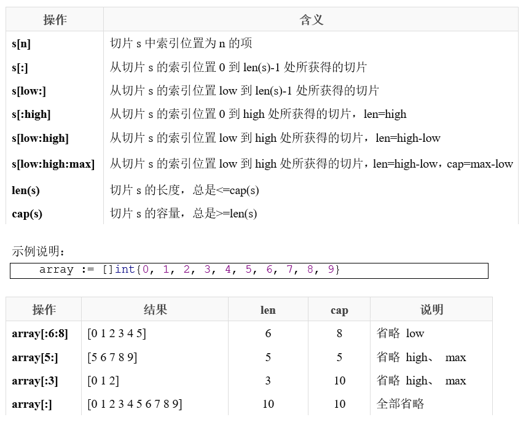

# 第二节课

## 数组-array

> 数组是指一系列同一类型数据的集合。数组中包含的每个数据被称为数组元素（element），一个数组包含的元素个数被称为数组的长度。

- 初始化

  ```go
  // var arr [len]type
  // arr := [len]type{data1,data2}
      a := [3]int{1, 2}           // 未初始化元素值为 0
      b := [...]int{1, 2, 3}      // 通过初始化值确定数组长度
      c := [5]int{2: 100, 4: 200} // 通过索引号初始化元素，未初始化元素值为 0
      fmt.Println(a, b, c)        //[1 2 0] [1 2 3] [0 0 100 0 200]
  
      //支持多维数组
      d := [4][2]int{{10, 11}, {20, 21}, {30, 31}, {40, 41}}
      e := [...][2]int{{10, 11}, {20, 21}, {30, 31}, {40, 41}} //第二维不能写"..."
      f := [4][2]int{1: {20, 21}, 3: {40, 41}}
      g := [4][2]int{1: {0: 20}, 3: {1: 41}}
      fmt.Println(d, e, f, g)
  
  ```

  >  数组⻓度必须是常量，且是类型的组成部分。 [2]int 和 [3]int 是不同类型。

- 操作数组

  ```go
  // 数组的每个元素可以通过索引下标来访问，索引下标的范围是从0开始到数组长度减1的位置。
      var a [10]int
      for i := 0; i < 10; i++ {
          a[i] = i + 1
          fmt.Printf("a[%d] = %d\n", i, a[i])
      }
  
      //range具有两个返回值，第一个返回值是元素的数组下标，第二个返回值是元素的值
      for i, v := range a {
          fmt.Println("a[", i, "]=", v)
      }
  
  ```

  

## 切片-slice

> 数组的长度在定义之后无法再次修改；数组是值类型，每次传递都将产生一份副本。显然这种数据结构无法完全满足开发者的真实需求。Go语言提供了数组切片（slice）来弥补数组的不足。

- 初始化

  ```go
  	//初始化一个空的切片
  	var a1 []int //就比数组少个中括号里的长度
  	a2 := []int{}
  
  	//或者用make函数
  	//make([]T, length, capacity) //capacity省略，则和length的值相同
      var a3 []int = make([]int, 0)
      a4 := make([]int, 0, 0)
  
      a5 := []int{1, 2, 3} //创建切片并初始化值
  ```

- 操作切片

  

- 遍历

  ```go
  func main() {
      slice := []int{0, 1, 2, 3, 4, 5, 6, 7, 8, 9}
      //i是下标，v是元素的值
      for i, v := range slice {
          fmt.Printf("slice[%d]=%d, ", i, v)
          //slice[0]=-1, slice[1]=1, slice[2]=2, slice[3]=3, slice[4]=4, slice[5]=5, slice[6]=6, slice[7]=7, slice[8]=8, slice[9]=9,
      }
      fmt.Println("\n")
  }
  
  ```

- append( )

  > append函数向 slice 尾部添加数据，返回新的 slice 对象：
  
  ```GO
      var s1 []int //创建nil切换
      //s1 := make([]int, 0)
      s1 = append(s1, 1)       //追加1个元素
      s1 = append(s1, 2, 3)    //追加2个元素
      s1 = append(s1, 4, 5, 6) //追加3个元素
      fmt.Println(s1)          //[1 2 3 4 5 6]
  
      s2 := make([]int, 5)
      s2 = append(s2, 6)
      fmt.Println(s2) //[0 0 0 0 0 6]
  
      s3 := []int{1, 2, 3}
      s3 = append(s3, 4, 5)
      fmt.Println(s3)//[1 2 3 4 5]
  
  ```
  
  > append函数会智能地底层数组的容量增长，一旦超过原底层数组容量，通常以2倍容量重新分配底层数组，并复制原来的数据
  
  ```GO
  func main() {
  	var x, y []int
  	for i := 0; i < 10; i++ {
  		y = appendInt(x, i)
  		fmt.Printf("%d cap=%d\t%v\n", i, cap(y), y)
  		x = y
  	}
  }
  ```
  
  输出：
  
  ```shell
  0  cap=1    [0]
  1  cap=2    [0 1]
  2  cap=4    [0 1 2]
  3  cap=4    [0 1 2 3]
  4  cap=8    [0 1 2 3 4]
  5  cap=8    [0 1 2 3 4 5]
  6  cap=8    [0 1 2 3 4 5 6]
  7  cap=8    [0 1 2 3 4 5 6 7]
  8  cap=16   [0 1 2 3 4 5 6 7 8]
  9  cap=16   [0 1 2 3 4 5 6 7 8 9]
  ```
  
- 切片和数组

  > 切片并不是数组或数组指针，它通过内部指针和相关属性引⽤数组⽚段，以实现变⻓⽅案。
  >
  > slice并不是真正意义上的动态数组，而是一个引用类型。slice总是指向一个底层array

  


## 字典-map

> map是一种无序的基于key-value的数据结构
>
> 类似于我们高中学过的函数y=f(x)
>
> 每个x就会有一个与之对应的y
>
> 在map中,key就可以相当于x,value相当于y

- 定义

  ```go
  // map[KeyType]ValueType
  // KeyType:表示键的类型,只能为基本类型。
  // ValueType:表示键对应的值的类型。
  var m1 map[int]string
      
  //或者用make定义
  //make(map[KeyType]ValueType, [cap])
  //其中cap表示map的容量，该参数不是必须的
  m2 := make(map[int]string)
  m3 := make(map[int]string,10)
  ```

- 使用

  ```go
  func main() {
      scoreMap := make(map[string]int, 8)
      scoreMap["张三"] = 90
      scoreMap["小明"] = 100
      fmt.Println(scoreMap)
      fmt.Println(scoreMap["小明"])
      fmt.Printf("type of a: %T\n", scoreMap)
  }
  // map[小明:100 张三:90]
  // 100
  // type of a: map[string]int
  ```

  ```go
  // map也支持在声明的时候填充元素
  func main() {
      userInfo := map[string]string{
          "username": "pprof.cn",
          "password": "123456",
      }
      fmt.Println(userInfo)
  }
  ```

- 遍历

  ```go
  	m1 := map[int]string{1: "abc", 2: "def"}
      //迭代遍历1，第一个返回值是key，第二个返回值是value
      for k, v := range m1 {
          fmt.Printf("%d ----> %s\n", k, v)
          //1 ----> abc
          //2 ----> def
      }
  
      //迭代遍历2，第一个返回值是key，第二个返回值是value（可省略）
      for k := range m1 {
          fmt.Printf("%d ----> %s\n", k, m1[k])
          //1 ----> abc
          //2 ----> def
      }
  
      //判断某个key所对应的value是否存在, 第一个返回值是value(如果存在的话)
      value, ok := m1[1]
      fmt.Println("value = ", value, ", ok = ", ok) //value =  abc , ok =  true
  
      value2, ok2 := m1[3]
      fmt.Println("value2 = ", value2, ", ok2 = ", ok2) //value2 =   , ok2 =  false
  
  ```

  

- 删除

  ```go
  	m1 := map[int]string{1: "abc", 2: "def", 3: "gh"}
      //迭代遍历1，第一个返回值是key，第二个返回值是value
      for k, v := range m1 {
          fmt.Printf("%d ----> %s\n", k, v)
          //1 ----> abc
          //2 ----> def
          //3 ----> gh
      }
   
      delete(m1, 2) //删除key值为2的map
   
      for k, v := range m1 {
          fmt.Printf("%d ----> %s\n", k, v)
          //1 ----> abc
          //3 ----> gh
      }
  ```

## 函数

- 函数类型

  > 在Go语言中，函数也是一种数据类型，我们可以通过type来定义它，它的类型就是所有拥有相同的参数，相同的返回值的一种类型。

  ```go
  type FuncType func(int, int) int //声明一个函数类型, func后面没有函数名
  
  //函数中有一个参数类型为函数类型：f FuncType
  func Calc(a, b int, f FuncType) (result int) {
      result = f(a, b) //通过调用f()实现任务
      return
  }
  
  func Add(a, b int) int {
      return a + b
  }
  
  func Minus(a, b int) int {
      return a - b
  }
  
  func main() {
      //函数调用，第三个参数为函数名字，此函数的参数，返回值必须和FuncType类型一致
      result := Calc(1, 1, Add)
      fmt.Println(result) //2
  
      var f FuncType = Minus
      fmt.Println("result = ", f(10, 2)) //result =  8
  }
  
  ```

  

- 匿名函数

  > 在Go里面，函数可以像普通变量一样被传递或使用，Go语言支持随时在代码里定义匿名函数。

  ```go
  package main
  
  func main() {
      fn := func() { println("我是一个匿名函数") }
      fn()
  }
  ```

  

-  闭包

  > 闭包是由函数及其相关引用环境组合而成的实体(即：闭包=函数+引用环境)
  >
  > 这就意味着当闭包被调用的时候，不管在程序什么地方调用，闭包能够使用这些常量或者变量。
  >
  > 它不关心这些捕获了的变量和常量是否已经超出了作用域，所以只有闭包还在使用它，这些变量就还会存在。

  ```go
  package main
  
  import (
      "fmt"
  )
  
  func a() func() int {
      i := 0
      b := func() int {
          i++
          fmt.Println(i)
          return i
      }
      return b
  }
  
  func main() {
      c := a()
      c()
      c()
      c()
  }
  ```

  输出结果

  ```shell
  1
  2
  3
  ```

- defer延迟调用

  > 关键字 defer ⽤于延迟一个函数的执行
  >
  > defer语句经常被用于处理成对的操作，如打开、关闭、连接、断开连接、加锁、释放锁。
  >
  > 如果一个函数中有多个defer语句，它们会以后进先出的顺序执行。

  ```go
  func func1(){
      fmt.Println("func1调用")
  }
  func func2(){
      fmt.Println("func2调用")
  }
  func func3(){
      fmt.Println("func3调用")
  }
  func main(){
      defer func1()
      defer func2()
      defer func3()
      fmt.Println("a")
      fmt.Println("b")
  }
  ```

  输出

  ```shell
  a
  b
  func3调用
  func2调用
  func3调用
  ```

  

## git版本控制

- 什么是git

> Git 是一个开源的分布式版本控制系统，用于敏捷高效地处理任何或小或大的项目。

- 为什么使用git

> 说到版本控制，你可能见过以下类似现象

```
毕业论文_初稿.doc
毕业论文_修改1.doc
毕业论文_修改2.doc
毕业论文_修改3.doc
毕业论文_完整版1.doc
毕业论文_完整版2.doc
毕业论文_完整版3.doc
毕业论文_最终版1.doc
毕业论文_最终版2.doc
毕业论文_死也不改版.doc
......
```

> 以上就是使用最原始的方式进行版本控制，但是这种方式有显著缺点：
>
> - 多个文件，保留所有版本时，需要为每个版本保存一个文件。
> - 协同操作，多人协同操作时，需要将文件打包发来发去。
> - 容易丢失，被删除意味着永远失去...（可以选择网盘）
>
> 为了解决以上版本控制存在问题，应运而生了一批版本控制工具：VSS、CVS、SVN、Git等，其中Git应该属于绝对霸主地位。


- 如何使用git

  网上很多文章讲的很全面，大家可以自行搜索资料，这里推荐几个链接

  [goland配置git](Git版本控制及Goland使用Git教程)

  [git命令行练习游戏](https://learngitbranching.js.org)

- git常用命令

  - git init

    > Git 使用 git init 命令来初始化一个 Git 仓库，Git 的很多命令都需要在 Git 的仓库中运行，所以 git init 是使用 Git 的第一个命令。
    >
    > 在执行完成 git init 命令后，Git 仓库会生成一个 .git 目录，该目录包含了资源的所有元数据，其他的项目目录保持不变。

  - git clone

    > 从现有仓库中拷贝项目
    >
    > `git clone https://github.com/LanshanTeam/Courseware-Backend-Go-2023`

  - git add

    > 添加文件到暂存区
    >
    > git add .

  - git commit

    > 将暂存区内容添加到仓库中
    >
    > git commit -m "this is a commit"

  - git push

    > 上传远程代码并合并

## 作业

### LV1

计算器

实现一个简单计算器

传入两个元素和一个运算符号，符号需要是一个函数类型

```go
func Calculator(num1 int, num2 int, CMD func(int, int) int) int {
	return CMD(num1, num2)
}
```


### LV2

将goland配置git，并在github上共享一个项目

可以尝试使用git的命令行

### LV3

[git命令行练习游戏](https://learngitbranching.js.org)

尝试完成以下关卡


作业完成后将作业 GitHub 地址发送至 **[xiaote33@qq.com](xiaote33@qq.com)**

LV2-LV3截图发送即可

**提交格式（主题）：2023xxxx00-刘力延-LV3** (最后LV中写出你完成的最大等级)

**截止时间**：下一次上课之前
