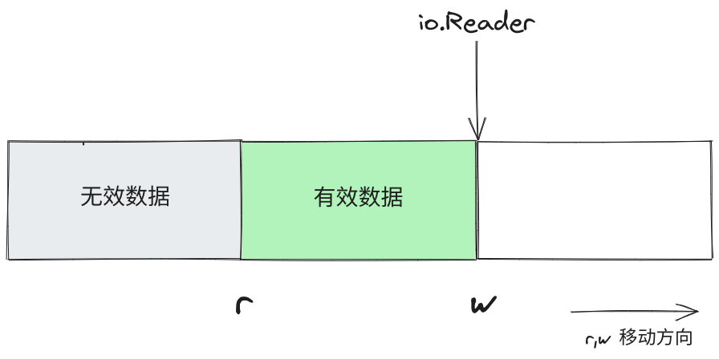
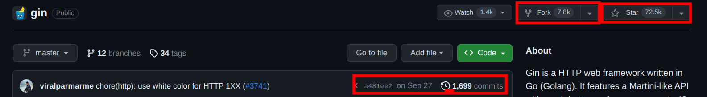

## 前言

这节课主要讲 Go 语言自带的一些常用的包，学习 Go 标准库可以从标准库文档入手：

- 中文（版本有些落后）： https://studygolang.com/pkgdoc
- 英文： https://pkg.go.dev/std
## time
### 时区

在 Golang 的 `time` 包中，时区用结构体 `Location` 表示

UTC 标准时间是以 GMT（Greenwich Mean Time，格林尼治时间）这个时区为主，所以本地时间与 UTC 时间的时差就是本地时间与 GMT 时间的时差。

```
UTC + 时间差 = 本地时间
```

>获取时区

在 Golang 的  `time` 包中有两个时区变量:

- time.UTC： UTC 时间
- time.Local 本地时间

除此之外还可以通过 `FixedZone` 、 `LoadLocation` 和 `Load` 方法来获取变量:

```go
func LoadLocation(name string) (*Location, error)
```

`FixedZone` 使用给定的时区名 `name` 和时间偏移量（单位秒）`offset` 创建并返回一个 `Location` 结构体

```go
func FixedZone(name string, offset int) *Location
```

`LoadLoaciton` 返回给定 `name` 的 `Location` 结构体，如果 `name` 为 `UTC` 或 `Local`，则返回一个 `time.UTC` 或 `time.Local`，否则 `name` 应该是在 IANA 时区数据库中有记录的地点名

>指定时区

```go
func (t Time) In(loc *Location) Time
```

`In` 返回采用 `loc` 指定的时区的时间
### 时间

`time` 包中的时间使用结构体 `Time` 表示:

>获取当前时间

```go
func Now() Time
```

Now 返回当前本地时间

>获取年、月、日……

```go
func (t Time) Clock() (hour, min, sec int) // 返回 t 对应的时、分、秒
func (t Time) Hour() int 
func (t Time) Minute() int
func (t Time) Second() int
func (t Time) Nanosecond() int

type Month int
func (t Time) Date() (year int, month Month, day int) // 返回 t 对应的年、月、日
func (t Time) Year() int
func (t Time) Month() Month
func (t Time) Day() int
```
### 操作

`time` 包中，用来表示时间段（纳秒为单位）的是 `Duration`:

```go
type Duration int64
```

`Duration` 最大大约能表示 290 年

```go
func (t Time) Add(d Duration) Time  // `Add` 返回时间 t+d
func (t Time) AddDate(years int, months int, days int) Time // `AddDate` 返回时间 t+date
func (t Time) Sub(u Time) Duration  // `Sub` 返回时间 t-d
func (t Time) Equal(u Time) bool    // `Equal` 判断 t 和 u 是否相同，注意如果精度不同，两个时间也是不一样的

func (t Time) Before(u Time) bool   // `Before` 判断 t 是否在 u 之后
func (t Time) After(u Time) bool    // `After` 判断 t 是否在 u 之前

func Since(t Time) Duration         // `Since` 返回 t 到现在经过的时间
func Until(t Time) Duration         // `Until` 返回现在到 t 的时间
func (t Time) Truncate(d Duration) Time  // `Truncate` 将时间阶段为某一精度
```
### 转换
#### 时间

>时间转换到时间戳

```go
func (t Time) Unix() int64        // 秒
func (t Time) UnixMilli() int64   // 毫秒
func (t Time) UnixMicro() int64   // 微秒
func (t Time) UnixNano() int64    // 纳秒
```

>时间戳转换到时间

```go
func Unix(sec int64, nsec int64) Time   // 秒和纳秒
func UnixMilli(msec int64) Time         // 毫秒
func UnixMicro(usec int64) Time         // 微秒
```

>时间格式化为字符串

Go语言中格式化时间模板不是常见的 `Y-m-d H:M:S` 而是使用Go语言的诞生时间 2006 年 1 月 2 号 15 点 04 分 05 秒，或者使用占位符

```go
func (t Time) Format(layout string) string
```

`Format` 根据 `layout` 指定的格式返回 t 代表的时间点的格式化文本表示 

>字符串解析为时间

```go
func Parse(layout, value string) (Time, error)
```

`Parse` 根据 `layout` 指定的格式解析一个格式化的时间字符串并返回它代表的时间

#### 时间段

>字符串解析为时间段

```go
func ParseDuration(s string) (Duration, error)
```

`ParseDuration` 解析一个时间段字符串，如"300ms"、"-1.5h"、"2h45m"。合法的单位有"ns"、"us" /"µs"、"ms"、"s"、"m"、"h"

>时间段表示为 float64 

```go
func (d Duration) Hours() float64
func (d Duration) Minutes() float64
func (d Duration) Seconds() float64
```

分别将时间段表示 float64 类型的小时、分钟、秒数
### 定时器

在 Go 语言中，`time` 包提供了 `Timer` 和 `Ticker` 两种类型，用于处理定时和周期性的时间事件。

>Timer

```go
func NewTimer(d Duration) *Timer
```

`Timer` 类型表示一个单次事件。在未来的某个时间点，`Timer` 会发送一个值到它的 `C` 通道，使用 `ticker` 的 `Stop` 方法可以提前停止它 

>Ticker

```go
func NewTicker(d Duration) *Ticker
```

`Ticker` 表示一个周期事件，跟 `Timer` 差不多

### example

```go
func main() {  
    // 时区  
    loc, err := time.LoadLocation("Asia/Shanghai")  
    if err != nil {  
       fmt.Println(err)  
       return  
    }  
    now := time.Now()  
    fmt.Println(now.In(loc))  
  
    // 使用 Clock() 方法获取时、分、秒  
    hour, min, sec := now.Clock()  
    fmt.Printf("时：%d 分：%d 秒：%d\n", hour, min, sec)  
    // 使用 Hour()、Minute()、Second() 方法获取时、分、秒  
    fmt.Printf("时：%d 分：%d 秒：%d\n", now.Hour(), now.Minute(), now.Second())  
    year, month, day := now.Date()  
    fmt.Printf("年：%d 月：%s 日：%d\n", year, month, day)  
    // 使用 Year()、Month()、Day() 方法获取年、月、日  
    fmt.Printf("年：%d 月：%s 日：%d\n", now.Year(), now.Month(), now.Day())  
  
    // 在当前时间上加上一小时  
    oneHourLater := now.Add(time.Hour)  
    fmt.Println("一小时后的时间：", oneHourLater)  
    // 在当前时间上加上指定的年、月、日  
    oneYearThreeMonthsFiveDaysLater := now.AddDate(1, 3, 5)  
    fmt.Println("一年三个月五天后的时间：", oneYearThreeMonthsFiveDaysLater)  
    // 计算两个时间的差值  
    otherTime := now.Add(2 * time.Hour)  
    duration := otherTime.Sub(now)  
    fmt.Println("两个时间的差值：", duration)  
    // 判断两个时间是否相同  
    areEqual := now.Equal(otherTime)  
    fmt.Println("两个时间是否相同：", areEqual)  
    // 判断时间先后顺序  
    isBefore := now.Before(otherTime)  
    isAfter := now.After(otherTime)  
    fmt.Println("当前时间是否在其他时间之前：", isBefore)  
    fmt.Println("当前时间是否在其他时间之后：", isAfter)  
    // 计算从某个时间点到现在的时间差  
    timeSince := time.Since(now)  
    fmt.Println("从当前时间到现在的时间差：", timeSince)  
    // 计算从现在到某个时间点的时间差  
    timeUntil := time.Until(otherTime)  
    fmt.Println("从现在到其他时间的时间差：", timeUntil)  
    // 截断时间到指定精度  
    truncatedTime := now.Truncate(time.Hour)  
    fmt.Println("截断到小时的时间：", truncatedTime)  
  
    // 格式化时间输出  
    formattedTime := now.Format("2006-01-02 15:04:05")  
    fmt.Println("格式化时间：", formattedTime)  
    // 解析字符串为时间  
    timeStr := "2023-11-15 12:30:45"  
    parsedTime, err := time.Parse("2006-01-02 15:04:05", timeStr)  
    if err != nil {  
       fmt.Println("解析时间出错：", err)  
    } else {  
       fmt.Println("解析后的时间：", parsedTime)  
    }  
    // 解析时间段字符串  
    durationStr := "1h30m45s"  
    parsedDuration, err := time.ParseDuration(durationStr)  
    if err != nil {  
       fmt.Println("解析持续时间出错：", err)  
    } else {  
       fmt.Printf("解析后的持续时间：%v，总小时数：%f\n", parsedDuration, parsedDuration.Hours())  
    }  
}
```

```go
func main() {  
    ticker := time.NewTicker(time.Second)  
    defer ticker.Stop()  
  
    for {  
       <-ticker.C // 等待定时器通道触发  
  
       // 在这里执行定时任务  
       fmt.Println("Tick at", time.Now())  
    }  
}
```
## strconv

### 字符串到基本数据类型

>int

```go
func Atoi(s string) (int, error)
```

`Atoi` 将字符串转换为 int 类型

>int64 或 uint64

```go
func ParseInt(s string, base int, bitSize int) (i int64, err error)
func ParseUint(s string, base int, bitSize int) (uint64, error)
```

`ParseInt` 和 `ParseUint` 将字符串转换为整数值，`base` 指定进制（2到36），如果 `base` 为 0，则从字符串前置判断，"0x"是16进制，"0"是8进制，否则是10进制，`bitsSize` 指定结果必须能无溢出赋值的整数类型，否则会返回一个错误，0、8、16、32、64 分别表示 int、int8、int16、int32、int64

>float

```go
func ParseFloat(s string, bitSize int) (float64, error)
```

`ParseFloat` 将字符串转换为浮点数，`bitSize` 指定期望的接收类型，32 是 float32，64 是 float64

>bool

```go
func ParseBool(str string) (value bool, err error)
```

`ParseBool` 返回字符串表示的bool值。它接受1、0、t、f、T、F、true、false、True、False、TRUE、FALSE；否则返回错误

### 基本数据类型到字符串

> int

```go
func Itoa(i int) string
```

`Itoa` 将 int 类型表示为对应的字符串

>int 或 uint

```go
func FormatInt(i int64, base int) string
func FormatUint(i uint64, base int) string
```

`FormatInt` 和 `FormatUint` 返回 i 的 `base` 进制的字符串

>float

```go
func FormatFloat(f float64, fmt byte, prec, bitSize int) string
```

`FormatFloat` 将浮点数表示为字符串，`bitSize` 表示来源的类型，并据此进行舍入。`fmt` 表示使用的格式: 'f'（-ddd.dddd）、'b'（-ddddp±ddd，指数为二进制）、'e'（-d.dddde±dd，十进制指数）、'E'（-d.ddddE±dd，十进制指数）、'g'（指数很大时用'e'格式，否则'f'格式）、'G'（指数很大时用'E'格式，否则'f'格式）。`prec` 控制精度，对'f'、'e'、'E'，它表示小数点后的数字个数；对 'g'、'G'，它控制总的数字个数。如果 `prec` 为 -1，则代表使用最少数量的、但又必需的数字来表示浮点数 

>bool

```go
func FormatBool(b bool) string
```

根据 `b` 的值返回"true"或"false"

### 字符串扩展

如 `AppendInt`，它实际上等价于 `append(dst, FormatInt(I, base)...)`

类似的函数还有 `AppendBool`、`AppendInt`、 `AppendUint`……

### example

```go
func main() {  
    // 字符串转换为整数  
    intStr := "123"  
    intValue, err := strconv.Atoi(intStr)  
    if err != nil {  
       fmt.Println("字符串转整数出错:", err)  
    } else {  
       fmt.Println("整数值:", intValue)  
    }  
    // 字符串转换为整数（指定进制）  
    hexStr := "1a"  
    hexValue, err := strconv.ParseInt(hexStr, 16, 0)  
    if err != nil {  
       fmt.Println("16进制字符串转整数出错:", err)  
    } else {  
       fmt.Println("16进制整数值:", hexValue)  
    }  
    // 字符串转换为无符号整数（指定进制）  
    uintStr := "255"  
    uintValue, err := strconv.ParseUint(uintStr, 10, 0)  
    if err != nil {  
       fmt.Println("字符串转无符号整数出错:", err)  
    } else {  
       fmt.Println("无符号整数值:", uintValue)  
    }  
    // 字符串转换为浮点数  
    floatStr := "3.14"  
    floatValue, err := strconv.ParseFloat(floatStr, 64)  
    if err != nil {  
       fmt.Println("字符串转浮点数出错:", err)  
    } else {  
       fmt.Println("浮点数值:", floatValue)  
    }  
    // 字符串转换为布尔值  
    boolStr := "true"  
    boolValue, err := strconv.ParseBool(boolStr)  
    if err != nil {  
       fmt.Println("字符串转布尔值出错:", err)  
    } else {  
       fmt.Println("布尔值:", boolValue)  
    }  
  
    // 整数转换为字符串  
    intValueToStr := 42  
    intStrFromInt := strconv.Itoa(intValueToStr)  
    fmt.Println("整数转字符串:", intStrFromInt)  
    // 格式化整数为字符串  
    otherIntValueToStr := 12345  
    otherIntStrFromInt := strconv.FormatInt(int64(otherIntValueToStr), 10)  
    fmt.Println("格式化整数为字符串:", otherIntStrFromInt)  
    // 格式化无符号整数为字符串  
    uintValueToStr := uint64(98765)  
    uintStrFromUint := strconv.FormatUint(uintValueToStr, 10)  
    fmt.Println("格式化无符号整数为字符串:", uintStrFromUint)  
    // 格式化浮点数为字符串  
    floatValueToStr := 2.71828  
    floatStrFromFloat := strconv.FormatFloat(floatValueToStr, 'f', -1, 64)  
    fmt.Println("格式化浮点数为字符串:", floatStrFromFloat)  
    // 布尔值转换为字符串  
    boolValueToStr := true  
    boolStrFromBool := strconv.FormatBool(boolValueToStr)  
    fmt.Println("布尔值转字符串:", boolStrFromBool)  
}
```
## os

### 文件和目录操作

>打开文件

```go
func Open(name string) (file *File, err error)
```

打开一个文件用于读取，如果操作成功返回一个只读的文件对象

```go
func OpenFile(name string, flag int, perm FileMode) (*File, error)
```

使用指定的标志 `flag`（如 O_RDONLY 等）打开指定名称的文件，或使用指定的权限模式 `perm`（如 0666）创建文件

`flag` 可以选下列的值:

- `os.O_RDONLY`：只读
- `os.O_WRONLY`：只写
- `os.O_RDWR`：读写
- `os.O_APPEND`：追加写
- `os.O_CREATE`：如果文件不存在则创建
- `os.O_TRUNC`：打开时清空文件
- `os.O_EXCL`: 和 `os.O_CREATE` 配合使用，文件必须不存在
- `os.O_TRUNC`: 打开时清空文件

`perm` 表示文件的权限，在 Unix 和类 Unix 系统（如 Linux）中，文件的权限通常用一个三位数的八进制数来表示，这个数被称为权限模式。其中，第一位表示文件类型，接下来的三位表示所有者（owner）的权限，再接下来的三位表示所属组（group）的权限，最后三位表示其他用户的权限，所以这个参数在 Windows 下是没有意义的

>创建文件

```go
func Create(name string) (file *File, err error)
```

如果文件不存在则使用模式 0666 创建一个名为 `name` 的文件，返回的文件对象进行读写，如果文件存在，则将文件清空

>删除文件或目录

```go
func Remove(path string) error
```

删除 `name` 指定的文件或目录

```go
func RemoveAll(path string) error
```

删除 `path` 指定的文件，如果 `path` 是目录，则删除它包含的所有下级对象，它会尝试删除所有对象，除非遇到错误

>写入文件

```go
func (f *File) Write(b []byte) (n int, err error)
```

向文件中写入 `len(b)` 字节数据。它返回写入的字节数和可能遇到的任何错误。

>读取文件

```go
func (f *File) Read(b []byte) (n int, err error)
```

从f中读取最多 `len(b)` 字节数据并写入 `b`。它返回读取的字节数和可能遇到的任何错误。

>重命名文件或目录

```go
func Rename(oldpath, newpath string) error
```

修改 `oldpath` 指定的文件或目录，或移动一个文件

>获取当前工作目录

```go
func Getwd() (dir string, err error)
```

>改变当前工作目录

```go
func Chdir(dir string) error
```

将工作目录修改为 `dir` 指定的目录

>判断类

下列函数用于判断错误是否是某种类型

```go
func IsNotExist(err error) bool // 文件不存在
func IsExist(err error) bool // 文件已经存在
func IsPermission(err error) bool // 无权限
func IsTimeout(err error) bool // 超时
```

### 环境变量

>获取所有环境变量 

```go
func Environ() []string
```

获取所有的环境变量，并返回格式为 `key=value` 的字符串切片

>获取指定的环境变量

```go
func Getenv(key string) string
```

查找名为 `key` 的环境变量并返回它的值，如果不存在会返回空字符串

>设置环境变量

```go
func Setenv(key, value string) error
```

设置名为 `key` 的环境变量
### 命令行参数

`os` 包中使用 `Args` 字符串切片表示命令行参数，其中第一个参数 `os.Args[0]` 是程序名

### example

```go
func main() {  
    // 创建文件  
    newFile, err := os.Create("example.txt")  
    if err != nil {  
       fmt.Println("创建文件出错:", err)  
    } else {  
       defer newFile.Close()  
       fmt.Println("成功创建文件:", newFile.Name())  
    }  
  
    // 打开文件  
    file, err := os.Open("example.txt")  
    if err != nil {  
       fmt.Println("打开文件出错:", err)  
    } else {  
       defer file.Close()  
       fmt.Println("成功打开文件:", file.Name())  
    }  
  
    // 打开文件（使用 OpenFile）  
    anotherFile, err := os.OpenFile("anotherfile.txt", os.O_CREATE|os.O_WRONLY, 0644)  
    if err != nil {  
       fmt.Println("打开文件出错:", err)  
    } else {  
       defer anotherFile.Close()  
       fmt.Println("成功打开文件:", anotherFile.Name())  
    }  
  
    // 写入文件  
    dataToWrite := []byte("Hello, Golang!")  
    bytesWritten, err := anotherFile.Write(dataToWrite)  
    if err != nil {  
       fmt.Println("写入文件出错:", err)  
       return  
    }  
    fmt.Printf("成功写入 %d 字节到文件\n", bytesWritten)  
  
    // 读取文件  
    readBuffer := make([]byte, 100)  
    bytesRead, err := file.Read(readBuffer)  
    if err != nil {  
       if err != io.EOF {  
          fmt.Println("读取文件出错:", err)  
          return  
       }  
    }  
    fmt.Printf("从文件中读取 %d 字节的数据: %s\n", bytesRead, readBuffer[:bytesRead])  
  
    // 移除文件  
    _, _ = os.Create("toRemove.txt")  
    err = os.Remove("toRemove.txt")  
    if err != nil {  
       fmt.Println("删除文件出错:", err)  
    } else {  
       fmt.Println("成功删除文件")  
    }  
  
    // 重命名文件  
    err = os.Rename("anotherfile.txt", "renamedfile.txt")  
    if err != nil {  
       fmt.Println("重命名文件出错:", err)  
    } else {  
       fmt.Println("成功重命名文件")  
    }  
  
    // 创建目录  
    err = os.Mkdir("example_dir", 0755) // 0755是目录权限，表示所有者具有读写执行权限，其他人具有读和执行权限  
    if err != nil {  
       fmt.Println("创建目录出错:", err)  
       return  
    }  
    // 改变工作目录  
    err = os.Chdir("example_dir")  
    if err != nil {  
       fmt.Println("改变工作目录出错:", err)  
    } else {  
       newCurrentDir, _ := os.Getwd()  
       fmt.Println("新的工作目录:", newCurrentDir)  
    }  
  
    // 获取当前工作目录  
    currentDir, err := os.Getwd()  
    if err != nil {  
       fmt.Println("获取当前工作目录出错:", err)  
    } else {  
       fmt.Println("当前工作目录:", currentDir)  
    }  
    _, _ = os.Create("dir_file")  
    _ = os.Chdir("..")  
  
    // 递归删除目录及其内容  
    err = os.RemoveAll("example_dir")  
    if err != nil {  
       fmt.Println("删除目录出错:", err)  
    } else {  
       fmt.Println("成功删除目录及其内容")  
    }  
  
    // 获取环境变量  
    goPath := os.Getenv("GOPATH")  
    fmt.Println("GOPATH环境变量:", goPath)  
  
    // 设置环境变量  
    err = os.Setenv("MY_VARIABLE", "my_value")  
    if err != nil {  
       fmt.Println("设置环境变量出错:", err)  
    } else {  
       fmt.Print("成功设置环境变量：")  
       fmt.Println(os.Getenv("MY_VARIABLE"))  
    }  
  
    // 获取命令行参数  
    fmt.Println("命令行参数:", os.Args)  
}
```
## I/O

### io

`io` 库是 Go 里面 IO 相关的最核心的库，因为许多用于处理 I/O 操作的接口和函数定义在这个库里。虽然这个库不涉及具体 I/O 的实现，但是描述的是最核心的 I/O 接口语义。Go 语言的 `io` 包充分利用接口的特性，通过为不同的 I/O 操作提供一致的接口，提高了可扩展性和灵活性，比如现在你有一段文件读取的代码，现在需要实现网络读取的功能，只需要将实现了相同接口的网络连接传递给相同的代码，而无需修改剩下的部分

下面面这张图充分体现了 Go 的 I/O 操作，都是以 `io` 库为中心发散的


#### 接口

>基本接口

`io` 库中有两个最基本最重要的接口 `Reader` 和 `Writer`，它们各自拥有一个方法:

```go
type Reader interface {  
    Read(p []byte) (n int, err error)  
}

type Writer interface {  
    Write(p []byte) (n int, err error)  
}
```

- `Reader` 表示可读对象，`Read` 可以将最多 `len(p)` 个字节读入 `p`，返回读取到的字节数 `n`（0<=n<=len(p) 和遇到的任何错误
- `Writer` 表示可写对象，`Write` 将 `len(p)` 个字节从 `p` 写入底层数据流，返回成功写入的字节数 `n` (0<=n<=len(p)) 和遇到的任何错误

还有两个接口分别是

```go
type Closer interface {
	Close() error
}

type Seeker interface {
	Seek(offset int64, whence int) (int64, error)
}
```

- `Closer` 表示可以关闭的对象，`Close` 方法用于关闭对象，释放资源
- `Seeker` 表示可以随机读取的对象，`Seeker` 方法将当前读写位置设置为偏移量 `offset` 字节之后的位置，`whence` 可以使 0、1、2
	- 0：表示相对于文件起始位置，offset 必须为非负数
	- 1：表示相对于当前位置，offset 可以为负数
	- 2：表示相对于文件结尾，offset 可以为负数

>组合接口

`io` 包通过匿名的方式将接口组合，如 `ReadWriter` 就是将 `Writer` 接口和 `Reader` 接口组合，如果要实现 `ReadWriter` 接口就要同时实现 `Reader` 和 `Writer` 接口的方法。

```go
type ReadWriter interface { 
	Reader 
	Writer 
}
```

>独立接口

类似 `ReaderAt` 和 `ReadFrom` 的接口实现了特定的功能，这里不多做介绍

```go
type ReaderAt interface {  
    ReadAt(p []byte, off int64) (n int, err error)     // 从指定位置读取
}

type ReaderFrom interface {  
    ReadFrom(r Reader) (n int64, err error)     // 从指定的 Reader 中读取
}
```


#### 函数

>Copy

```go
func Copy(dst Writer, src Reader) (written int64, err error)
```

从源 `src` 复制数据到目标 `dst`，直到源文件结束或发生错误，返回复制的字节数 `n` 和可能的错误

>CopyN

```go
func CopyN(dst Writer, src Reader, n int64) (written int64, err error)
```

从源 `src` 复制数据到目标 `dst` 最多复制 `n` 个字节，返回复制的字节数 `n` 和可能的错误

>ReadAll

```go
func ReadAll(r Reader) ([]byte, error)
```

读取 `r` 中的所有数据，不限制读取的大小

>ReadAtLeast

```go
func ReadAtLeast(r Reader, buf []byte, min int) (n int, err error)
```

读取 `r` 中至少 `min` 字节数据，如果数据不足，会返回一个无法读取请求字节数的错误

>ReadFull

```go
func ReadFull(r Reader, buf []byte) (n int, err error)
```

读取 `r` 中 `len(buf)` 字节数据，如果数据不足，会返回一个无法读取请求字节数的错误
### bufio

使用 Golang 进行写入文件操作时，如果每次都进行系统调用写入磁盘，在很多场景下都会影响程序的性能。`bufio` 包提供了带缓冲的读写函数，在读写文件或网络数据时，可以使用 `bufio` 来提高效率，例如，从一个大文件中读取数据时，可以使用 `bufio.Reader`来每次读取一些数据到缓冲区中，然后从缓冲区中读取数据，避免每次读取都进行系统调用，提高效率。
#### Writer

`bufio.Writer` 是一个带有缓冲区的 `io.Writer` 接口的实现，结构体定义如下：

```go
type Writer struct {  
    err error  
    buf []byte  
    n   int  
    wr  io.Writer  
}
```

```go
func NewWriter(w io.Writer) *Writer                  // 获取一个以 w 作为底层 io.Writer 的 bufio.Writer
func NewWriterSize(w io.Writer, size int) *Writer      // 获取一个以 w 作为底层 io.Writer 缓冲区大小为 size 的 bufio.Writer
```

`bufio.Writer` 常用的方法有:

>写入

```go
func (b *Writer) Write(p []byte) (nn int, err error) // 将字节切片 p 的内容写入缓存中
func (b *Writer) WriteByte(c byte) error            // 将一个字符串写入缓存中
func (b *Writer) WriteByte(c byte) error          // 写入单个字节
func (b *Writer) WriteRune(r rune) (size int, err error)     // 写入一个 unicode 码值
```

>操作

```go
func (b *Writer) Flush() error           // 缓存中的所有数据写入到底层的 io.Writer 对象中
func (b *Writer) Available() int         // 返回底层缓冲区的字节数
func (b *Writer) Reset(w io.Writer)        // 清除缓存，并将底层 io.Writer 对象设置为 w
func (b *Writer) Size() int              // 返回底层缓冲区的大小
```
#### Reader

`bufio.Reader` 是一个带有缓冲区的 `io.Reader` 接口的实现，它会在内存中存储从底层 `io.Reader` 中读取到的数据，然后先从内存缓冲区中读取数据，这样可以减少访问底层 `io.Reader` 对象的次数以及减轻操作系统的压力。结构体定义：

```go
type Reader struct {  
    buf          []byte  
    rd           io.Reader // reader provided by the client  
    r, w         int       // buf read and write positions   
    err          error  
    lastByte     int // last byte read for UnreadByte; -1 means invalid  
    lastRuneSize int // size of last rune read for UnreadRune; -1 means invalid  
}
```

```go
func NewReader(rd io.Reader) *Reader                    // 获取一个以 rd 作为底层 io.Reaer 的 bufio.Reader
func NewReaderSize(rd io.Reader, size int) *Reader      // 获取一个以 rd 作为底层 io.Reaer 缓冲区大小为 size 的 bufio.Reaer
```



`r`，`w` 是两个偏移量表示缓冲区中读写的位置。当从缓冲区中读取数据时，`r` 增加，当调用底层 `io.Reader` 的 `Read` 方法读取数据到缓冲区时，`w` 增加。

常用的方法：

>读取

```go
func (b *Reader) Read(p []byte) (n int, err error)             // 从缓冲区中读取数据到 p 中
func (b *Reader) ReadByte() (byte, error)                      // 从缓冲区中读取一个字节
func (b *Reader) ReadRune() (r rune, size int, err error)       // 从缓冲区中读取一个 UTF-8 编码的字符
func (b *Reader) ReadLine() (line []byte, isPrefix bool, err error)      // 从缓冲区中读取一行
```

>操作

```go
func (b *Reader) Peek(n int) ([]byte, error)     // 读取 n 个字节，但不改变偏移量
func (b *Reader) Reset(r io.Reader)              //  清除缓存，并将底层的 io.Reader 重新设置为传入的 r 
```
### strings & bytes

>strings

由于 Go 中的字符串是只读的，所以 `strings` 包中只实现了读相关的接口，结构体定义如下：

```go
type Reader struct {  
    s        string  
    i        int64 // current reading index  
    prevRune int   // index of previous rune; or < 0  
}
```

```go
func NewReader(s string) *Reader       // 创建一个从 s 读取数据的 Reader
```

常用的方法有：

```go
func (r *Reader) Read(b []byte) (n int, err error)   // 读取数据到 p
func (r *Reader) ReadByte() (b byte, err error)  // 读取一个字节
```

>bytes

跟  `strings.Reader` 差不多 `bytes.Reader` 也实现了读相关的接口，结构体定义如下：

```go
type Reader struct {  
    s        []byte  
    i        int64 // current reading index  
    prevRune int   // index of previous rune; or < 0  
}
```

```go
func NewReader(b []byte) *Reader   // 创建一个从 b 读取数据的 Reader
```

除此之外，`bytes` 包中还有一个 `bytes.Buffer` 结构体实现了读写相关的接口，结构体定义如下：

```go
type Buffer struct {  
    buf      []byte // contents are the bytes buf[off : len(buf)]  
    off      int    // read at &buf[off], write at &buf[len(buf)]  
    lastRead readOp // last read operation, so that Unread* can work correctly.  
}
```

```go
func NewBuffer(buf []byte)           // 将 buf 作为出初始内容并创建一个 Buffer， 
func NewBufferString(s string) *Buffer   // 将 []byte(s) 作为初始内容创建一个 Buffer
```

常用的方法：

>写入和读取

```go
func (b *Buffer) Write(p []byte) (n int, err error)    // 将 p 写入缓冲区
func (b *Buffer) WriteString(s string) (n int, err error)   // 将 s 写入缓冲区
func (b *Buffer) Read(p []byte) (n int, err error) // 从缓冲区读取数据到 p
```

>操作

```go
func (b *Buffer) Reset()   // 清空缓冲区的内容
func (b *Buffer) Len() int     // 返回缓冲区中未读取的字节数
func (b *Buffer) Cap() int      // 返回缓冲区的容量
func (b *Buffer) Bytes() []byte   // 以字节切片返回所有未读取的数据
func (b *Buffer) String() string    // 以字符串返回所有未读取的数据
```
### example

```go
func main() {  
    // 打开文件进行读写操作（如果文件不存在则创建，文件权限为0666）  
    file, err := os.OpenFile("example.txt", os.O_RDWR|os.O_CREATE, 0666)  
    if err != nil {  
       fmt.Println("打开文件出错:", err)  
       return  
    }  
    defer file.Close()  
  
    // 初始化 bufio.Writer    writer := bufio.NewWriter(file)  
  
    // 写入数据到缓冲区  
    data := []byte("Hello, Golang!")  
    _, err = writer.Write(data)  
    if err != nil {  
       fmt.Println("写入数据到缓冲区出错:", err)  
       return  
    }  
  
    // 获取缓冲区可用字节数  
    availableBytes := writer.Available()  
    fmt.Printf("缓冲区可用字节数: %d\n", availableBytes)  
  
    // 获取底层缓冲区的大小  
    bufferSize := writer.Size()  
    fmt.Printf("底层缓冲区的大小: %d\n", bufferSize)  
  
    // 刷新缓冲区到底层的 io.Writer（即文件）  
    err = writer.Flush()  
    if err != nil {  
       fmt.Println("刷新缓冲区出错:", err)  
       return  
    }  
    fmt.Println("刷新缓冲区成功")  
  
    // 初始化 bufio.Reader    file.Close()  
    file, _ = os.Open("example.txt")  
    defer file.Close()  
    reader := bufio.NewReader(file)  
  
    // 从缓冲区读取数据  
    readData := make([]byte, 12)  
    n, err := reader.Read(readData)  
    if err != nil {  
       if err != io.EOF {  
          fmt.Println("从缓冲区读取数据出错:", err)  
          return  
       }  
    }  
    fmt.Printf("从缓冲区读取 %d 字节的数据: %s\n", n, readData)  
  
    // 使用 Peek 方法  
    peekData, err := reader.Peek(5)  
    if err != nil {  
       if err != io.EOF {  
          fmt.Println("Peek 出错:", err)  
          return  
       }  
    }  
    fmt.Printf("Peek 到的数据: %s\n", peekData)  
  
    // 使用 Reset 方法  
    newBuffer := bytes.NewBufferString("Reset Buffer")  
    reader.Reset(newBuffer)  
  
    resetData, err := reader.Read(readData)  
    if err != nil {  
       fmt.Println("从重置后的缓冲区读取数据出错:", err)  
       return  
    }  
    fmt.Printf("从重置后的缓冲区读取 %d 字节的数据: %s\n", resetData, readData[:resetData])  
}
```
## 初识开源

### 什么是开源

开源项目是指通过公开可用的源代码，允许任何人查看、使用、修改和分享的项目。一些比较出名的开源项目有：

- Linux 内核
- Apache HTTP Server
- Python
- Docker
- K8S
- ……

开源项目有很多种组织模式，比如个人项目、开源社区……这里主要介绍开源社区，也是许多开源项目常见的组织形式。

开源社区是一个由志愿者组成的社群，致力于共同开发和分享开源软件、硬件或其他项目的社会集体。在开源社区中，人们可以自由地查看、使用、修改和分享项目的源代码，使用分散和协作的方式进行开源软件的开发。
### 开源项目的运作

>开源项目的一些重要角色和元素：

- 项目维护者Maintainer：维护者有一位或者多位，他们启动开源项目、管理项目、制定决策、集思广益并且和贡献者、用户以及营销平台密切接触。
- 项目贡献者Contributor：顾名思义对参与项目贡献的人，项目越大贡献者越多，具体的贡献方式下面会介绍到
- 用户User：开源项目的消费者、使用者
- 源代码和文档库Source Code & Documentation Library：维护者将项目源代码保存在一个中心化的源代码库（如 Github）。这样所有贡献者就可以访问代码并且参与贡献。开源项目的文档库包括安装指南、使用手册、贡献指南等，有助于新用户和开发者更好地理解和参与项目。
- 项目许可证License：每一个开源项目都必须指定一个分发许可证，主要作用是规定其他人使用、修改或分享你的开源项目的行为。一些常见的开源许可证包括MIT许可证、GNU通用公共许可证（GPL）、Apache许可证、BSD许可证等。
- 贡献指南：帮助贡献者理解合并请求（pull request）的流程、标准、范围等。

>什么是开源项目贡献

开源贡献就是使用一切办法提升开源项目，很多以为开源贡献只能贡献源代码（开始我也这么觉得）但其实还有很多其他方式：

- 优化项目文档，帮助贡献者和用户更容易参与和使用
- 测试应用，发现问题，提 issue
- 编写单元测试、端到端测试，使得应用的质量更高
- 写文章或制作视频等，为项目布道
- ……

>开源项目的开发流程

一个具有一定规模的开源项目一般有一套成熟的开发流程，主要包括以下步骤：

1. 新想法的提出，可以是一个新项目、新特性或是对现有项目的提升
2. 基于这个被提议的功能，社区里志愿的开发人员完成相关开发并创建一个对现有项目的合并请求（Pull Request）
3. 社区中更有经验的人（通常是 Maintainer 或 Reviewer）将审查被提交的代码更改并决定是否应将其合并到代码的主要版本中，也可能要求作出一定的修改
4. 将当前版本作为一个开发版本来发布，即使它可能包含已知和未知的 bugs。然后，该软件将由社区进行测试，并提供反馈，项目成员和维护人员会记录并考虑社区反馈并改进实施，然后将提供新的开发版本
5. 反馈的循环会发生多次，直到项目成员认为软件的执行足够稳定，最后作为稳定版本发布
### PR

一般来说，直接向主仓库（通常是上游仓库，即项目的原始仓库）推送修改是有限制的。这是因为直接推送可能会导致冲突、代码覆盖和其他问题。开源项目一般是通过 PR(Pull Request) 允许其他开发者为项目做出贡献同时确定代码质量的。

那么如何提一个 PR 呢？我们需要遵循以下步骤：

1. Fork 项目：访问你想要为其做出贡献的项目的 GitHub 页面，点击右上角的"Fork"按钮，将该项目复制到你的GitHub账户下，这会在你的账户中创建一个对应的 Fork 仓库
2. 克隆仓库：将上面说的 Fork 仓库克隆到本地
3. 创建分支：在你的本地仓库中，创建一个新的分支
4. 修改：在这个新的分支上进行修改和提交
5. 推送到 Fork 仓库：将这个本地分支推送到你账户上的  Fork 仓库中
6. 创建 PR：现在在你的仓库中出现了一个 `Compare & pull request` 按钮，单击创建一个 PR
7. 根据社区规范填写 PR 表单：提交 PR 时，你会看到一个表单，填写标题和描述，解释你的修改是什么，为什么需要这个修改等。
8. 等待审核：提交了 PR 之后，项目维护者会审查你的代码。可能会有讨论、修改的请求，直到最终合并或关闭。如果在审查中有修改，需要在本地更新分支，然后再次推送

### 怎么找到自己感兴趣的开源项目？

#### Github Explore

GitHub Explore 会向你展示你感兴趣的仓库，你可以给特定仓库设置提醒。

https://github.com/explore/

#### Github Trending

GitHub 提供了一个 "Trending" 页面，用于显示当前在 GitHub 上流行的开源项目。这个页面上列出了每日、每周和每月的趋势，涵盖了各种编程语言和主题。

https://github.com/trending

#### Github 直接搜索

- `in:name <关键字>` 仓库名称带关键字查询
- `in:description <关键字>` 仓库描述带关键字查询
- `in:readme <关键字>` README 文件带关键字查询
- `stars(fork): >(=) <数字> <关键字>` star 或 fork 数大于(或等于)指定数字的带关键字查询
- `stars(fork): 10..20 <关键词>` star 或 fork 数在 10 到 20 之间的带关键字查询
- `size:>=5000 <关键词>` 限定仓库大于等于 5000K 的带关键字查询
- `pushed(created):>2019-11-15 <关键字>` 更新 或 创建 日期在 2019 年 11 月 16 日之后的带关键字查询
- `license:apache-2.0 <关键字>` LICENSE 为 apache-2.0 的带关键字查询
- `language:java <关键词>` 仓库语言为 Java 的带关键字查询
- `user:<用户名>` 查询某个用户的项目
- `org:<组织名>` 查询某个组织的项目 这些可以混合使用，也可以先查找某一类的 awesome 仓库，然后从 awesome 库里找相关的资源，github 里有很多归纳仓库，可以先看看已有的收集，有时候会节省很多时间

可以根据下面几个标准判断项目热度：

1. Star 数量
2. Fort 数量
3. 项目代码更新日期



#### 技术论坛

- 掘金
- Stack Overflow
- Reddit
- ……

### 从开源项目中我们能学到什么

贡献开源项目对于开发者来说好处多多，但是主要的好处有：

- 抓住机会、提高技能水平
- 提高软件/应用的代码和文档水平
- 接触想法相似的朋友、建立人脉和社区
- 理解应用开发和维护的流程
- 从 Pull Request 反馈中学习
- 学习如何管理自己的开源项目

## 拓展阅读

1. [浅析Go IO 的知识框架](https://zhuanlan.zhihu.com/p/394888082)
2. [Golnag 中的 io 包详解](https://blog.csdn.net/luduoyuan/article/details/131057066) 
3. [github 参与开源项目开发或贡献代码流程](https://www.cnblogs.com/yuejunasia/p/15161915.html)
4. [初学者开源项目参与指南](https://www.freecodecamp.org/chinese/news/a-practical-guide-to-start-opensource-contributions/)

## 作业

### LV0

将今天讲的包都自己敲一遍
### LV1

借助这节课学习的 `time` 包和 `bufio` 包自己验证一下带缓冲 I/O 写是否比不带缓冲 I/O 写的效率更高（通常写入次数越多差异越明显）

TIPS: `time.Since`
### LV2

通过这节课的学习，相信你们都对 Go 语言的 I/O 有了比较清晰的认识。那么自己动手来实现一个日志 I/O 接口吧

需要实现的功能：
1. 将日志信息保存在文件
2. 日志信息中要包含时间和时间戳

参考下面的代码

```go
func main() {
	// 打开一个日志文件，如果文件不存在则创建，追加写入

	// 创建一个带时间戳的写入器
	logWriter:=&timestampWriter{timestamp:time.Now()}
	
	// 模拟用户操作并记录日志
	fmt.Fprintln(logWriter, "用户登录")
	time.Sleep(2 * time.Second)
	fmt.Fprintln(logWriter, "用户执行操作A")
	time.Sleep(1 * time.Second)
	fmt.Fprintln(logWriter, "用户执行操作B")
}

// timestampWriter 是一个实现 io.Writer 接口的结构体，它在写入数据前添加时间戳
type timestampWriter struct {
	timestamp time.Time
}

func (tw *timestampWriter) Write(p []byte) (n int, err error) {
	// 添加时间戳和时间

	// 输出到文件
}
```
### LV2 PLUS

将日志信息同时输出文件和控制台中

TIPS:  `io.MultiWriter`

实现任何你想实现的功能：

1. 通过环境变量，命令行参数（可以自己了解一下 `flag` 包），配置文件等方式指定日志文件路径
2. 提供日志级别功能
3. 允许自定义日志格式
4. ……

### LV PRO MAX

实现一个文件同步工具，编写一个文件同步工具，可以监视目录中的文件变化，并在文件修改时自动将变化同步到另一个目录。

TIPS: 
- 可以用 `os.Stat` 获取文件信息 
- `time.Ticker` 实现周期事件，或者自己了解一下 `cron`

### LV?

~~gayhub~~ gitHub 不仅仅是一个代码托管平台，还是一个面向开发者的社交网络。默认的个人主页十分单调，学习如何美化你的 Homepage，介绍你自己，让更多的人了解你吧！

可以按着这篇博客进行操作 https://blog.csdn.net/qq_44231797/article/details/129251980

不作要求自己感兴趣的可以玩一下

提交方式:    mull1on0910@gmail.com


