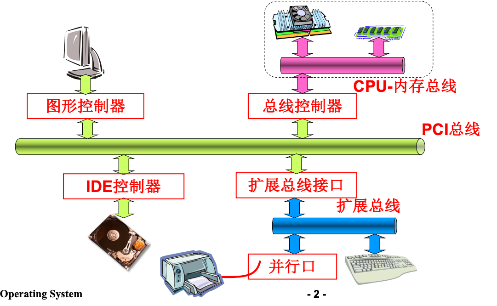
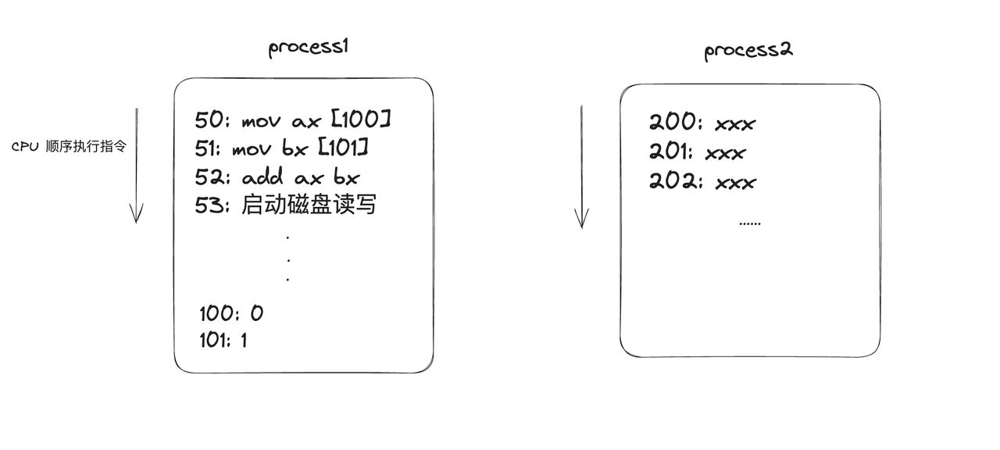
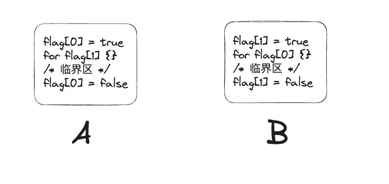
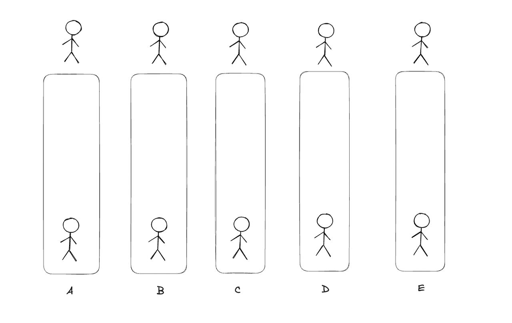

# 并发

> 本节课讲的基本都是基于单 CPU 的
> 
> 因为概念太多了，我在课件中肯定有遗漏，有问题的自己网上查一下或者在群里面问都可以

## 写在前面

能够坚持到这里已经很厉害了，大家也能看到从第一节课到第四节课人数的变化，其实大家学到这里现在已经超越年级 80% 以上的人了，相信大家只要坚持学下去都能够成功通过考核的。

这节课的内容是并发，并发很常见的，生活中充满了并发，而我们使用计算机就是为了解决现实生活中的问题，所以计算机中有并发就很自然了。但计算机世界中的并发可比现实世界复杂得多，这节课会带领大家了解并发的实质是什么，为什么并发控制这么难，我们要怎么解决并发过程中出现的种种问题......

希望大家能够真正的认识、理解并解决一系列并发问题，而不是只会使用别人提供的 API。我认为蓝山工作室后端研发组如果以后出去还是从事后端行业的话，大家都是往架构师方向发展的，我们是给别人提供解决方案的，而不是只会做一个 API Programmer。所以建议大家还是多探寻一下本质而不是停留在会用的阶段。

**基本要求（这节课达到基本要求就成功了）：**

- **学会在 Go 语言中使用并发**
    
- **知道** **Channel** **select 的基本使用**
    

进阶要求：课件中除了基本要求相关的全是进阶要求

> 课件很长，基本全是我自己一个字一个字敲出来的，图也是我自己画的，有错是在所难免的，如果大家发现错别字或者讲的有问题的话麻烦大家谅解一下并及时向我反馈（可以直接在飞书文档中评论）🙏🙏🏻🙏🏼🙏🏽🙏🏾🙏🏿

## 操作系统基础知识

操作系统也是一种软件，它为用户提供了一系列的接口帮助我们管理和使用硬件，我们使用的软件，编写的程序都是运行在操作系统上的，常见的操作系统有 Windows 、Linux 和 MacOS...


### 为什么要有操作系统

我们先来看一下计算机大概是怎么样的


  


程序员的任务便是使用计算机帮助人们解决一些实际问题，可这计算机这么复杂，比如想要让显示屏打印一个 “Hello World”，是不是就要让 CPU 发出指令到总线上，显示屏接受到后，再打印一个个像素点。对于我们来说是不是就需要完成如何让 CPU 发出指令，发出什么指令，怎么把指令传达给显示器等等。这要求也太高了吧，让每个程序员既要知道上层的代码如何编写，又要知道底层硬件如何交互，显然是不合理的。

根据我们生活中的经验，比如做一个小组作业，往往都是分工完成的，每个人只需要完成自己的任务而不用关心其他任务的细节，那在计算机的世界也是这样，我们想要写代码的只需要写代码的只需要写代码，而不需要关心 CPU 是怎么运行的，显示器是怎么打印像素点的。

  

所以编写一个操作系统，屏蔽掉底层硬件的细节，让我们专心写代码，就是一个很有必要的事情了。

### 操作系统的任务

一个计算机的组成大概可以分成三部分：CPU、内存和 IO 设备。

> "IO" 指的是输入/输出（Input/Output），是计算机领域中常用的术语，用于描述计算机系统中的数据传输和交换。在计算机术语中，输入/输出通常指的是计算机与外部环境（设备、存储介质或其他计算机）之间的数据交换和传输。
> 
> 显示器、鼠标、硬盘等等都是 IO 设备。

操作系统要做的就是**管理好这三种硬件**。

  

CPU 就是计算机中实际执行计算任务的硬件，CPU 的工作其实就是取地址、执行，取地址，执行...

> 地址指数据或指令在内存中的位置

内存就是存储数据或指令的硬件，CPU 都是和内存进行交互，磁盘中的数据要先读到内存中来才能被 CPU 知道。

### 其他概念

> 这些内容可以先看一遍留个印象，后面再遇到的时候回来翻，看不懂也没关系

**内核态 & 用户态**：为了对系统资源（硬盘，显示器等等都是系统资源）进行保护和隔离，操作系统将内存空间分为了用户态和内核态，用于表示不同的运行级别和特权级别，内核态可以执行特权指令，直接操作硬件，用户态只能访问有限的资源和受限制的指令集，不能直接访问底层硬件资源。我们编写的代码都是运行在用户态之上的。

**系统调用**：我们很多时候都会想要使用硬件，如读取一个文件，打印一串字符，这在用户态是无法实现的，故操作系统为用户提供了许多接口，用于完成一些需要操作系统提供支持的特权操作。（例如 fmt.Printf() 最终也是一个系统调用）

**中断**：简单来说就是 CPU 停下当前的工作任务，去处理其他事情，处理完后回来继续执行刚才的任务。中断机制使得处理器能够即时响应外部设备或软件的请求，处理特定事件或异常情况，提高了系统的实时性和并发性能。

**调度：**简单来说就是用某种算法找到一个可以执行的进程或线程然后 CPU 切换到这个进程或线程执行。（切换前 CPU 会先将当前的上下文信息保存）

**程序：**一条条代码的集合，经过编译后存放在磁盘中的静态文件

**进程：**进程就是一个正在执行的程序。每个进程都拥有独立的内存空间、资源和执行环境。进程之间是相互独立的，它们之间不能直接访问对方的内存空间，每个进程有其自己的地址空间。

> 进程之间的隔离就是操作系统管理内存的结果

**线程：**线程是进程中某一条具体的代码执行流。一个进程包含多个线程，因为都是一个进程中的，所以线程与线程之间是可以共享内存空间的。（例如全局变量可以被多个函数访问）

- **用户级线程****：**用户级线程是在用户空间管理的线程，用户级线程的调度不受内核控制，在 Go 语言中就是由 GMP 调度模型来管理
    
- **核心级线程：**核心级现场就是在内核空间管理的线程
    

操作系统并不知道用户级线程的存在，线程的创建、调度、同步和销毁等操作由用户空间的线程库来管理。

而核心级线程的调度、同步和管理，创建、切换和销毁等操作都由内核完成。

**CS****:****IP**：

CS和IP是8086CPU中两个关键的寄存器，它们指示了CPU当前要读取指令的地址。

**CS :** 代码段寄存器；

**IP** **:** 指令指针寄存器。在8086机中，任意时刻，CPU 将 CS:IP 指向的内容当作指令来执行。（这是 x86 架构 CPU 下的概念）

**PC**：Program Counter，是通用寄存器，但是有特殊用途，用来指向当前运行指令的下一条指令。（这是通用术语）

## 管理 CPU

上面提到了 CPU 的任务就是管理三大类硬件，这节课的内容就是在管理 CPU 的过程中引出的。

### 直观想法


想让 CPU 工作起来，其实只需要给 PC 设置一个初值，然后 CPU 就会取出指令执行，然后自动将 PC 加一...

#### 存在的问题

上面的操作很简单，但其实是有一些问题的，让我们写一个代码来看看

```Go
// 我是将 n 赋值为 1000 测的数据
func Sum(n int) {
    f, err := os.Create("text.txt")
    if err != nil {
       panic(err)
    }
    defer f.Close()
    a := 0
    t := time.Now()
    for i := 0; i < n; i++ {
       a++
    }
    fmt.Println(time.Since(t)) // output: 375ns

    t = time.Now()
    if _, err = f.WriteString("a"); err != nil {
       panic(err)
    }
    fmt.Println(time.Since(t)) // output: 22us
}
```

这段代码中有 IO 操作（将 "a" 写到了 "text.txt" 中）

CPU 执行指令是很快的，但是如果遇到 IO 操作了，程序的执行时间就会慢下来，因为 IO 操作的大部分时间 CPU 是不参与的

> I/O 操作相对于 CPU 执行指令慢主要是因为它们牵涉到物理设备的限制、机械运动、网络传输、数据处理等诸多复杂性和开销



CPU 需要执行 process1 和 process2，此时正在执行 process1，在 PC=53 时，遇到了 IO，那么 CPU 就有两个选择了

1. 等待 IO 完成后继续执行 process1，等 process1 执行完后再执行 process2
    
2. 先去执行 process2
    

其实根据生活经验，我们很容易知道选 b 才是更合理的选择。明明还有其他任务需要 CPU 执行，操作系统却在 IO 操作启动后让 CPU 等着，显然是一个不合理的操作。

这里选 b 就形成了 CPU 在交替执行多个程序，这就是**并发**。

选 a 就是**串行。**

> ~~这么久终于提到这节课的主题了~~

### 更好的管理 CPU

更好的管理 CPU 其实就是充分利用 CPU，从上面的例子可以看出，想要充分利用 CPU 其实就是在合适的时机进行调度，让程序交替执行，其实就是管理好并发。

## 并发

在上面的例子中我们已经知道了并发其实就是有多个任务，这些任务交替执行，而在某一个具体的时间只有一个任务正在执行。

我们在之前已经提到了进程和线程的概念，我理解的进程就是**资源+线程，**实现并发必然有任务的切换，而一个个任务实际上是一条条指令的集合，线程不就是一条条指令吗，那我们的并发是不是就可以在线程上实现呢？答案当然是可以的。这样就避免了资源切换的开销，而当任务切换是进程的切换时，我们只需要将资源也切换了即可。

核心级线程操作系统已经帮助我们实现了并发机制，而用户级线程的并发机制，Go 语言也已经为我们实现好了，我们想要在 GO 语言中使用并发很简单，只需要使用 **`go`** 关键字即可

```Go
// ConcurrentPrint 开启十个线程，每个线程都打印100次 a
func ConcurrentPrint() {
    for i := 0; i < 10; i++ {
       go Print()
    }
}

func Print() {
    for i := 0; i < 100; i++ {
       fmt.Println("a")
    }
}
```

大家可以想办法测一下这样打印一千次 a 和顺序打印一千次 a 在时间上的差距

这么一看，Go 语言也太好了吧，啥都不用自己干，直接用就行了，但真的是这样吗？

下面我们想要使用十个线程，每个线程轮流打印 1～10

```Go
func ConcurrentPrint() {
    for i := 0; i < 10; i++ {
       go func() {
          fmt.Printf("%d ",i)
       }()
    }
}
// output: 10 10 10 10 10 10 10 6 8 10
```

这个输出结果是很让人意外的，并且我们测试多次，发现每次测试结果都不一样。

让我们来分析一下这个问题，我们每次循环都开启一个线程来打印 i。但我们知道，i 每次循环都会自增，而上面也提到了，IO 相较于 CPU 是很慢的（打印也是一个 IO 操作）。那答案就显而易见了，在打印出来前，i 就已经完成了自增了。

但还有个问题，为什么会打印出 10 6 8 10 这种序列呢？这其实是因为，调度的时机是我们无法预测的。所以这里的打印顺序我们也无法确定。

再举一个例子

```Go
var a = 0

func ConcurrentAdd() {
    go Add()
    go Add()
}

func Add() {
    for i := 0; i < 10000; i++ {
       a++
    }
}

func TestConcurrentAdd(t *testing.T) {
    ConcurrentAdd()
    time.Sleep(time.Second)
    fmt.Println(a)
}

// output: 12269
```

上面的代码中，我们想要使用两个线程来并发的对 a 进行自增，最终我们期望的结果是 20000，但实际上每次打印的结果都不到 20000。

我们来具体分析为什么不能到达 20000，实际上 a++ 这样的操作并不是原子性的，他被分为了三部分：1. CPU 读取 a 的值。2. CPU 对 a 的值加一。3. CPU 将新的 a 的值写回内存

前面也提到了，线程的调度时机我们是不确定的

一开始 a == 0，假设第一个 Add 线程在执行到 a++ 的第二步的时候，发生了调度，此时第二个 Add 线程开始执行，第二个 Add 线程运气比较好，它完整的执行了 a++，此时 a == 1。然后又调度回了第一个 Add 线程，它继续执行 a++ 的第三步，按照它的记忆，它是会把 1 写回到内存中的 a 的。那就出现了一种情况，一开始 a == 0，执行了两次 a++ 后，a 竟然是 1。

假设刚好就有这样的问题出现与钱相关的场景上，那问题可太大了。

从上面的两个例子中，我们可以看出，并发并没有我们想的那么简单。特别是涉及到多个并发的线程操作同一变量时，并发控制就变得尤其复杂。

### 临界资源的保护

在上面 a++ 的例子中我们已经发现，当并发的线程使用同一个资源的时候，它们会发生冲突，实际上发生冲突的原因是因为它们相互之间都是不可见的，第二个 Add 执行 a++ 时并不知道第一个 Add 已经开始执行 a++ 并且还没执行完。

对于 a 这一种被两个或多个线程访问的不可共享的资源，我们称之为**临界资源，**使用临界资源的那一部分程序称作程序的**临界区**。我们想要代码正确的执行，就要保证同一时间只有一个线程留在临界区中，这就是**互斥****。**

想要实现互斥的手段有很多，大致分为了硬件方法和软件方法。

#### 屏蔽中断

在单 CPU 机器上，程序只能交替执行。此外，一个线程将一直执行，直到它发生了系统调用（发生系统调用后将会进入内核空间，那么调度就交给了操作系统内核，用户层面是无法控制的）或被中断。因此要实现互斥，只需要保证在执行的过程中不会被中断即可。

```Go
for {
    /*屏蔽中断*/
    /*临界区*/
    /*启用中断*/
    ...
}
```

这样很简单，但是这个方法的代价是很高的，还有一点就是这个方法不能用在多 CPU 的机器上，因为屏蔽当前 CPU 的中断，临界区还是有可能会被另一个 CPU 访问

#### 专用机器指令

我们想一下生活中的场景，临界区只能让一个线程进入，是不是很像我们寝室的一个厕所同时只能让一个人使用（~~正常情况~~）。如果每个人进入厕所后，上个锁，这样就不会发生冲突了吧。那在程序上，我们是不是也可以使用锁来保护临界区呢？

显然是可以的，比如我们使用一个 lock 变量，lock 为 1 代表已经上锁了，为 0 代表未上锁。每次想要进入临界区的时候，先看一下 lock 的值，如果为 1 我们就等待，如果为 0 我们就把 lock 设置为 1，然后自己进入，出来的时候再把锁解开。

```Go
for{
    for lock != 0 {}
    lock = 1
    /*临界区*/
    lock = 0
}
```

我们乍一看，感觉好像是对的，但是实际上呢，使用这样的机制去跑上面的给 a 自增两万次的代码还是有问题。

实际上，这里的 lock 变量也变成了临界资源，那对 lock 肯定也需要保护啊。

我们想要的是对 lock 的操作一次性完成，对 lock 的操作其实就是一个 **compare_and_swap(CAS)** 的操作，硬件为我们提供这样的操作，CAS 指令可以等价于以下的 Go 代码，但是一次性完成的，中间不会被调度。

```Go
// 先比较 *addr 和 old 的值，如果相等就给 addr 赋值为 new，不相等就不操作
// 返回值为 addr 的值是否被改变
func compare_and_swap(addr *int, old, new int) (swapped bool){
    oldVal := *addr 
    if oldVal == old{
        *addr = new
        return true
    }
    return false
}
```

那么上面的 lock 就可以被改写为

```Go
// 如果没有被交换，那就代表 lock 已经被其他线程占有了，所有需要等待
for{
    for !compare_and_swap(*lock,0,1) {} 
    /*临界区*/
    lock = 0
}
```

Go 的 sync 包已经为我们定义了一个锁的接口，并且提供了实现此接口的结构体

```Go
// A Locker represents an object that can be locked and unlocked.
type Locker interface {
    Lock()
    Unlock()
}

// A Mutex is a mutual exclusion lock.
// The zero value for a Mutex is an unlocked mutex.
//
// A Mutex must not be copied after first use.
//
// In the terminology of the Go memory model,
// the n'th call to Unlock “synchronizes before” the m'th call to Lock
// for any n < m.
// A successful call to TryLock is equivalent to a call to Lock.
// A failed call to TryLock does not establish any “synchronizes before”
// relation at all.
type Mutex struct {
    state int32
    sema  uint32
}

// Lock locks m.
// If the lock is already in use, the calling goroutine
// blocks until the mutex is available.
func (m *Mutex) Lock() {...}

// Unlock unlocks m.
// It is a run-time error if m is not locked on entry to Unlock.
//
// A locked Mutex is not associated with a particular goroutine.
// It is allowed for one goroutine to lock a Mutex and then
// arrange for another goroutine to unlock it.
func (m *Mutex) Unlock() {...}
```

上面的 Mutex 便是 Go 官方提供了锁，Mutex 的中文意思便是互斥，那么这就很好理解了，我们使用 Mutex 的流程大致如下

```Go
var m sync.Mutex

for{
   m.Lock()
   /*临界区*/
   m.Unlock()
   ...
}
```

接下来我们来简单看一下官方的锁是怎么实现的

```Go
// Lock locks m.
// If the lock is already in use, the calling goroutine
// blocks until the mutex is available.
func (m *Mutex) Lock() {
    // Fast path: grab unlocked mutex.
    if atomic.CompareAndSwapInt32(&m.state, 0, mutexLocked) {
       if race.Enabled {
          race.Acquire(unsafe.Pointer(m))
       }
       return
    }
    // Slow path (outlined so that the fast path can be inlined)
    m.lockSlow()
}
```

这里我们就很好理解了，上锁就是尝试使用 CAS 指令获取锁，如果获取失败就进入 m.lockSlow，lockSlow 其实就对应了上文中提到的等待，当中的具体实现就不展开了，大家有兴趣自己下去了解。

#### 软件方法实现互斥

上文中提到的屏蔽中断和专用机器指令都是硬件层面提供的操作，硬件实现互斥但话开销其实是比较大的，实际上我们使用一定的算法也是可以实现对临界资源的保护的。

##### 轮转法

我们设想一个场景，A 和 B 他们两个人需要长期共同打扫一个房间的卫生，一种简单的分配工作方法就是轮流打扫。那如果要轮流打扫卫生，每次就只能一个人打扫卫生，很容易想到的是使用一个标签记录一下，A 打扫完了就把标签改成 B，B 打扫完了就把标签改成 A。标签上是谁，那就谁去打扫卫生。

其实此处的打扫卫生也是一种并发，我们把房间的卫生想成一个资源，那么打扫卫生就是临界区，A 和 B 就是两个线程，他们轮流访问临界区，而使用标签的方式，也是很好的保护了临界区。


这样的方式其实很好的实现了互斥，但这是一种好的对临界区保护的方法吗？

我们想一下，如果某一天 turn == A ，但是 A 生病了，此时 B 是打扫不了卫生的（必须要 turn == B 时 B 才能打扫），那么房间就没人打扫了，但其实此时的卫生是可以被 B 打扫的。

再想一下其他场景，如果我们有两个人共享一个厕所，那么使用这种方式管理厕所显然是不合理的。

由此我们可以得出，想要更好的对临界区的保护除了互斥应该还有其他条件

**有空让进：若干进程要求进入空闲临界区时，应尽快使一进程进入临界区**

##### 标记法

上面提到了保护临界区我们应该满足有空让进的条件，所以我们开始想怎么满足有空让进。

举个例子，现在还是两个人用一个厕所，采用举旗子的方式。如果想上厕所，先把自己的旗子举起来，然后看对面有没有举旗。如果看到对面举旗子了，那就视作厕所里面有人，我就等到对面旗放下才去上厕所；如果对面没举旗，我就去上厕所，上完厕所我就把自己的旗子放下来。



很明显，他肯定满足了互斥，也满足了有空让进，但这个算法实际上在计算机的世界还是有问题。

我们是只有一个 CPU 的，假设此时 CPU 正在执行 A 的任务，把旗举起来了，但举完后突然发生了调度，开始执行 B 的任务，B 也把旗举起来了，那问题就出现了，我们会发现接下来 A 和 B 都不能上厕所了。

由此我们得出了保护临界区的第三个原则：**有限等待：从线程发出进入请求到允许进入， 不能无限等待**

上面的对称标记法显然是错误的，那我们怎么让其正确呢，其实也很简单，我们只需要让其中的某一个人在看到对面举旗后把自己的旗子放下来就可以了，等一段时间再来上上厕所


  

这样一来，我们的代码就正确了，既满足了基本的互斥，也满足了有空让进和有限等待的原则。

但是这样的代码，非对称的设计在遇到复杂情况的时候，编码的复杂度会大大增加，所以我们还需要探索一个既满足三大原则，编码又简单的算法。

##### Peterson 算法

上面的标记法和轮转法各自都有优缺点，那我们能不能将其结合起来呢？

答案也是可以的，**Peterson 算法**是一个实现[互斥锁](https://zh.wikipedia.org/wiki/%E4%BA%92%E6%96%A5%E9%94%81)的[并发程序设计](https://zh.wikipedia.org/w/index.php?title=%E5%B9%B6%E5%8F%91%E7%A8%8B%E5%BA%8F%E8%AE%BE%E8%AE%A1&action=edit&redlink=1)[算法](https://zh.wikipedia.org/wiki/%E7%AE%97%E6%B3%95)，可以控制两个进程访问一个共享的单用户资源而不发生访问冲突。蓋瑞·L·彼得森（Gary L. Peterson）于1981年提出此算法。

还是使用上厕所的场景来解释 Peterson 算法，现在大家想要上厕所不只要举旗子了，再贴一个标签，具体的流程如下：A 想要上厕所，A 先把自己的旗子举起来，再往厕所门上面贴 turn = B 的标签。然后判断，如果 B 举了旗，并且厕所门上的标签是 B，那自己的等待，否则就进入，上完厕所后把自己的旗放下来；B 同理。


乍一看，好像大家都很谦让，都去往门上贴对面的标签，但实际上真的谦让吗？其实认真分析每一种调度策略可以发现，实际上是谁先完成往门上贴标签这一步，谁就会先进入临界区。

### 同步

上面举了这么多例子，其实我们可以发现，计算机上的很多问题都是可以映射到现实生活的，只是计算机世界的条件更加苛刻。

我们每一个人都可以看作一个线程，多个人就是并发的线程。现实世界存在资源的竞争，映射到计算机世界就是临界区，但现实世界不止有资源的竞争，还有多个人的协作，大家在共同完成某些事情的时候，必然存在着**同步。**比如公司开发项目的时候，必定会开会同步进度；

并发的线程之间其实也存在同步。如主线程开了两个并发线程， A 线程去查 Mysql，B 线程去查 MongoDB，然后等到他们两个都查到了，主线程再把数据汇总，这就是同步的经典例子。

**同步：两个或两个以上随时间变化的量在变化过程中保持一定的相对关系**

- 同步电路 (一个时钟控制所有触发器)
    
- iPhone/iCloud 同步 (手机 vs 电脑 vs 云端)
    
- 变速箱同步器 (合并快慢速齿轮)
    
- 同步电机 (转子与磁场转速一致)
    
- 同步电路 (所有触发器在边沿同时触发)
    

**异步 (Asynchronous) = 不需要同步**

- 上述很多例子都有异步版本 (异步电机、异步电路、异步线程)
    

接下来我们使用一个生产者消费者的问题来理解同步

> 99% 的并发问题都可以用生产者-消费者解决

我们去面包店买面包，面包就是资源，我们去买面包我们就是消费者（消耗资源），面包店生产面包就是生产者（产生资源），而面包店一般都有柜台放着很多面包（缓冲区），我们就可以先买柜台的面包（消耗缓冲区资源）。如果柜台没有了（缓冲区空了），我们就需要等待他们产出新的面包才能买。

接下来，面包店的柜台只能放 n 个面包，而有个消费者，他要一直一直吃面包，有个面包师，他可以一直一直生产面包。顾客只有在柜台有面包的时候才会去拿一个面包来吃，否则等待而面包师就是在柜台还有空位的时候才会往柜台放面包，使用代码模拟这个过程。

我们来分析这两个线程的同步问题

Eat 同步条件：breadCount > 0

Eat 达成同步：breadCount--

Make 同步条件：breadCount < CounterCapacity

Make 达成同步：breadCount++

由此我们很容易的便可以写出代码

```Go
// CounterCapacity 柜台的容量
// breadCount 面包的数量
var CounterCapacity, breadCount = 20, 0
var l sync.Mutex

// Eat 吃吃吃
func Eat() {
    for {
       l.Lock()
       // 柜台没面包了
       if !(breadCount > 0) {
          // 没面包肯定不能把柜台占着不让面包师放面包吧
          l.Unlock()
          continue
       }
       // 吃掉一个面包
       breadCount--
       fmt.Printf("吃")
       l.Unlock()
    }
}

// Make 做做做
func Make() {
    for {
       l.Lock()
       if !(breadCount < CounterCapacity) {
          // 柜台都满了肯定不能占着不让别人吃吧
          l.Unlock()
          continue
       }
       // 将一个面包放到柜台里面
       breadCount++
       fmt.Printf("做")
       l.Unlock()
    }
}

func Concurrent(){
    // 分别让三个人吃，三个人做
    for i := 0; i < 3; i++ {
        go Eat()
        go Make()
    }
    select {}
}
```

上面的代码是正确的，大家可以想一下怎么验证代码的正确性，上课解答

> 提示：我们是对打印的结果判断，不能出现面包数多于柜台的容量；不能出现面包数小于0，想想怎么记录面包数，面包数在什么时候变化

#### 条件变量

上面其实是一个很典型的同步问题，实际上所有的同步问题都是在等一个同步条件成立才能继续往下执行。在上面的例子中，我们遇到同步条件不成立的情况，处理方法是一直循环，判断条件是否成立，这虽然简单，但它合理吗？

想想我们在寝室和室友都要上厕所，室友先进去了，我们肯定不是在厕所门口一直把门盯着吧，一般我们都会先去干点其他的事情，比如刷抖音，等到同学出来的时候我们才去。这实际上也给我们提供了一个很好的解决思路，在线程的世界里，每个线程都是有自己的时间片的（简单理解为线程可以执行的时间），时间片完了那就不能执行了，而上面一直空转检查同步条件是否成立这也是要消耗时间片的，那我们想要的应该是让线程先不执行了，把 CPU 让出来，等到同步条件成立的时候别人来提醒自己继续执行。

所以我们理想的 API 应该是 **wait_util(condition)**，但这只是理想，实现起来有诸多困难，所以操作系统就为我们提供了一个**折衷**的设计：**条件变量(Cond)，**Go 作为一个很新的语言，为我们提供了条件变量

> 折衷思想在计算机中是一个很常见且重要的思想

条件变量有以下 API

```Go
// NewCond 传入一把锁返回一个条件变量
NewCond(l Locker) *Cond

// 调用 Wait 前务必保证已经获得了锁
// Wait 会让当前线程睡眠
// Wait 会释放锁
// 被唤醒的线程再次执行时会重新占有锁
Cond.Wait()

// Signal 会唤醒一个之前调用了 Wait 正在睡眠的线程
// 如果没有正在睡眠的线程就什么也不做
// 调用此方法不一定需要占有锁
Cond.Signal()

// Broadcast 会将所有之前调用了 Wait 正在睡眠的线程唤醒
// 调用此方法不一定需要占有锁
Cond.Broadcast()
```

通过以上的 API ，我们就可以让我们吃面包和做面包更加合理

```Go
// CounterCapacity 柜台的容量
// breadCount 面包的数量
var CounterCapacity, breadCount = 1, 0
var l sync.Mutex

var cond = sync.NewCond(&l)

// Eat 吃吃吃
func Eat() {
    for {
       l.Lock()
       // 柜台没面包了
       if !(breadCount > 0) {
          cond.Wait()
       }
       // 吃掉一个面包
       breadCount--
       fmt.Printf("吃")
       cond.Signal()
       l.Unlock()
    }
}

// Make 做做做
func Make() {
    for {
       l.Lock()
       if !(breadCount < CounterCapacity) {
          cond.Wait()
       }
       // 将一个面包放到柜台里面
       breadCount++
       fmt.Printf("做")
       cond.Signal()
       l.Unlock()
    }
}

func Concurrent() {
    for i := 0; i < 2; i++ {
       go Eat()
       go Make()
    }
    select {}
}
```

上面的代码看似很合理是吧，但是我们实际跑一下，甚至测试代码都不用跑，直接看控制台输出都能看出问题


一看，竟然连着输出了超过 1 个的吃或做，我们设置的 CounterCapacity 可只有 1。

我画了一张图，帮助大家理解这里的问题到底出在哪里


1. Eat1 判断是否能吃面包，发现不能就去睡觉了
    
2. Eat2 也发现不能吃面包，去睡觉了
    
3. Make1 来发现可以做面包，他做了一个面包
    
4. Make1 随机唤醒了一个正在睡觉的线程（Eat1 或 Eat2，因为唤醒哪一个我们是不确定的，此时假设唤醒了 Eat1，Eat1 的状态变为 Runnable，但不一定接下来就是 Eat1 执行，这得看调度策略，我们也是无法预知的，所以我假设接下来 Make2 开始执行）
    
5. Make2 以来看发现柜台满了，不能做面包，那它也去睡觉了
    
6. 接下来调度到了 Eat1，Eat1 开始吃面包，吃完了那柜台就有空位了，又能让面包师做了，他也去唤醒一个正在睡觉的线程
    
7. 问题来了，他会唤醒 Eat2 还是 Make2 呢？这也是不确定的，如果运气好唤醒了 Make2，那执行序列就正确了，如果唤醒了 Eat2，那就会出现面包数小于 0 的情况，那就大错特错了
    

想一想出现这样的情况的根本原因是什么呢？其实就是 Signal 唤醒是随机的，Eat 吃完了他想要唤醒的是能做面包的线程，而不是吃面包的线程

那我们要怎么解决这个问题呢？很简单，只要让 Eat 只去唤醒 Make，Make 也只能唤醒 Eat 就行了，那使用两个条件变量不就行了吗

```Go
// Eat 吃吃吃
func Eat() {
    for {
       l.Lock()
       // 柜台没面包了
       if !(breadCount > 0) {
          condEat.Wait()
       }
       // 吃掉一个面包
       breadCount--
       fmt.Printf("吃")
       condMake.Signal()
       l.Unlock()
    }
}

// Make 做做做
func Make() {
    for {
       l.Lock()
       if !(breadCount < CounterCapacity) {
          condMake.Wait()
       }
       // 将一个面包放到柜台里面
       breadCount++
       fmt.Printf("做")
       condEat.Signal()
       l.Unlock()
    }
}
```

但这又带来什么问题呢，这里有两种线程，它们有各自有一个同步条件，我们就使用了两个条件变量，那如果有三个四个同步条件呢？如果一直新增条件变量那代码的可维护性就会大大降低，所以我们应该思索一种方法，只是用一个条件变量，就可以完成多线程多同步条件的同步。

再来一个生活中的例子：蓝山中学的高三二班，大家现在都在认真的做作业，然后数学老师带来了全班上次考试的卷子，老师说点到一个人就上来拿，然后点人，每个人都会注意听是不是自己的名字，如果不是自己就继续做作业，如果是自己就上去拿卷子。大家这里把做作业想成线程的睡觉，判断是不是自己名字就是对同步条件的判断，而老师每次点名，是不是就和 Broadcast 方法很相似了呢，点名也会吸引起全班同学的注意，据此，我们写出了更好的同步代码。

```Go
// Eat 吃吃吃
func Eat() {
    for {
       l.Lock()
       // 柜台没面包了
       for !(breadCount > 0) {
          cond.Wait()
       }
       // 吃掉一个面包
       breadCount--
       fmt.Printf("吃")
       cond.Broadcast()
       l.Unlock()
    }
}

// Make 做做做
func Make() {
    for {
       l.Lock()
       for !(breadCount < CounterCapacity) {
          cond.Wait()
       }
       // 将一个面包放到柜台里面
       breadCount++
       fmt.Printf("做")
       cond.Broadcast()
       l.Unlock()
    }
}
```

我们将 if 改成了 for，将 Signal 改成了 Broadcast，每次虽然唤醒了所有的线程，但因为是 for，不满足条件的线程就算占据了 CPU 他也会再次进入睡眠。

根据这个可以总结出一个万能的同步法

```Go
l.Lock()
for !(condition) {
    cond.Wait()
}
work...
cond.Broadcast()
l.Unlock()
```

使用条件变量解决并发的同步问题最重要的就是要找到同步条件是什么，只要分析清楚了，基本就按上面我给出的代码框架套就行了

#### 信号量

> 在前文中其实已经有信号量的出现了，大家可以找一下

操作系统中除了条件变量外，**信号量****（****semaphore****）**也是一种常用的并发机制。

> **信号量**（英语：**semaphore**）又称为**信号标**，是一个同步对象，用于保持在0至指定最大值之间的一个计数值。当线程完成一次对该semaphore对象的等待（wait）时，该计数值减一；当线程完成一次对semaphore对象的释放（release）时，计数值加一。当计数值为0，则线程等待该semaphore对象不再能成功直至该semaphore对象变成signaled状态。semaphore对象的计数值大于0，为signaled状态；计数值等于0，为nonsignaled状态。
> 
> ------维基百科

大家看了这段话，想必都很懵，我刚开始看的时候也很懵，没关系，我们先来看怎么用，在用的过程中感受什么是信号量。

信号量通常包含三个操作，初始化，P 操作和 V 操作（P/V 操作都是原子性的），下面我用 Go 为大家解释一下这三个 API

> **P**的名称来源于荷兰语的 **proberen**，即 **test ，V** 的名称也来源于荷兰语 **verhogen(increment)**

```Go
type Semaphore struct {
    count int64
    ...
}

func InitSemaphore(n int64) *Semaphore {
    return &Semaphore{
       count: n,
    }
}

func (s *Semaphore) P() {
    s.count--
    if s.count < 0{
        s.sleep()
    }
}

func (s *Semaphore) V() {
    s.count++
    if s.count <= 0{
        s.signal()
    }
}

func (s *Semaphore) sleep() {...} 

func (s *Semaphore) signal() {...}
```

我们用买面包的例子来解释这几个操作：

InitSemaphore：面包店开门了，往柜台放了 n 个面包

P：尝试买面包

- 还有剩余的面包，买走
    
- 柜台没有面包了，排队
    

V：往柜台里面放面包

- 没人排队，放了面包就走
    
- 有人排队，提醒某一个排队的人来拿面包
    

由此我们可以看到，信号量其实就是一种计数机制，把 count 想成是一种资源，P 操作就是尝试获取资源，V 操作就是生产资源（又回到了生产者-消费者）

那信号量怎么用来实现同步呢？接下来用两个经典例子来说明

1. 我们想要 A 线程要比 B 线程先执行，初始化一个 0 值信号量，B 就算比 A 先得到了调度，也会因为 sem.P() 而睡眠，只有等到 A 执行 sem.V() 后 B 才能执行
    

```Go
func A(sem *Semaphore){
    work...
    sem.V()
}

func B(sem *Semaphore){
    sem.P()
    work...
}

func Concurrent(){
    sem := InitSemaphore(0)
    go A(sem)
    go B(sem)
}
```

2. 解决条件变量中提到的面包问题
    

```Go
// CounterCapacity 柜台的容量
// breadCount 面包的数量
var CounterCapacity, breadCount = 1, 0
var l sync.Mutex

var semBread,semCounter = InitSemaphore(breadCount), InitSemaphore(CounterCapacity)

// Eat 吃吃吃
func Eat() {
    for {
       l.Lock()
       semBread.P()
       // 吃掉一个面包
       breadCount--
       fmt.Printf("吃")
       semCounter.V()
       l.Unlock()
    }
}

// Make 做做做
func Make() {
    for {
       l.Lock()
       semCounter.P()
       // 将一个面包放到柜台里面
       breadCount++
       fmt.Printf("做")
       semBread.V()
       l.Unlock()
    }
}

func Concurrent() {
    for i := 0; i < 2; i++ {
       go Eat()
       go Make()
    }
}
```

#### Channel

前面提到的同步机制都是其实都是基于共享内存来通信来实现的同步，大家学 Go 这么久了，可能听说过一句话 **"****Share Memory By Communicating****"，**这是 Go 语言中很出名的一句话，而这句话正是因为 Go 为我们提供了一种很特殊的数据类型可以实现多个线程之间的通信：**Channel****，**Channel 是一个并发安全的数据类型，放心使用

Channel 的中文意思就是管道，其实就三个操作：往管道里面丢东西（写）；从管道里面拿东西（读）；关闭管道。

```Go
// 通常使用 make 关键字来创建一个管道
// 创建管道时 make 接受一个必选参数和一个可选参数
// dataType 表示你想要创建的管道中可以丢什么类型的数据进去，如 int, string...
// 第二个是可选参数，为int 类型，代表你想创建的管道的缓冲区大小，通俗来讲就是管道有多长
ch := make(chan dataType) // 创建一个无缓冲的管道
ch := make(chan dataType,10) // 创建一个缓冲区为 10 的管道

// 往管道里面写
// 如果管道的缓冲区已经满了，那线程将会阻塞，直到有其他线程把管道里面的数据拿走空出了位置
// 如果是往无缓冲的管道写也视作缓冲区已满
ch <- yourData

// 从管道里面读
// 如果管道里面没有数据，那线程将会阻塞，直到有线程往管道里面写
v := <- ch
v,ok := <- ch // ok 表示是否从管道里面读取到值

// 关闭管道
// 往已经关闭的管道里面写数据会触发 panic，但是可以从已经关闭的管道里面读取数据
close(ch)

// 单向管道.  chan<- 只能往管道里面写，不能读.  <-chan 只能从管道里面读，不能写
// 我们可以在创建或者把管道当函数参数的时候将其设置为单向管道
ch := make(chan<- dataType) // 创建时设置成单向的我想不到有什么用
ch := make(<-chan dataType)

func FuncName(ch <-chan int){}
func FuncName(ch chan<- int){}

// 遍历
// 可以使用 range 遍历可读的管道
// 如果使用这个的话线程会停在这里，类似于监控 ch，直到 ch 被关闭才会继续往下执行
for v := range ch{
    handle...
}
```

前面已经提到了，99% 的并发问题都可以转换为生产者-消费者，往管道里面丢东西不就是生产者吗，往管道里面拿东西不就是消费者吗，再加上管道的设计就是并发安全的，所以使用管道进行线程间的同步是一种比较简单且高效的方式

```Go
ch := make(chan struct{})

func A(){
    work...
    ch <- data
    work...
}

func B(){
    work...
    data := <- ch
    work...
}

// A 和 B 会在操作管道的位置达成同步
```

与 channel 相关的还有一个重要的用法：**select**

我理解的 Go 语言中的 select 是将多路复用的思想应用在了 channel 上面，先来了解一下什么是多路复用

> **多路复用**（Multiplexing，又称“**多工**”）是一个[通信](https://zh.wikipedia.org/wiki/%E9%80%9A%E4%BF%A1)和[计算机网络](https://zh.wikipedia.org/wiki/%E8%AE%A1%E7%AE%97%E6%9C%BA%E7%BD%91%E7%BB%9C)领域的专业[术语](https://zh.wikipedia.org/wiki/%E6%9C%AF%E8%AF%AD)，在没有歧义的情况下，“多路复用”也可被称为“复用”。多路复用通常表示在一个[信道](https://zh.wikipedia.org/wiki/%E4%BF%A1%E9%81%93)上[传输](https://zh.wikipedia.org/wiki/%E4%BC%A0%E8%BE%93)多路[信号](https://zh.wikipedia.org/wiki/%E4%BF%A1%E5%8F%B7)或[数据流](https://zh.wikipedia.org/wiki/%E6%95%B0%E6%8D%AE%E6%B5%81)的过程和技术。因为多路复用能够将多个低速信道集成到一个高速信道进行传输，从而有效地利用了高速信道。 -------维基百科

大家看到可能又是一脸懵，没关系，大家后面在系统学习操作系统的时候会再次遇到这个概念的，到时候再深入理解也可以。接下来我用带大家通俗理解 select

现在有五条路，每条路上面都随时有可能会有人带来要处理的信息，要求是一旦有一条路来人了，就处理他带来的信息，我们很容易想到的就是给每条路都开一个线程，把路监控着。

```Go
ch1 := make(chan int)
ch2 := make(chan int)
...

go func() {
        for {
                v := <- ch1
                handleCh1(v)
        }
}()

go func() {
        for {
                v := <- ch2
                handleCh2(v)
        }
}()
...
```

这种处理方法用图表示就是



这样虽然能解决问题，但显然不是一个好方法。想想生活中如果遇到这种情况，我们的处理方式是什么？答案就是让那个一个人更勤劳，让一个人去监控这五条路，谁来消息了就处理谁的，如果同时来消息，就选一个先处理，选一个后处理。


这其实就是多路复用的思想，代码表现为下

```Go
ch1 := make(chan int)
ch2 := make(chan int)
...

// 注意 select 的 case 后面必须接与 channel 相关的操作
select {
    case v := <-ch1: handle(v)
    case v := <-ch2: handle(v)
    ...
}
```

但是 Go 中与我们生活中不一样的是，如果同时来了两条消息，他不会把两条消息都处理了，而是选一条处理。所以使用 select 的时候，我们经常会在外层包一个 for 循环。

select 中还有一些其他需要注意的

```Go
// 单独使用一个 select 不带 case 可以阻塞当前线程让他不退出
select{}

// select 里面包一个 default 可以在没消息来的时候进入 default 那条路
select {
    case v := <-ch1: handle(v)
    case v := <-ch2: handle(v)
    default : ...
}
```

Channel 还有很多高级用法，大家就自己慢慢探索吧，这里就不讲了

### Go 中其他并发相关的包

Go 中与并发相关的包主要存在于 sync 和 context 包中，我为大家整理了一些基本用法供参考

##### sync 包

###### WaitGroup

WaitGroup 是用来等待一组 goroutine 全部完成的，用法相当于于计数器，开 goroutine 就 Add，goroutine 结束后就 Done，在想要等待的地方调用 Wait

```Go
var a = 0
var m sync.Mutex

var wg sync.WaitGroup

func ConcurrentAdd() {
    wg.Add(2)
    go Add()
    go Add()
    wg.Wait()
    work...
}

func Add() {
    defer wg.Done()
    for i := 0; i < 10000; i++ {
       m.Lock()
       a++
       m.Unlock()
    }
}
```

~~如果真的去跑了我前面给出的代码时应该就会发现直接跑的话可能~~ ~~main~~ ~~函数啥也没干就退出了~~

###### Pool

Pool 就是一个存放对象的池子，一句话总结：保存和复用临时对象，减少内存分配，降低 GC 压力。

初始化 sync.Pool 只需要声明它内部的 New 函数即可，就是告诉他我们要创建一个怎么样的对象，然后在要使用对象的时候从 Pool 里面拿（Get 方法），用完了再放回去（Put 方法）即可

```Go
pool := sync.Pool{
    New: func() interface{} { 
        ...
        return YourObject
    },
}

// 因为返回的是一个空接口，所以一般需要类型断言
yourObj := pool.Get().(YourObjectType)
work...
// 注意：如果这里的对象是带有状态的，放回 Pool 之前一定要清除状态，否则有可能下次取到到这个带状态的对象
pool.Put(yourObj)
```

###### Once

Once 只提供了一个方法，就是 Do ，使用 once 可以让你传入的函数只执行一次，一般用在单例模式，例如初始化配置、保持数据库连接等

```Go
var once sync.Once

func ReadConfig(){
    once.Do(func(){
        fmt.Printf("aaa")
    })
}

func main(){
    for i:=0;i<2;i++{
        ReadConfig()
    }
}
```

执行上面这个函数，会发现只打印了一次

###### Map

大家第三节课学习了 map，map 确实是一个很方便的数据结构，但是有一个缺点就是 map 是并发不安全的，如果有多个线程在并发的读写 map 就会触发 panic，官方也为我们提供了并发安全的 map，就是 sync.Map

都是一些比较简单的接口，官方的注释写得也比较清楚，大家就自己看一下怎么用吧，顺便锻炼一下英语

```Go
// Load returns the value stored in the map for a key, or nil if no
// value is present.
// The ok result indicates whether value was found in the map.
func (m *Map) Load(key any) (value any, ok bool) {}

// Store sets the value for a key.
func (m *Map) Store(key, value any) {}

// LoadOrStore returns the existing value for the key if present.
// Otherwise, it stores and returns the given value.
// The loaded result is true if the value was loaded, false if stored.
func (m *Map) LoadOrStore(key, value any) (actual any, loaded bool) {}

// LoadAndDelete deletes the value for a key, returning the previous value if any.
// The loaded result reports whether the key was present.
func (m *Map) LoadAndDelete(key any) (value any, loaded bool) {}

// Delete deletes the value for a key.
func (m *Map) Delete(key any) {}

// Swap swaps the value for a key and returns the previous value if any.
// The loaded result reports whether the key was present.
func (m *Map) Swap(key, value any) (previous any, loaded bool) {}

// CompareAndSwap swaps the old and new values for key
// if the value stored in the map is equal to old.
// The old value must be of a comparable type.
func (m *Map) CompareAndSwap(key, old, new any) bool {}

// CompareAndDelete deletes the entry for key if its value is equal to old.
// The old value must be of a comparable type.
//
// If there is no current value for key in the map, CompareAndDelete
// returns false (even if the old value is the nil interface value).
func (m *Map) CompareAndDelete(key, old any) (deleted bool) {}

// Range calls f sequentially for each key and value present in the map.
// If f returns false, range stops the iteration.
//
// Range does not necessarily correspond to any consistent snapshot of the Map's
// contents: no key will be visited more than once, but if the value for any key
// is stored or deleted concurrently (including by f), Range may reflect any
// mapping for that key from any point during the Range call. Range does not
// block other methods on the receiver; even f itself may call any method on m.
//
// Range may be O(N) with the number of elements in the map even if f returns
// false after a constant number of calls.
func (m *Map) Range(f func(key, value any) bool) {}
```

###### RWMutex

上面我们已经提到了 Go 中锁的使用了，但那个锁一下就锁完了，其实实际场景我们是允许一些临界区有多个线程访问的，直接使用互斥锁不就是降低性能了吗。所以 Go 官方提供了一种更细粒度的锁，RWMutex（读写锁）

```Go
func (*RWMutex) Lock // 写锁定
func (*RWMutex) Unlock // 写解锁
func (*RWMutex) RLock // 读锁定
func (*RWMutex) RUnlock // 读解锁
```

我们可以把读写锁想成有两把锁，读锁是比较宽松的，可以被多个线程同时获取，而写锁就是严格的互斥锁。一旦有一个线程获得了写锁，其他的所有线程无论是获取读锁还是写锁都会被阻塞。写解锁的时候会尝试唤醒所有因为读锁定的线程，而读解锁的时候尝试会唤醒一个因写锁定的线程。

###### atomic

atomic 包相关的东西也在 sync 目录下，这个就更简单了，相信大家一看就会，直接去翻源码看吧，位置 **{yourSdk}/src/sync/atomic**

##### context 包

Context 其实是一个比较新的概念，在 Go1.17 提出，并且这可以说是 Go 的一个特色。

```Go
type Context interface {
    // 返回 context 的过期时间
    Deadline() (time.Time,bool) 
    // 返回一个 channel，这个 channel 会在 context 被取消后关闭
    // 多次调用 Done 会返回同一个 channel
    Done() <-chan struct{} 
    // Err 会返回 context 取消的原因，如果没被取消 Err 就返回 nil
    Err() error
    // Context 可以当一个 map 用，往里面放键值对，使用 Value 方法获取 key 对应的 value
    // 不建议使用 context 当 map 用，建议就只有一两个很简单的数据需要上下文传递的时候用一下
    Value(key any) any
}
```

Context 的源码只有不到八百行，而且还有很多注释，为了加强大家阅读源码的习惯、提高大家自己解决问题的能力和加深对接口的理解，这里建议大家直接自己去读 context 的源码，位置位于 **{yourSdk}/src/context/context.go**

在 1.20 版本 Context 还有一次更新，大家可以先看 1.20 以前的 context，代码更短，理解了之后再看现在的 context

## 相关链接

哈工大李治军老师的操作系统课程：https://www.bilibili.com/video/BV1iW411Y73K

南京大学蒋炎岩的操作系统课程：https://space.bilibili.com/202224425/channel/collectiondetail?sid=1116786

mit 操作系统实验：https://pdos.csail.mit.edu/6.828/2020/schedule.html

select：https://draveness.me/golang/docs/part2-foundation/ch05-keyword/golang-select/

Channel 相关资料：

- https://www.bilibili.com/video/BV1uv4y187p6
    
- https://mp.weixin.qq.com/s/QgNndPgN1kqxWh-ijSofkw
    
- https://golang-china.github.io/gopl-zh/ch8/ch8-04.html
    
- https://draveness.me/golang/docs/part3-runtime/ch06-concurrency/golang-channel/
    

Context 相关资料：

- https://www.bilibili.com/video/BV1EA41127Q3
    
- https://mp.weixin.qq.com/s/AavRL-xezwsiQLQ1OpLKmA
    

GMP：https://www.bilibili.com/video/BV1oT411Y7m3

> GMP 是 Go 语言特有的调度模型，正是这个模型使得 Go 语言天然支持高并发

再贴一个实用的工具网站：https://go.godbolt.org/

> 这个网站可以把我们写的代码编译成汇编，可以让我们更清楚的看到代码执行的某一步到底是怎么样的，
> 
> 现在不懂汇编也没关系（我也不会🤣），我认为大家后面深入学习总会用到的

## 作业

1. 复习课件
    
2. 将 Peterson 算法推广到多线程，并使用其实现一把你自己的锁，要求如下
    
    1. 满足互斥进入临界区
        
    2. 满足有空让进
        
    3. 满足有限等待

    > Peterson 算法就是轮转法和标记法的结合，想想在多线程的情况下，怎么进行轮转和标记
    > 
    > 不要用锁实现锁
    
3. 实现一个面向并发场景的 map，要求如下
    
    1. 提供 Put 与 Get 两个方法，时间复杂度 O(1)
        
    2. 查询时若 key 不存在则阻塞并等待 maxWaitingTime 时间，若在该时间内有写入该 key 的操作，返回 value，超时则返回超时错误
        
    3. 不能有死锁和 panic 风险
    
    > 提示一下，关闭 channel 的时候会唤醒所有因为 channel 的操作而阻塞的线程
    
      接口定义如下
    
    ```Go
    func (*YourMap)Get(k int, maxWaitingTime time.Duration) (int, error) {}
    
    func (*YourMap)Put(k, v int)() {} 
    ```
    
4. 使用两个线程交替打印一百以内的奇数和偶数，即 A 线程打印 1 3 5...，B 线程打印 2 4 6...，要求有序
    
    > 想想轮转法、条件变量或利用 channel 的阻塞机制
    > 
    > 思路一：让两个线程同步，然后只允许一个线程打印
    > 
    > 思路二：让线程轮流打印
    
5. 了解哲学家就餐问题并尝试使用信号量解决
    
    > https://zh.wikipedia.org/wiki/%E5%93%B2%E5%AD%A6%E5%AE%B6%E5%B0%B1%E9%A4%90%E9%97%AE%E9%A2%98
    
6. 阅读 Context 源码并学会怎么使用 Context
    

序号不代表难度，一道也做不出来都是正常的，但只要去认真思考了，我相信对你的能力，对并发的理解，对 Go 语言的理解都会更深的，大家加油。

计算机其实也是状态机，分析并发 bug 时，把每个可能的程序执行流，状态列出来问题往往就迎刃而解了

runtime.GOMAXPROCS(1) 可以设置只使用一个 CPU 核心跑代码

提交方式：zhaoxijun@lanshan.email