# 单体架构实战

上了之前的课但是还没听懂？感觉会用但是写起来感到寸步难行？本节课会教大家从0开始写一个完整的好项目
## 前置知识
在上本节课之前，你需要了解到的一些前置知识。
### viper (配置管理)


通常，在一个或多个项目中我们需要使用定义一些配置（数据库的配置，项目功能的参数配置），从而我们可以在项目的开发或上线过程中可以快速的自定义项目的一些功能，以便满足我们的一些特定需求，那么项目中的配置如何管理呢，在 Go 中我们需要用到叫做 Viper 配置管理器。
尽管 Go 有官方库可以读取配置，但是通常情况下，推荐使用viper库来读取配置文件， viper 支持以下功能：

- 支持 yaml、json、toml、hcl 等格式的配置文件

- 可以从文件、io.Reader 、环境变量、cli命令行 中读取配置

- 支持自动转换的类型解析

- 可以远程从Key/Value中读取配置，需要导入 viper/remote 包

- 监听配置文件。以往我们修改配置文件后需要重启服务生效，而Viper使用watch函数可以让配置自动生效
  
  
  [Go语言配置管理神器——Viper中文教程](https://www.liwenzhou.com/posts/Go/viper_tutorial/)

### logger(日志管理）

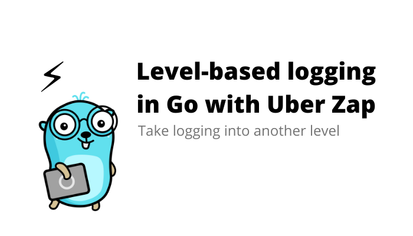


> 程序员的日常离不开日志，日志就好比私人秘书，负责运行周期一切 trace 工作。优秀的日志实践能极大帮助地程序员快速定位问题，减少在线错误报警。
> 在 Go 中我们用到 zap 作为日志记录器

Go 在 1.21.3 中新推出了 slog ，但是无论从自由度还是性能上都比不过已有的一些第三方库，其中 zap 就是非常好用的一款日志管理组件

[日志实践准则](http://www.yunweipai.com/23766.html)

[在Go语言项目中使用Zap日志库](https://www.liwenzhou.com/posts/Go/zap/)

[Zap 日志库实践](https://juejin.cn/post/7032091256457003044)

## 后端到底是怎么工作的？
上了前面的课，大家应该能够明白后端其实就是负责业务逻辑与数据处理的，但是在实际生产环境中，后端是如何在互联网中发挥作用的呢？

我们都知道，gin 是一个 http 框架，http 是传输协议，那么 gin 框架也就是和 web（World Wide Web) 息息相关，也是 Go 作为一款擅长于后端编程的核心框架之一（当然 http 框架还有很多），为什么我们用 gin 框架写一个接口（API）就能处理请求呢，最后又把消息返回给谁了呢，这些问题都会在这节课得到解答。

我们以一个真实场景作为示例
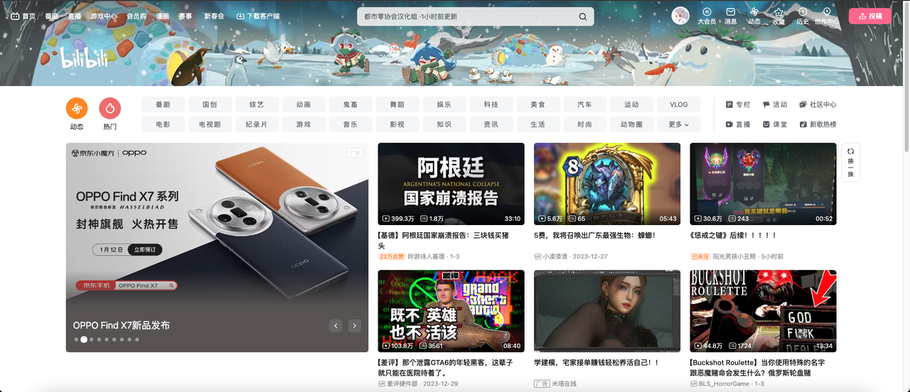
打开 B 站会看到一个页面，上面有很多功能和分类，看起来十分眼花缭乱，但是其实如果我们只以简单的功能为目的实现去做一个这样的 web 项目其实不是很难，我们只要一点点去完成基础功能——CRUD（增删改查)即可，但是如果有更高要求比如应对高并发，性能优化等等可能就比较困难了

进入正题，我们打开首页会看到这样一个界面，那么为什么我们可以看到这个界面？
后端有一个很好的伙伴，他就是前端，前端负责直接与客户端交互，而前端为了拿到一些数据需要和后端进行交互
这里的数据可以是，视频封面图，视频播放链接，用户信息令牌，用户头像等等

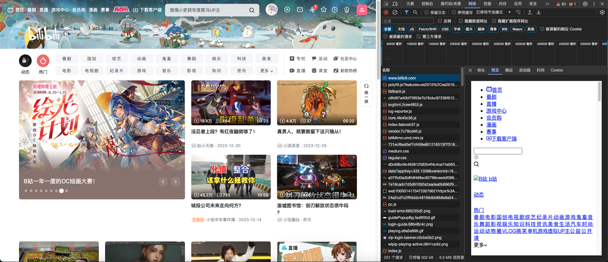
按下 f12 进入开发者模式然后刷新页面，我们可以看到第一个请求为

所以当我们敲下这个网址，整个页面才会为我们加载，剩下的很多乱七八糟的就不多赘述了，学后端的不懂这些（

那我们后端需要为前端提供哪些东西呢？还是以 B 站首页为例，首先第一个我们需要提供很多视频给用户看
我们需要这么一个接口，简化如下

> http_method : GET
> Path : /video/feed

前端来请求这个接口，就可以获得视频流
那么请求的参数我们假设为 token ，返回的参数设为 videoList

这个 videoList 可以直接返回结构体吗，前端可以直接接收后端的数据类型吗？
这个时候就需要 json 登场了
什么是 **JSON** ？

- JSON 指的是 JavaScript 对象表示法（JavaScript Object Notation）
- JSON 是轻量级的文本数据交换格式
- JSON 独立于语言：JSON 使用 Javascript语法来描述数据对象，但是 JSON 仍然独立于语言和平台。JSON 解析器和 JSON 库支持许多不同的编程语言。 目前非常多的动态（PHP，JSP，.NET）编程语言都支持JSON。
- JSON 具有自我描述性，更易理解
  
  ```json
  {
    "video_list": [
      { "video_name":"1111",video_path":"https://xxxx" , "username":"张三" },
      { "video_name":"2222",video_path":"https://xxxx" , "username":"李四" },
      { "video_name":"3333",video_path":"https://xxxx" , "username":"王五" }
    ]
  }
  ```
  
  简单来说后端和前端就可以通过 json 来进行传递消息
  
  

除了返回视频流，我们还需要写其他的接口，比如获取用户信息、获取封面轮播图、获取直播间、上传视频等等
简单来说前端要什么接口我们就提供什么接口，至于什么点击跳转、界面美化、花里胡哨的特效大部分情况下不归后端管，我们只需要专注于接口的内部实现即可


## 如何写一个单体项目

一个后端软件工程师的基本工作是**完成后端程序的设计与开发**。而后端开发的工作流程往往包括以下几个方面。

**确定需求**：后端的需求从产品经理来，在确定产品需求的过程中，后端工程师必须**确定产品需求是否存在逻辑问题，并有一套实现方案**。当然，一般情况下产品需求是没问题的，只是实现的难易程度不同而已。但不排除产品经理不会提出“app主题颜色跟随手机外壳变化而变化”这种需求。

**开发排期**：在确定需求之后，后端工程师要**对自己即将的开发工作做一个时间计划**，以便跟进计划。产品经理往往最在意你的时间节点。不过，最终的时间节点一般和前端工程师一起定的。

**设计接口**：在开发之前我们后端的同学要**和前端的同学沟通接口的设计**，以此来使前后端的开发工作能够并行，不要等到后端的接口写完了之后前端才开始开发工作

**技术方案选择**：确定项目需求和设计完接口之后以后，我们就需要**确定自己的技术方案**，比如说，选择什么开发框架，选择什么数据库里，运行在什么环境里。在一些复杂和高并发的场景中，不仅要考虑程序的功能，更重要的是健壮性和安全性。实际上，在程序开发中，第一重要是安全，其次是健壮，最后才是功能。整个项目架构需要后端工程师进行合理设计，当然了，除了上面说的这些特性，项目应当还要做到易维护。如果做出来的系统只有你自己能搞定，显然是不行的。

**设计数据库**：在项目开发之前，先**设计好数据库**。一般把需要存储的结构化数据进行表结构的设计。数据库设计时需要注意**语意化**，需要给予备注的添加合理的备注。

**项目开发**：在项目开发前，一定要**把开发的功能点整理出来**，并挨个实现。编码开发是整个项目最核心的部分，也是最花时间的部分。

**项目对接**：在开发过程中，要**编写开发文档，接口文档，与前端工程师一起对接功能**。项目后期，配合测试工程师进行项目质量检测，功能测试。最后，配合运维同事进行项目上线。

实际上，要高效高质量地完成后端开发工作，需要学习和作用很多知识。这些技能包括：Linux操作能力，编码能力，数据库设计能力，文档编写能力，英文阅读能力，组织和设计能力。等等，需要在平时工作和生活中不断学习，不断提高自己。

当然，专业技术能力是需要用心学习和总结，如果说技术很容易地学会，很容易登达顶峰，那就不是技术了！

### **需求不明确**

- 盲人摸象，各阶段人员只掌握了一段
- 初期阶段，业务还在摸索
- 各部门目标和kpi不一致，需求有冲突

### **需求理解不一致**

**客户**：我家有三个小孩，我需要一个能三个人用的秋千。它是由一绳子吊在我园子里的树上。

**项目经理**：秋千这东西太简单了，就是一块板子，两边用绳子吊起来，挂在树上的两个枝子上。

**设计师**：这个无知的项目经理，两个树枝上挂上秋千哪还能荡漾起来吗？除非是把树从中截断再支起来，这样就满足要求了。

项目最重要的阶段是进行需求分析，明白真正的需求。项目需求指的是用户真正需要什么，而不是供应商假设用户需要什么和供应商能够供应什么。需求的准确定位就是要按用户要求，对目标系统提出完整、准确、清晰、具体要求。这对一个项目的成功来说非常重要，需求分析做得不好，就会造成需求不断变更，从而影响进度、费用，甚至会导致项目失败。


### 如何做架构设计

#### **解耦**

在软件工程中，耦合指的就是对象之间的依赖性。对象之间的耦合度越高，维护成本越高。因此对象的设计应使类和构件之间的耦合最小。软件设计中通常用耦合度和内聚度作为衡量模块独立程度的标准。**划分模块的一个准则就是高内聚低耦合。**

耦合性存在于各个领域，而非软件设计中独有的，理论上说绝对的零耦合是做不到的，但可以通过一些方法将耦合降至最低，降低耦合度即可理解为解耦，在设计上解耦的核心思想是【彼此独立，互不依赖】。

#### **分层**

分层结构是最为流行、应用最广泛的应用软件的设计方式。在应用了分层结构的系统中，各个子系统按照层次的形式组织起来，上层使用下层的各种服务，而下层对上层一无所知。每一层都对自己的上层隐藏其下层的细节。

**经典三层架构**：

在软件架构中，经典三层架构自顶向下由用户界面层、业务逻辑层、数据访问层组成。在提出该分层架构的时代，多数系统往往较为简单，本质上都是一个单体架构的数据库管理系统。这种分层架构有效地隔离了业务逻辑与数据访问逻辑，使得这两个不同关注点能够相对自由和独立地演化。经典的三层架构如下所示：

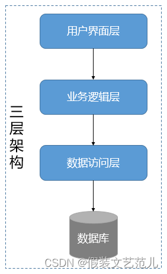
**分层的设计原则是：保证同一层的组件处于同一个抽象层次**。即所谓的“单一抽象层次原则”。这一原则可以运用到分层架构中。比如下图所示：

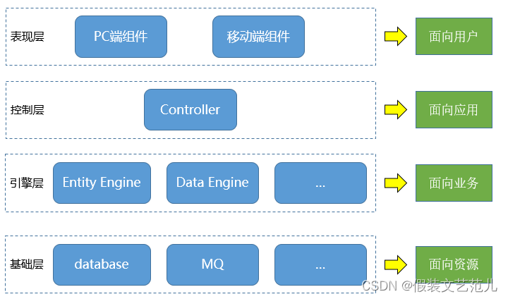

#### **封装**

假设我们有一个程序，它在逻辑上有一些不同的对象，并且这些对象彼此之间会相互交流。

**在一个类中，当每个对象的状态保持相对孤立，就实现了封装**。其余的对象并不能观察到这个对象的状态。他们能做到的只有调用一些被称作“方法”的通用功能。

因此，对象使用方法掌控着自己的状态，除非明确允许，没有其他人可以接触到它。如果你想和某个对象交流，你需要使用提供的方法。但在默认情况下，你无法改变对象的状态。

### **案例：电商订单系统**

这个看不明白也没关系，懂个大概然后自己上手写明白了

#### **概述**

电商所有模块中，订单系统是非常核心的一个子系统，决定了整个流程能不能顺畅的执行，起着承上启下的作用，其他模块都是围绕订单系统进行构建的。订单系统出问题，或者功能流程设计不完善、不准确，将会造成整个电商系统整体或局部业务流转不顺畅，甚至导致项目的失败。

订单系统的作用是：管理订单类型、订单状态，收集关于商品、优惠、用户、收货信息、支付信息等一系列的订单实时数据，进行库存更新、订单下发等一系列动作。订单系统业务的基本模型涉及用户、商品（库存）、订单、付款。订单基本流程是下订单-->减库存，这两步必须同时完成，不能下了订单不减库存（超卖），或者减了库存没有生成订单（少卖）。

下面我们从需求分析的角度，来看一看B2C电商中先款后货模式下的订单系统设计的过程。

#### **角色**

一个订单系统，涉及到的角色包括：

**实体角色：**

- C端用户
- B端商户
- 电商平台
- 配送商
- 第三方平台

#### **系统关系：**

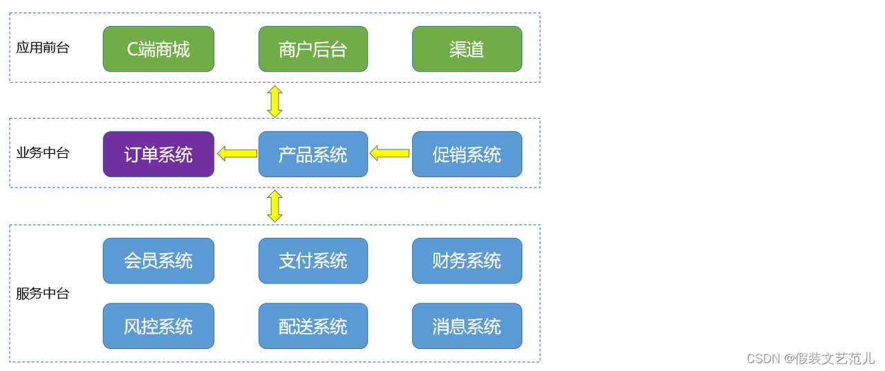**场景(用例)**

从用户的角度，我们看到的用户场景如下：

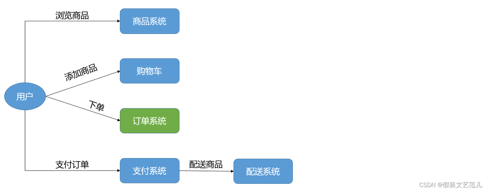

**用例图：**

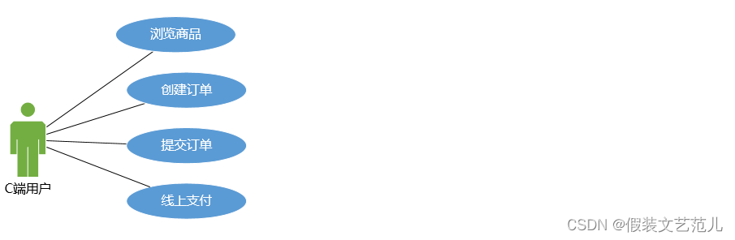

#### **功能**

**订单系统业务架构：**

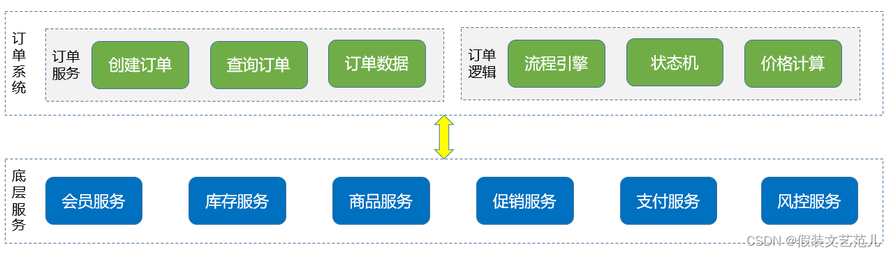

**（1）订单服务**

该模块的主要功能是用户日常使用的服务和页面，主要有订单列表、订单详情、在线下单等，还包括为公共业务模块提供的多维度订单数据服务。

**（2）订单逻辑**

订单系统的核心，起着至关重要的作用，在订单系统负责管理订单创建、订单支付、订单生产、订单确认、订单完成、取消订单等订单流程。还涉及到复杂的订单状态规则、订单金额计算规则以及增减库存规则等。在4节核心功能设计中会重点来说。

**（3）底层服务**

信息化建设达到一定程度的企业，一般会将公司公共服务模块化，比如：产品，会构建对应的产品系统，代码、数据库，接口等相对独立。但是，这也带来了一个问题，比如：订单创建的场景下需要获取的信息分散在各个系统。

如果需要从各个公共服务系统调用：一是会花费大量时间，二是代码的维护成本非常高。因此，订单系统接入所需的公共服务模块接口，在订单系统即可完成对接公共系统的服务。

#### **实体**

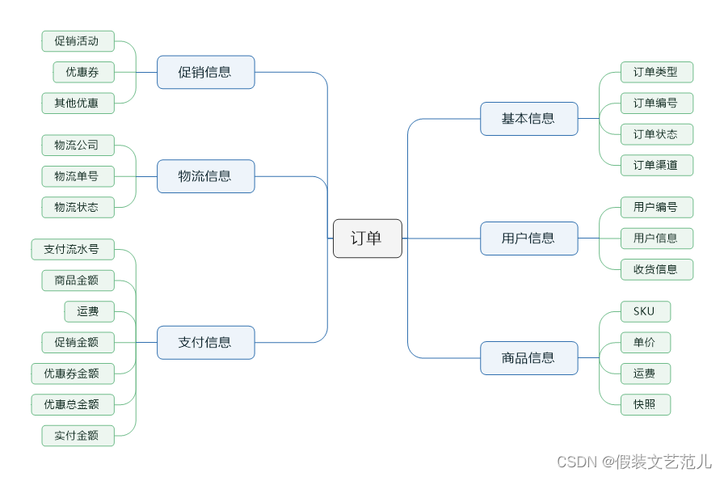

#### **流程**

流程是指从平台角度出发，将订单从创建到完成的整个流转过程进行抽象，从而形成了一套标准流程规则。每个流程触发的条件又可分为系统触发和人工触发两种场景。

下面以一个通用B2C商城的订单系统为例，根据其实际业务场景，其订单流程可抽象为5大步骤：**订单创建>订单支付>订单生产>订单确认>订单完成。** 如下图：

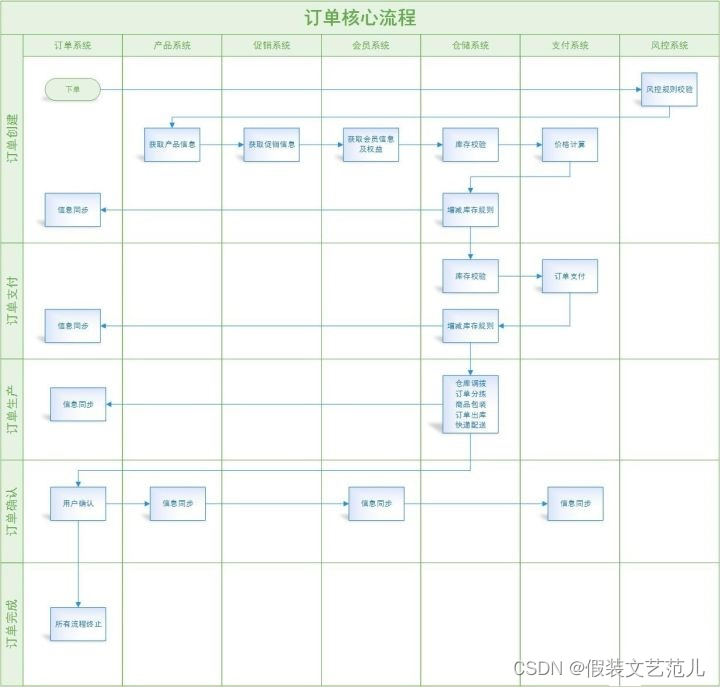

## 如何写好一个项目

### 代码规范

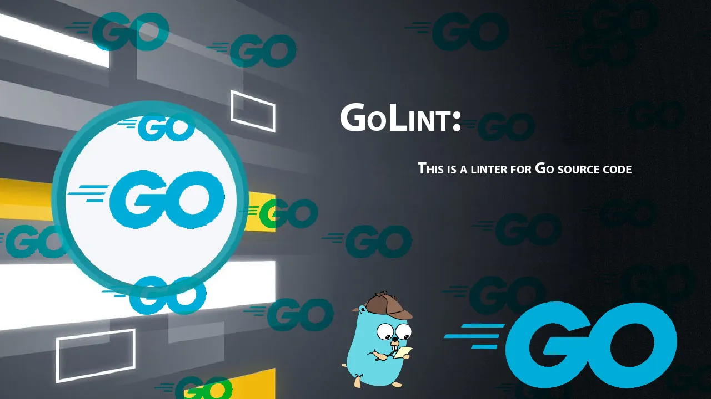

**代码规范**其实是一个老生常谈的问题，我们也不能免俗还是要简单介绍一下相关的内容，Go 语言比较常见并且使用广泛的代码规范就是官方提供的 [Go Code Review Comments](https://github.com/golang/go/wiki/CodeReviewComments)，无论你是短期还是长期使用 Go 语言编程，都应该**至少完整地阅读一遍这个官方的代码规范指南**，它既是我们在写代码时应该遵守的规则，也是在代码审查时需要注意的规范。

**学习 Go 语言相关的代码规范是一件非常重要的事情**，也是让我们的项目遵循统一规范的第一步，虽然阅读代码规范相关的文档非常重要，但是实际开发过程中不能保证所有人（包括自己）都能完成的遵循代码规范的，所以需要一个自动化工具来校验/限制不规范的代码。

**[golangci-lint](https://golangci-lint.run/)** 是一个绝大多数 go 开发者都熟悉的一个工具，可以校验任何 go 项目的代码规范，能够指出不规范的部分，并且支持指定开启/关闭部分类型的校验。

下面是一个写得很好的规范指南，一定要看，而且不能只过一遍就完了，要反复阅读，反复品味才行：

- [Go 语言编码规范](https://yusank.space/posts/go-standard/#介绍)

https://github.com/maodou1990/code_review_comments_cn 中文翻译

### 如何做好架构设计

▐ **行为和架构哪个重要？**

一个软件的行为固然是很重要的，因为**一个不能按预定行为工作的软件是不会产生价值的**，所以很多程序员认为能实现软件行为是最重要的，根本不该关心架构，反正坏的架构也不是实现不了行为，出了 bug 修复即可。我认为，他们忽略的是随着软件行为的改动，坏的架构将导致他们自己的工作越来越难以进行，改动的代码越来越大，bug 越来越多，项目最终可能不可维护。

一个软件的架构虽然不直接表现在行为上，但其最大的特点就是良好的**可变性**，即使目前行为不符合预期，也能通过低成本的改动将行为改变到预期。

可运行不可变的软件，最终会因为无法改变而导致行为无法迭代或者迭代慢而变成没有价值。可变不可运行的软件，可通过迭代，变成可运行可变软件，所以**架构比行为更重要**。

▐ **恶魔小时候也可爱**


一个不太好的架构，在项目初期有时难以察觉，因为此时项目模块少，功能少，依赖关系显而易见，一切显得毫无恶意，甚至有点简洁美。但是，恶魔小时候往往也很可爱。随着项目的增长，模块增加了，开发人员变多了，恶魔长大了。架构带来的问题逐渐暴露了出来，混乱的层次关系，毫无章法的依赖关系，模块权责不清等问题接踵而至。

对开发人员而言，项目理解成本不断增加，添加小功能都要先理清好几个模块的调用关系，难以测试导致上线后 bug 防不胜防，组件无法复用。项目逐渐长成大家闻风丧胆，避而不及的“大恶魔”。

虽然我们也反对过度设计，但是识别，或者说猜测项目未来符合逻辑的可能变动，将架构设计考虑进项目早期是十分有必要的，**架构设计和调整应该贯穿项目的整个成长过程。**

▐ **架构的理解成本**

架构是有一定理解成本的，甚至架构设计之初会增加一定的系统理解成本，但是一个好的架构理解成本一定不会很高，因为架构的理解也是人力成本。在理解架构设计的意图之前，因为其增加系统的理解成本而否定它的必要性是不合逻辑的。

好的架构，其关键意义在于降低项目发展过程中整体理解成本。

也就是说，架构良好的项目随着业务复杂度增加，项目理解成本增长也是缓慢的。架构不合理的项目随着业务复杂度的增加，整体理解成本可能是指数增长的。

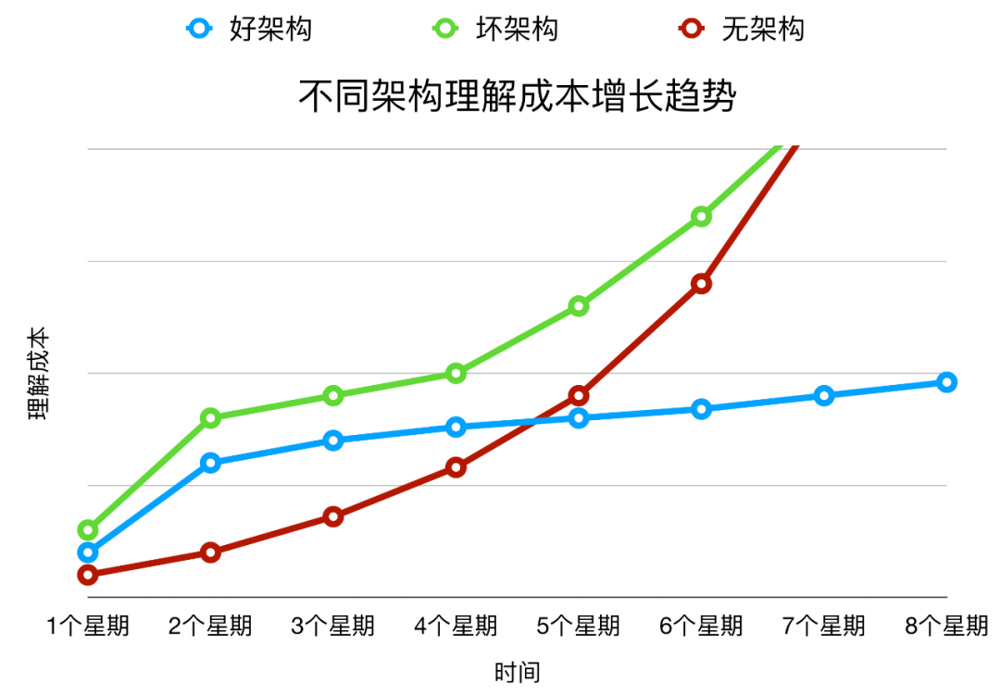

### **通用应用目录分层**

**目录结构基本上就是一个项目的门面**，很多时候我们从目录结构中就能够看出开发者对这门语言是否有足够的经验，所以在这里首先要介绍的最佳实践就是如何在 Go 语言的项目或者服务中组织代码。

官方并没有给出一个推荐的目录划分方式，很多项目对于目录结构的划分也非常随意，这其实也是没有什么问题的，但是社区中还是有一些比较常见的约定，例如：[golang-standards/project-layout](https://github.com/golang-standards/project-layout) 项目中就定义了一个比较标准的目录结构。

```Plaintext
------------------------- go目录 ----------------------------
/cmd：项目的可执行文件名称相符，通常有一个简短的main函数。从/internal和/pkg目录导入代码。其他没有了
/internal： 私有应用程序和库代码
/pkg：外部应用可以导入的库代码
/vendor：应用程序依赖项
-----------------服务应用程序目录 ---------------
/api：协议文件
/web:  静态web组件
-----------------通用应用目录 ---------------
/configs：项目的默认配置
/init：system init （systemd，upstart，sysv) 配置
/scripts：执行各种构建、安装、分析等操作的脚本
/build：打包和持续集成
/deployments：部署配置
/test：测试
-----------------其他目录 ---------------
/docs：文档
/tools：项目支持的工具
/examples：应用程序和公共库实例
/third_party：外部工具
/githooks: -
/assets: 图片和其他存储的文件
/website：-
不应该有的目录
/src：请不要将项目级别的src目录和工作空间的src目录混淆。
```

#### **Go 目录**

**▐** **cmd**

当前项目的**可执行文件**。`cmd` 目录下的每一个**子目录名称都应该匹配可执行文件**。比如果我们的项目是一个 `grpc` 服务，在 /cmd/**myapp**/main.go 中就包含了启动服务进程的代码，编译后生成的可执行文件就是 ▐ **myapp**。

不要在 `/cmd` 目录中放置太多的代码，我们应该将**公有代码**放置到 `/pkg` 中，将**私有代码**放置到 `/internal` 中并在 `/cmd` 中引入这些包，**保证** **main** **函数中的代码尽可能简单和少**。

例子：

- [moby](https://github.com/moby/moby/tree/master/cmd)
- [prometheus](https://github.com/prometheus/prometheus/tree/master/cmd)
- [influxdb](https://github.com/influxdata/influxdb/tree/master/cmd)
- [kubernetes](https://github.com/kubernetes/kubernetes/tree/master/cmd)

> 注：`cmd` 目录存在有一个前提，那就是项目有**多个可执行文件**，如果你的项目是**微服务**，那么通常是**只有一个可执行文件**的。这时，建议大家直接将 `main.go` 放在项目根目录下，而取消 `cmd` 目录。

▐ **internal**

**私有的**应用程序代码库。这些是不希望被其他人导入的代码。请注意：这种模式是 Go **编译器强制执行**的。有关更多细节，请参阅 Go 1.4 的 [release notes](https://golang.org/doc/go1.4#internalpackages)。并且，在项目的目录树中的**任意位置都可以有 internal 目录**，而不仅仅是在顶级目录中。

私有代码推荐放到 `/internal` 目录中，真正的项目代码应该写在 `/internal/app` 里，同时这些内部应用依赖的代码库应该在 `/internal/pkg` 子目录和 `/pkg` 中，下图展示了一个使用 `/internal` 目录的项目结构：

当我们在其他项目引入包含 `internal` 的依赖时，Go 语言会在编译时报错：

```Plaintext
An import of a path containing the element “internal” is disallowed
if the importing code is outside the tree rooted at the parent of the
"internal" directory.
```

这种错误只有在被引入的 `internal` 包不存在于当前项目树中才会发生，如果在同一个项目中引入该项目的 `internal` 包并不会出现这种错误。

▐ **pkg**

**外部应用程序**可以使用的库代码（如，`/pkg/mypubliclib`）。其他项目将会导入这些库来保证项目可以正常运行，所以在将代码放在这里前，一定要三思而行。请注意，`internal` 目录是一个更好的选择来确保项目私有代码不会被其他人导入，因为这是 Go 强制执行的。使用 `/pkg` 目录来明确表示代码可以被其他人安全的导入仍然是一个好方式。Travis Jeffery 撰写的关于 [I’ll take pkg over internal](https://travisjeffery.com/b/2019/11/i-ll-take-pkg-over-internal/) 文章很好地概述了 `pkg` 和 `inernal` 目录以及何时使用它们。

`/pkg` 在许多开源项目中都使用了，但**未被普遍接受，并且 Go 社区中的某些人不推荐这样做**。

如果**项目确实很小**并且嵌套的层次并不会带来多少价值（除非你就是想用它），那么就不要使用它。**但当项目变得很大，并且根目录中包含的内容相当繁杂**（尤其是有很多非 Go 的组件）时，可以考虑使用 `/pkg`。

例子：

- [prometheus](https://github.com/prometheus/prometheus) 上报和存储指标的时序数据库
- [istio](https://github.com/istio/istio) 服务网格 2.0
- [kubernetes](https://github.com/kubernetes/kubernetes) 容器调度管理系统
- [grafana](https://github.com/grafana/grafana) 展示监控和指标的仪表盘

> 注：
>
> - 对于 `pkg` 目录，如果是在**微服务下，更我建议尽量不使用它**。因为微服务，每个服务都会相对简单，也就是**项目都比较小** pkg 不会带来多大价值。
> - 如果有**公用的代码**，这里更建议大家将这类代码做成**私有库（go module）**，供其他项目复用，**做了物理隔离，更有利于代码的抽象**。
> - 但是，有一种情况，可以考虑使用 `pkg`，那就是有一类**公用的代码只在有限几个项目中可公用**。比如：在**权限服务**中需要使用到**用户服务**的 `User` 结构体，那这种公用的代码，可以考虑放在用户服务的 `pkg` 中，供权限服务引用。
>
> 注：在 Go 语言中组织代码的方式还有一种叫”平铺“的，也就是**在根目录下放项目的代码**。这种方式在很多**框架或者库**中非常常见，如果想要引入一个使用 pkg 目录结构的框架时，我们往往需要使用 `github.com/golang/project/pkg/somepkg`，当代码都平铺在项目的根目录时只需要使用 `github.com/golang/project`，很明显地减少了引用依赖包语句的长度。所以，对于一个 Go 语言的**框架或者库，将代码平铺在根目录下也很正常**，但是在一个 Go 语言的**服务中使用这种代码组织方法可能就没有那么合适了**。

#### **服务端应用程序目录**

▐ **api**

`/api` 目录中存放的就是当前项目对外提供的各种不同类型的 API 接口定义文件了，其中可能包含类似 `/api/protobuf-spec`、`/api/thrift-spec` 或者 `/api/http-spec` 的目录，这些目录中包含了当前项目对外提供的和依赖的所有 API 文件：

$ tree ./api

api

└── user

└── auth

└── comment

二级目录的主要作用就是在一个项目同时提供了多种不同的访问方式时，用这种办法避免可能存在的潜在冲突问题，也可以让项目结构的组织更加清晰。

#### **Web应用目录**

常见的业务项目基本目录结构如下：

```Plaintext
    ├── app ----------------------------- (项目文件)
        ├── api ------------------------- (对外接口)
                ├── global ---------------------- (全局组件对象)
                ├── internal -------------------- (内部逻辑)
                        ├── middleware -------------- (中间件)
                        ├── model ------------------- (模型层)
                        ├── service ----------------- (服务层)
                ├── router ---------------------- (路由层)
    ├── manifest ------------------------ (交付清单)
       ├── deploy ----------------------- (部署配置文件)
          ├── docker -------------------- (docker配置文件)
          ├── kustomize ----------------- (k8s配置文件)
       ├── sql -------------------------- (mysql初始化配置文件)
    ├── utils/tools --------------------------- (工具包)
    ├── build.sh ------------------------ (应用运行脚本)
    ├── docker-compolse.yml ------------- (容器构建配置)
    ├── go.mod -------------------------- (go依赖)
    ├── main.go ------------------------- (项目运行入口)
    ├── README.md ----------------------- (项目说明文档)
```

##### 对外接口 (api)

服务接口的职责类似于三层架构设计中的`UI`表示层，负责接收并响应客户端的输入与输出，包括对输入参数的过滤、转换、校验，对输出数据结构的维护，并调用 `service` 实现业务逻辑处理。

##### **业务实现 (service)**

业务实现的职责类似于三层架构设计中的`BLL`业务逻辑层，负责具体业务逻辑的实现以及封装。

一是用于解耦业务模块之间的调用。

二是负责具体业务逻辑的实现以及封装。

##### **结构模型 (model)**

`model`包的职责类似于三层架构中的`Model`模型定义层。模型定义代码层中仅包含全局公开的数据结构定义，往往不包含方法定义。

这里需要注意的是，这里的`model`不仅负责维护数据实体对象（`entity`）结构定义，也包括所有的输入/输出数据结构定义，被`service`共同引用。这样做的好处除了可以统一管理公开的数据结构定义，也可以充分对同一业务领域的数据结构进行复用，减少代码冗余。

▐ 数据模型 - `entity`

与数据集合绑定的程序数据结构定义，通常和数据表一一对应。

▐ 业务模型 - `model`

与业务相关的通用数据结构定义，其中包含大部分的方法输入输出定义。

▐ 数据访问 - `dao`

`dao`的职责类似于三层架构中的`DAL`数据访问层，数据访问层负责所有的数据访问收口。

##### **如何清晰界定和管理**`service`**和**`dao`**的分层职责**

这是一个很经典的问题。

**痛点：**

常见的，开发者把数据相关的业务逻辑实现封装到了`dao`代码层中，而`service`代码层只是简单的`dao`调用，这么做的话会使得原本负责维护数据的`dao`层代码越来越繁重，反而业务逻辑`service`层代码显得比较轻。开发者存在困惑，我写的业务逻辑代码到底应该放到`dao`还是`service`中？

业务逻辑其实绝大部分时候都是对数据的`CURD`处理，这样做会使得几乎所有的业务逻辑会逐步沉淀在`dao`层中，业务逻辑的改变其实会频繁对`dao`层的代码产生修改。例如：数据查询在初期的时候可能只是简单的逻辑，目前代码放到`dao`好像也没问题，但是查询需求增加或变化变得复杂之后，那么必定会继续维护修改原有的`dao`代码，同时`service`代码也可能同时做更新。原本仅限于`service`层的业务逻辑代码职责与`dao`层代码职责模糊不清、耦合较重，原本只需要修改`service`代码的需求变成了同时修改`service`+`dao`，使得项目中后期的开发维护成本大大增加。

**建议：**

我们的建议。`dao`层的代码应该尽量保证通用性，并且大部分场景下不需要增加额外方法，只需要使用一些通用的链式操作方法拼凑即可满足。业务逻辑、包括看似只是简单的数据操作的逻辑都应当封装到`service`中，`service`中包含多个业务模块，每个模块独自管理自己的`dao`对象，`service`与`service`之间通过相互调用方法来实现数据通信而不是随意去调用其他`service`模块的`dao`对象。

**为什么要使用**`internal`**目录包含业务代码**

`internal`目录是`Golang`语言专有的特性，**防止同级目录外的其他目录引用其下面的内容**。业务项目中存在该目录的目的，是避免若项目中存在多个子项目（特别是大仓管理模式时），多个项目之间无限制随意访问，造成难以避免的多项目不同包之间耦合。

### RESTful API 设计

REST（英文：Representational State Transfer，简称REST，直译过来表现层状态转换）是一种软件架构风格、设计风格，而不是标准，只是提供了一组设计原则和约束条件。它主要用于客户端和服务器交互类的软件。基于这个风格设计的软件可以更简洁，更有层次，更易于实现缓存等机制。

需要注意的是**REST**并没有一个明确的标准，而更像是一种设计的风格**，满足这种设计风格的程序或接口我们称之为RESTful(从单词字面来看就是一个形容词)。所以RESTful API 就是满足REST架构风格的接口。

总结一下什么是 RESTful 架构：

- 每一个 URI 代表一种资源；
- 客户端和服务器之间，传递这种资源的某种表现层；
- 客户端通过四个 HTTP 动词，对服务器端资源进行操作，实现 “表现层状态转化”。

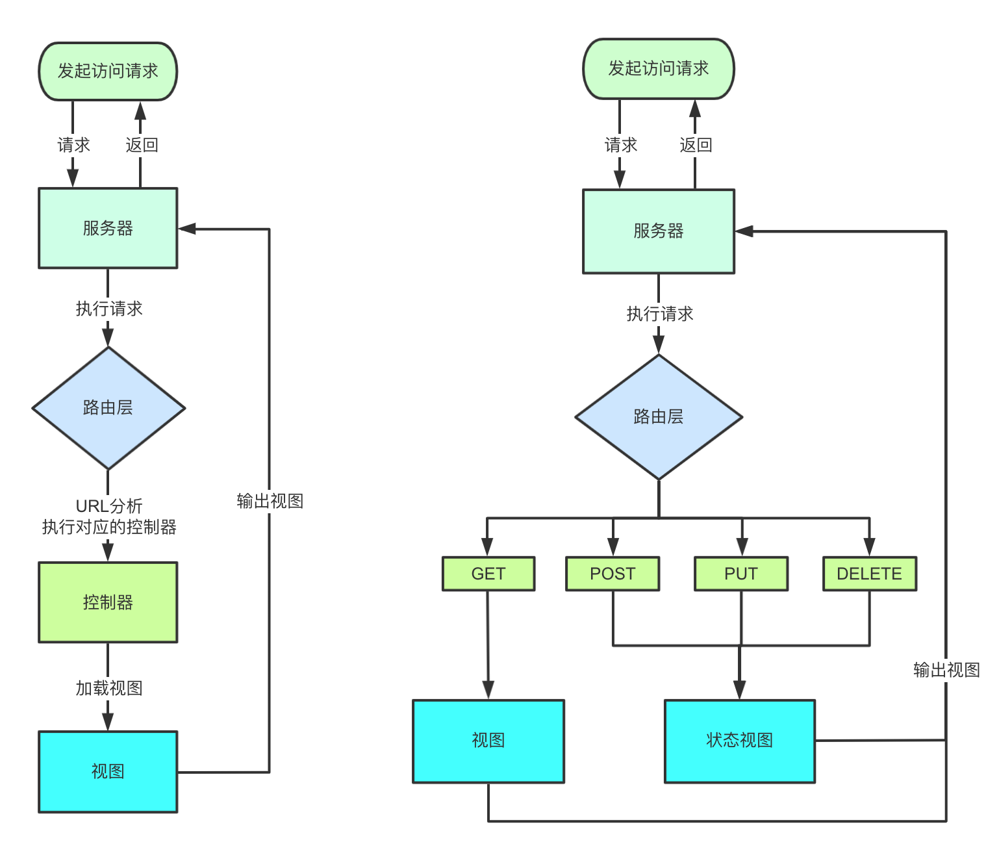

▐ **URI指向资源**

URI = Universal Resource Identifier 统一资源标志符，用来标识抽象或物理资源的一个紧凑字符串。URI包括URL和URN，在这里更多时候可能代指URL(统一资源定位符)。RESTful是面向资源的，每种资源可能由一个或多个URI对应，但一个URI只指向一种资源。

▐ **无状态**

服务器不能保存客户端的信息， 每一次从客户端发送的请求中，要包含所有必须的状态信息，会话信息由客户端保存， 服务器端根据这些状态信息来处理请求。 当客户端可以切换到一个新状态的时候发送请求信息， 当一个或者多个请求被发送之后, 客户端就处于一个状态变迁过程中。 每一个应用的状态描述可以被客户端用来初始化下一次的状态变迁。

#### **URI**设计

在RESTful API设计中，最主要的目的其实是**让整个接口更具有自描述性**，这样在接口的易用性上和可维护性上才能有更好的表现。

关于资源的URI，简单来讲就是用来在web环境下**如何定位一个资源的描述标准**。

URL为统一资源定位器 ,接口属于服务端资源，首先要通过URL这个定位到资源才能去访问，而通常一个完整的URL组成由以下几个部分构成：

```Shell
URI = scheme "://" host  ":"  port "/" path [ "?" query ][ "#" fragment ]
```

- **scheme**： 指底层用的协议，如http、https、ftp
- 如果能全站 HTTPS 当然是最好的，不能的话也请尽量将登录、注册等涉及密码的接口使用 HTTPS。
- **host**：服务器的IP地址或者域名
- **port**： 端口，http默认为80端口
- **domain**：域名，等同于 host + port

应该尽量将API部署在专用域名之下。

```Plain
https://api.example.com
```

如果确定API很简单，不会有进一步扩展，可以考虑放在主域名下。

```Plain
https://example.org/api/
```

- **path**：访问资源的路径，就是各种web 框架中定义的route路由
- **query**: 查询字符串，为发送给服务器的参数，在这里更多发送数据分页、排序等参数。
- **fragment**：锚点，定位到页面的资源

我们在设计API时URL的path是需要认真考虑的，而RESTful对path的设计做了一些规范，通常一个RESTful API的path组成如下：

```Plain
/{version}/{resources}/{resource_id}
```

- **version**：API版本号，有些版本号放置在头信息中也可以，通过控制版本号有利于应用迭代。

```JavaScript
https://api.example.com/v1/
```

应该将API的版本号放入URL。

另一种做法是，将版本号放在HTTP头信息中，但不如放入URL方便和直观。[Github](https://developer.github.com/v3/media/#request-specific-version)采用这种做法。

- **resources**：资源，RESTful API推荐用小写英文单词的复数形式。
- **resource_id**：资源的id，访问或操作该资源。

当然，有时候可能资源级别较大，其下还可细分很多子资源也可以灵活设计URL的path，例如：

```Plain
/{version}/{resources}/{resource_id}/{subresources}/{subresource_id}
```

从大体样式了解URL路径组成之后，对于RESTful API的URL具体设计的规范如下：

1. 不用大写字母，所有单词使用英文且小写。
2. 正确使用 `"/"`表示层级关系,URL的层级不要过深，并且越靠前的层级应该相对越稳定
3. 结尾不要包含正斜杠分隔符`"/"`
4. URL中不出现动词，用请求方式表示动作
5. 资源表示用复数不要用单数
6. 不要使用文件扩展名

RESTful API的资源URI一般由两个部分组成的：Path和Query Parameters

#### **方法设计**

在RESTful API中，不同的HTTP请求方法有各自的含义，

这里就展示GET,POST,PUT,DELETE几种请求API的设计与含义分析。针对不同操作，具体的含义如下：

```Bash
GET /collection：从服务器查询资源的列表（数组）
GET /collection/resource：从服务器查询单个资源
POST /collection：在服务器创建新的资源
PUT /collection/resource：更新服务器资源
DELETE /collection/resource：从服务器删除资源
```

#### 返回值和状态码

服务端处理完成后客户端也可能不知道具体成功了还是失败了，服务器响应时，包含**状态码**和**返回数据**两个部分。

我们首先要正确使用各类状态码来表示该请求的处理执行结果。状态码主要分为五大类：

> 1xx：相关信息 2xx：操作成功 3xx：重定向 4xx：客户端错误 5xx：服务器错误

每一大类有若干小类，状态码的种类比较多，而主要常用状态码罗列在下面：

200 `OK - [GET]`：服务器成功返回用户请求的数据，该操作是幂等的（Idempotent）。 201 `CREATED - [POST/PUT/PATCH]`：用户新建或修改数据成功。 202 `Accepted - [*]`：表示一个请求已经进入后台排队（异步任务） 204 `NO CONTENT - [DELETE]`：用户删除数据成功。 400 `INVALID REQUEST - [POST/PUT/PATCH]`：用户发出的请求有错误，服务器没有进行新建或修改数据的操作，该操作是幂等的。 401 `Unauthorized - [*]`：表示用户没有权限（令牌、用户名、密码错误）。 403 `Forbidden - [*]` 表示用户得到授权（与401错误相对），但是访问是被禁止的。 404 `NOT FOUND - [*]`：用户发出的请求针对的是不存在的记录，服务器没有进行操作，该操作是幂等的。 406 `Not Acceptable - [GET]`：用户请求的格式不可得（比如用户请求JSON格式，但是只有XML格式）。 410 `Gone -[GET]`：用户请求的资源被永久删除，且不会再得到的。 422 `Unprocesable entity - [POST/PUT/PATCH]` 当创建一个对象时，发生一个验证错误。 500 `INTERNAL SERVER ERROR - [*]`：服务器发生错误，用户将无法判断发出的请求是否成功。

在使用 HTTP Status Code 的基础上，还需要有业务错误码，通过code字段返回。错误码由各业务方自行约定，业务内部自行划分区段。

针对不同操作，服务器向用户返回数据，而各个团队或公司封装的返回实体类也不同，但都返回JSON格式数据给客户端。

使用相同的 HTTP 响应结构，推荐使用下列结构：

```JSON
{

  "code": 0,            # 错误码，请求成功时返回0
  "msg": "success",     # 错误信息，请求成功时返回"success"
  "ok": true,           # 返回状态是否成功
  "data": {             # 数据内容，结构必须为object，使用 list/string 均不合规范
    "id": 1,
    "name": "abc"
  },
  "extra": {            # 错误码非0时，data应为空，推荐extra字段返回错误时需要携带的信息
  
  }
}
```

另外需要强调的是，每一个接口都要可以完成一整个业务逻辑，而不是通过调用方组合多个接口完成一个业务逻辑。

比如，创建一个员工记录的时候，需要调用政府的一个系统接口对其SIN（社会保险号）进行校验，那么最佳的实现方式是，要有一个创建员工记录接口一次性完成所有的SIN校验以及记录创建，如下，

**good**

```Plain
POST: http://www.goodhr.com/api/v1/companies/66/employees
```

请求体

```JSON
{
    "firstname": "Steve",
    "lastname": "Bill",
    "birthDate": "1982-01-01",
    "gender": "male",
    "hiredDate": "2019-01-01",  
    "socialSecurityNumber": "1234567890123456789"
}
```

相反，有的时候会有人把这两个逻辑拆分为两个独立的接口来提供，就会变成下面的效果

**bad**

校验社会保险号

```Plain
GET: http://www.goodhr.com/api/v1/sin-record/1234567890123456789
```

创建员工记录

```Plain
POST: http://www.goodhr.com/api/v1/companies/66/employees
```

请求体

```Plain
{
    "firstname": "Steve",
    "lastname": "Bill",
    "birthDate": "1982-01-01",
    "gender": "male",
    "hiredDate": "2019-01-01",  
    "socialSecurityNumber": "1234567890123456789"
    "sinVerfiied": true
}
```

### Git 提交规范

尽管现在你只是一个人负责后端项目的编写，但是在不久的将来你很有可能在大型公司或者开源社区进行团队协作，因此掌握良好的团队协作能力与 git 提交规范也十分重要

[Commit message](https://www.ruanyifeng.com/blog/2016/01/commit_message_change_log.html)

[如何使用 git 与 github 进行团队开发](https://zhuanlan.zhihu.com/p/23478654)

不会现在还有人在用 upload files 上传代码吧😠

## **🔧 实操**


## **一些好的 Web 项目**

[gin-vue-admin](https://github.com/flipped-aurora/gin-vue-admin)

[alist](https://github.com/alist-org/alist)

[awesome-gf](https://github.com/gogf/awesome-gf)

## **作业**

**Lv.0**

反复阅读本次课件，对项目知识有个大概印象
