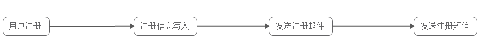
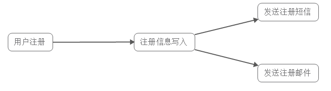
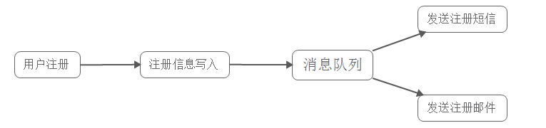
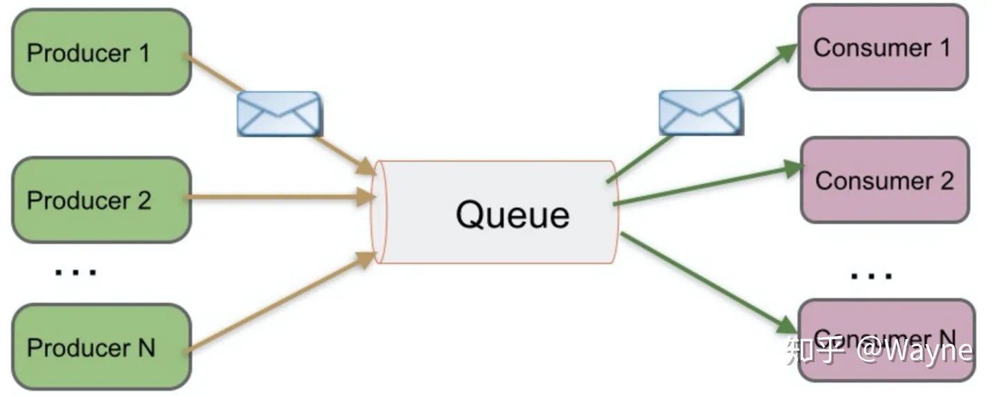
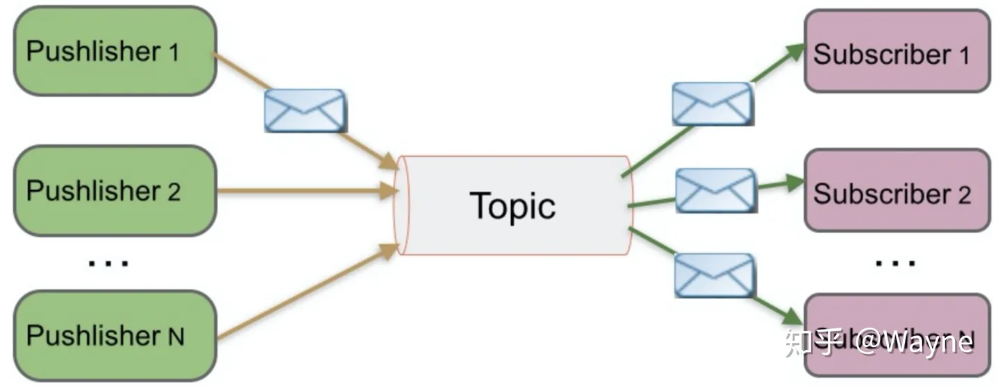
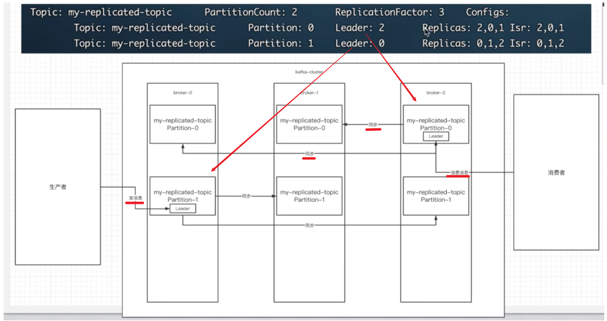
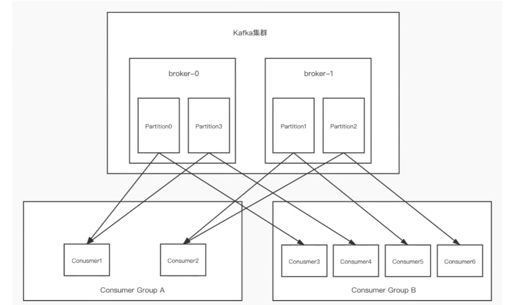
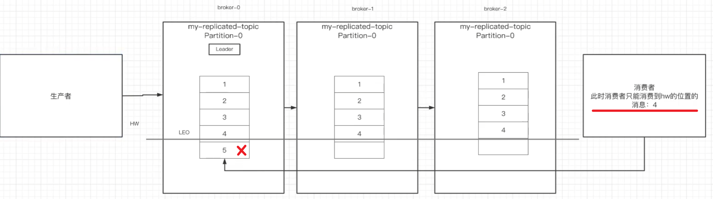

### 一、消息队列(MQ)概述

消息队列（Message Queue），是分布式系统中重要的组件，其通用的使用场景可以简单地描述为：

> 当不需要立即获得结果，但是并发量又需要进行控制的时候，大概就是需要使用消息队列的时候。

消息队列主要解决了应用耦合、异步处理、流量削锋等问题。

### 二、消息队列使用场景

#### 2.1 异步处理

多应用对消息队列中同一消息进行处理，应用间并发处理消息，相比串行处理，减少处理时间；

具体场景：用户为了使用某个应用，进行注册，系统需要发送注册邮件并验证短信。对这两个操作的处理方式有两种：串行及并行。

（1）串行方式：新注册信息生成后，先发送注册邮件，再发送验证短信；

  

在这种方式下，需要最终发送验证短信后再返回给客户端。


（2）并行处理：新注册信息写入后，由发短信和发邮件并行处理； 

  

在这种方式下，发短信和发邮件 需处理完成后再返回给客户端。

假设以上三个子系统处理的时间均为50ms，且不考虑网络延迟，则总的处理时间：

> 串行：50+50+50=150ms  并行：50+50 = 100ms

若使用消息队列：

  

并在写入消息队列后立即返回成功给客户端，则总的响应时间依赖于写入消息队列的时间，而写入消息队列的时间本身是可以很快的，基本可以忽略不计，因此总的处理时间相比串行提高了2倍，相比并行提高了一倍；


#### 2.2 应用耦合

多应用间通过消息队列对同一消息进行处理，避免调用接口失败导致整个过程失败；

具体场景：用户使用QQ相册上传一张图片，人脸识别系统会对该图片进行人脸识别，一般的做法是，服务器接收到图片后，图片上传系统立即调用人脸识别系统，调用完成后再返回成功，如下图所示：

  

该方法有如下缺点：


- 人脸识别系统被调失败，导致图片上传失败；
- 延迟高，需要人脸识别系统处理完成后，再返回给客户端，即使用户并不需要立即知道结果；
- 图片上传系统与人脸识别系统之间互相调用，需要做耦合；


若使用消息队列：


  

客户端上传图片后，图片上传系统将图片信息如uin、批次写入消息队列，直接返回成功；而人脸识别系统则定时从消息队列中取数据，完成对新增图片的识别。 

此时图片上传系统并不需要关心人脸识别系统是否对这些图片信息的处理、以及何时对这些图片信息进行处理。事实上，由于用户并不需要立即知道人脸识别结果，人脸识别系统可以选择不同的调度策略，按照闲时、忙时、正常时间，对队列中的图片信息进行处理。


#### 2.3 限流削峰

广泛应用于秒杀或抢购活动中，避免流量过大导致应用系统挂掉的情况；

具体场景：购物网站开展秒杀活动，一般由于瞬时访问量过大，服务器接收过大，会导致流量暴增，相关系统无法处理请求甚至崩溃。而加入消息队列后，系统可以从消息队列中取数据，相当于消息队列做了一次缓冲。

  

该方法有如下优点： 

1. 请求先入消息队列，而不是由业务处理系统直接处理，做了一次缓冲,极大地减少了业务处理系统的压力； 
2. 队列长度可以做限制，事实上，秒杀时，后入队列的用户无法秒杀到商品，这些请求可以直接被抛弃，返回活动已结束或商品已售完信息；


#### 2.4 消息驱动的系统

系统分为消息队列、消息生产者、消息消费者，生产者负责产生消息，消费者(可能有多个)负责对消息进行处理；

具体场景：用户新上传了一批照片， 人脸识别系统需要对这个用户的所有照片进行聚类，聚类完成后由对账系统重新生成用户的人脸索引(加快查询)。这三个子系统间由消息队列连接起来，前一个阶段的处理结果放入队列中，后一个阶段从队列中获取消息继续处理。

  

该方法有如下优点：

- 避免了直接调用下一个系统导致当前系统失败；
- 每个子系统对于消息的处理方式可以更为灵活，可以选择收到消息时就处理，可以选择定时处理，也可以划分时间段按不同处理速度处理；


### **三、消息系统分类**

我们知道常见的消息系统有RabbtMQ、RocketMQ、Kafka、ZeroMQ等，但是这些消息系统中所使用的消息模式如下两种：

#### 3.1 **Peer-to-Peer (Queue)**

简称PTP队列模式，也可以理解为点到点。例如单发邮件，我发送一封邮件给小徐，我发送过之后邮件会保存在服务器的云端，当小徐打开邮件客户端并且成功连接云端服务器后，可以自动接收邮件或者手动接收邮件到本地，当服务器云端的邮件被小徐消费过之后，云端就不再存储(这根据邮件服务器的配置方式而定)。


  


**Peer-to-Peer模式工作原理：**

1. 消息生产者`Producer1`生产消息到`Queue`，然后`Consumer1`从Queue中取出并且消费消息。
2. 消息被消费后，`Queue`将不再存储消息，其它所有`Consumer`不可能消费到已经被其它Consumer消费过的消息。
3. `Queue`支持存在多个`Producer`，但是对一条消息而言，只会有一个`Consumer`可以消费，其它Consumer则不能再次消费。
4. 但`Consumer`不存在时，消息则由`Queue`一直保存，直到有`Consumer`把它消费。

#### 3.2 **Publish/Subscribe（Topic）**

简称发布/订阅模式。例如我微博有30万粉丝，我今天更新了一条微博，那么这30万粉丝都可以接收到我的微博更新，大家都可以消费我的消息。

> 注：以下图示中的`Pushlisher`是错误的名词，正确的为`Publisher`


  


**Publish/Subscribe模式工作原理：**

1. 消息发布者`Publisher`将消息发布到主题`Topic`中，同时有多个消息消费者 `Subscriber`消费该消息。
2. 和PTP方式不同，发布到`Topic`的消息会被所有订阅者消费。
3. 当发布者发布消息，不管是否有订阅者，都不会报错信息。
4. 一定要先有消息发布者，后有消息订阅者。

**注意：Kafka所采用的就是发布/订阅模式，被称为一种高吞吐量、持久性、分布式的发布订阅的消息队列系统。**


### 四、kafka 介绍

#### 3.1 Kafka是什么？

> Kafka是Apache旗下的一款分布式流媒体平台，Kafka是一种高吞吐量、持久性、分布式的发布订阅的消息队列系统。 它最初由LinkedIn(领英)公司发布，使用Scala语言编写，与2010年12月份开源，成为Apache的顶级子项目。

**Kafka三大特点**

1.**高吞吐量**：可以满足每秒百万级别消息的生产和消费。

2.**持久性**：有一套完善的消息存储机制，确保数据高效安全且持久化。

3.**分布式**：基于分布式的扩展；Kafka的数据都会复制到几台服务器上，当某台故障失效时，生产者和消费者转而使用其它的Kafka。


#### 3.2 概念介绍

- **Producer：**消息和数据的生产者，主要负责生产`Push`消息到指定的Topic中。

- **Consumer：**消息和数据的消费者，主要负责主动到已订阅的Topic中拉取消息并消费。

- **Broker：**Kafka节点就是被称为Broker，Broker主要负责创建Topic，存储Producer所发布的消息，记录消息处理的过程，现是将消息保存到内存中，然后持久化到磁盘。

- **Topic：**同一个Topic的消息可以分布在一个或多个Broker上，一个Topic包含一个或者多个Partition分区，数据被存储在多个Partition中。

- **Partition：**分区，在这里被称为Topic物理上的分组，一个Topic在Broker中被分为1个或者多个Partition，也可以说为每个Topic包含一个或多个Partition，分区在创建Topic的时候可以指定。分区才是真正存储数据的单元。


#### 3.3 Kafka集群

**副本：** 副本是对分区（partition）的备份，在集群中，不同的副本会被部署在不同的broker上，其中一个作为leader，其它的是follower。

kafka的读写操作都发生在**leader**上，leader负责把数据同步给**follower**，当leader挂了，经过主从选举，从多个follower中选举产生一个leader，follower接收leader同步的数据。

**isr**：可以同步和已同步的节点都存到isr集合中（如果isr中节点的性能较差，会被踢出isr集合）




kafka 集群中 （kafka——cluster）， 有多个 **broker** （kafka 进程），部署在多台服务器上  (也可以部署在一台服务器，学习用)。

**topic** 是一个逻辑概念 ，消息会发送到 指定的某个 topic ，然后 由某个 topic 下面的 实物 **partition** 来接收。

 同一个 partition 的副本 分布在不同的服务器上，其中有一个被选为 **leader**  ，leader down掉后，从同步比较好的副本中，选一个当 leader 。

**集群的消息发送和接收**

分区分消费组的集群消费中的一些细节：



- 一个partition只能被一个消费组中的同一个消费者消费，保证了partition范围内消息的有序性，但是无法保证整体消息的有序性。

```
Partition 1:  --------------[消息1]-------------------------> 

Partition 2:  -->[消息2]--->[消息3]--->[消息4]--->[消息5]---> 

Partition 3:  --------------[消息6]--------->[消息7]--------->
```

每个partition 中的消息是有序的，但是多个partition中，无法保证消息有序。

- partition的数量要多于同一个消费组中的消费者数量，否则多的消费者消费不到消息。
- 如果消费者挂了，就会触发rebalance机制，让其它消费者来消费该分区


###  五、Kafka集群的Controller、Rebalance、HW

#### Controller

每个broker启动时都会向zk创建一个临时序号节点，获得序号最小的那个broker将会成为集群中的controller，controller会负责以下三件事：

- 当集群中有一个副本的leader挂掉后，需要在集群中选举出一个新的leader，选举的规则是从isr集合中的最左边获得；
- 当集群中有 broker 新增或减少时，controller 会同步信息给其它的 broker ；
- 当集群中有分区新增或减少时，controller会同步信息给其它broker。

#### Rebalance

前提：消费组中的消费者没有指明分区来消费

触发条件：当消费组中的消费者和分区的关系发生变化时（比如某个消费者不消费原本分区，或者是新增/减少消费者/分区）

**分区分配策略：**在rebalance之前，分区使用以下三种策略进行分配

- **range**：根据公式计算每个消费者消费哪几个分区(前面的消费者是分区总数/消费者数量 +1，之后的消费者是分区总数/消费者数量)

  > 例如，如果有3个消费者，6个分区，那么可能的分配方式是：消费者1负责分区0-1，消费者2负责分区2-3，消费者3负责分区4-5。

- **轮询**：把分区轮流分给消费者

  > 例如，如果有3个消费者，6个分区，Round Robin分配策略可能会让消费者1负责分区0和3，消费者2负责分区1和4，消费者3负责分区2和5。

- **sticky：**粘合策略，当发生rebalance时，尽量减少分区的移动，优先考虑让已有消费者继续消费它们之前消费的分区，减少资源消耗。如果这个策略没开，就会进行全部的重新分配。

#### HW 和 LEO 机制

LEO(log-end-offset)  是某个副本最后消息的位置。

HW(HighWatermark)  是已完成同步的位置。

leader和follower都会保存并负责更新自己的 hw 。消息写入leader且 ISR 中所有都同步完这个消息后，hw才会变化。消费者最多都读到 hw 的位置，即使 leader 的 leo  大于 hw。这样的机制能够保证消息不丢失。

> 例如，消费者消费到了 leader 的最新的还没有同步的消息，消费之后同步完成，然后leader 挂了，这时换了leader后，消息会被重复消费




### 作业

- 使用docker部署kafka，尝试kafka指令。
- 完成使用go操作kafka 的demo。
- 使用消息队列将之前的项目进行优化。


### 参考资料

[常见消息队列简单介绍](https://cloud.tencent.com/developer/article/1006035)

 [Go操作Kafka之kafka-go | 李文周的博客 (liwenzhou.com)](https://www.liwenzhou.com/posts/Go/kafka-go/)

[go-kafka](https://github.com/segmentio/kafka-go)

[kafka官网](https://kafka.apache.org/)

[黑马程序员kafka](https://www.bilibili.com/video/BV19y4y1b7Uo/?vd_source=23db46b6191c8462c4060f596df4e99e)


