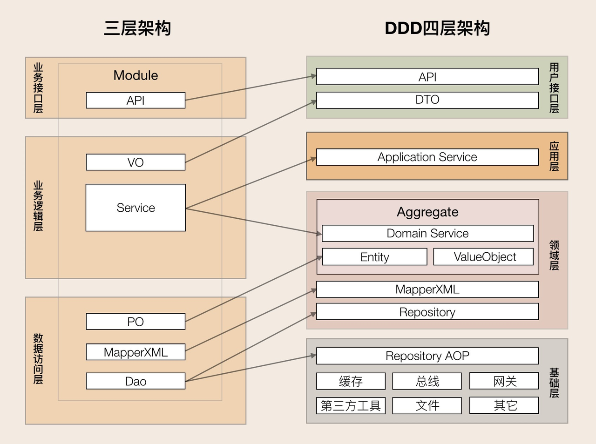
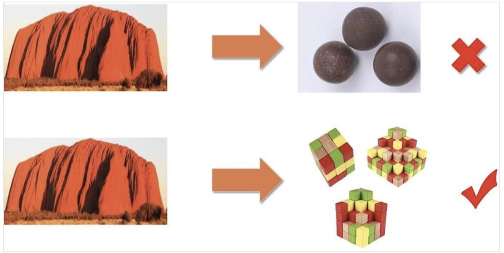
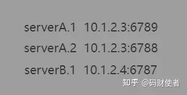
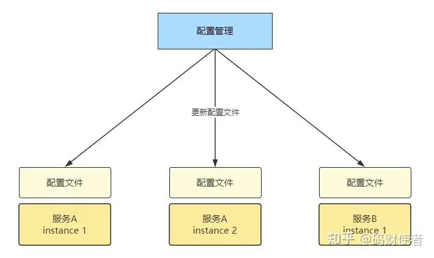
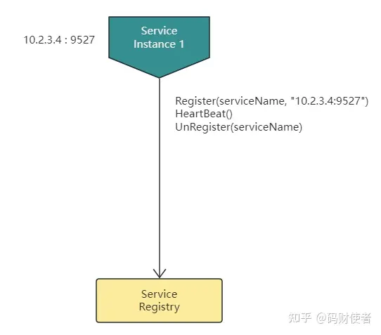
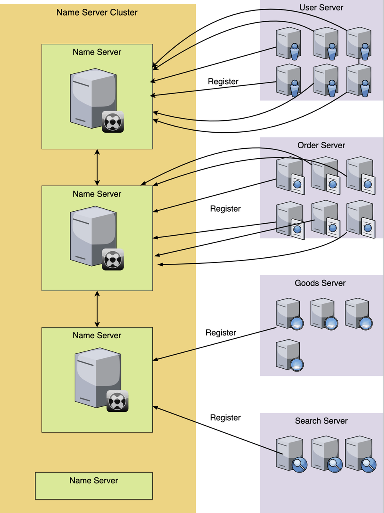
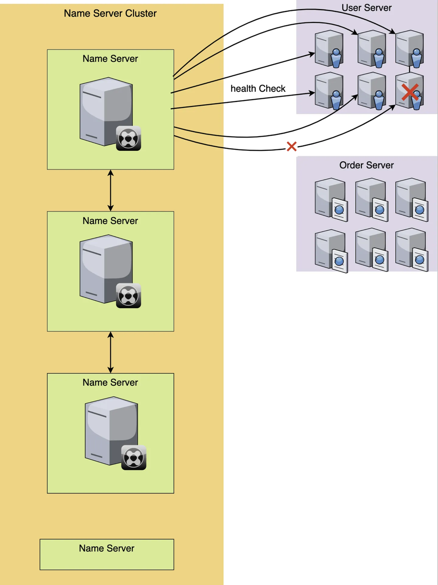
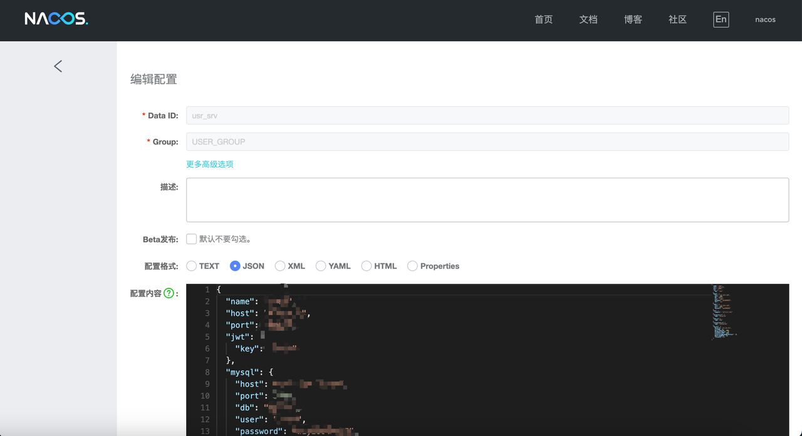
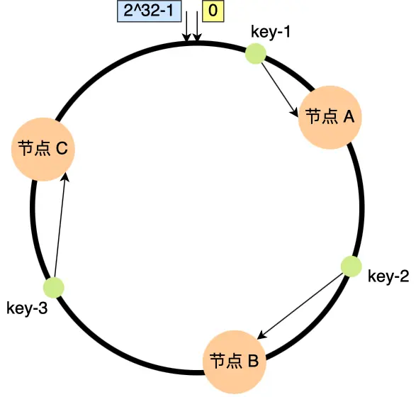
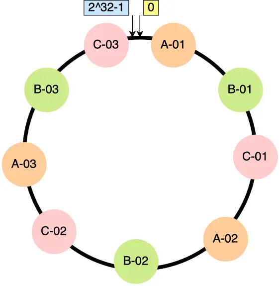

## 架构设计

在前两节课当中，相信大家都熟悉了微服务，但是微服务并不是万金油，通常会带来更高的维护成本和更复杂的架构设计难度，如果架构设计的不好，那么很容易就会写成屎山，也不能充分发挥微服务的优势。

传统企业应用大多是单体架构，而单体架构则大多是三层架构。三层架构解决了程序内代码间调用复杂、代码职责不清的问题，但这种分层是逻辑概念，在物理上它是中心化的集中式架构，并不适合分布式微服务架构。

DDD 分层架构中的要素其实和三层架构类似，只是在 DDD 分层架构中，这些要素被重新归类，重新划分了层，确定了层与层之间的交互规则和职责边界。

[什么是 DDD](https://blog.csdn.net/qq_16498553/article/details/110848831)

[DDD 实战课](http://learn.lianglianglee.com/专栏/DDD实战课)

DDD 分层架构在用户接口层引入了 DTO，给前端提供了更多的可使用数据和更高的展示灵活性。

DDD 分层架构对三层架构的业务逻辑层进行了更清晰的划分，改善了三层架构核心业务逻辑混乱，代码改动相互影响大的情况。DDD 分层架构将业务逻辑层的服务拆分到了应用层和领域层。应用层快速响应前端的变化，领域层实现领域模型的能力。

另外一个重要的变化发生在数据访问层和基础层之间。三层架构数据访问采用 DAO 方式；DDD 分层架构的数据库等基础资源访问，采用了仓储（Repository）设计模式，通过依赖倒置实现各层对基础资源的解耦。

如何判断微服务设计是否合理呢？其实很简单，只需要看它是否满足这样的情形就可以了：随着业务的发展或需求的变更，在不断重新拆分或者组合成新的微服务的过程中，不会大幅增加软件开发和维护的成本，并且这个架构演进的过程是非常轻松、简单的。

这也是微服务设计的重点，就是看微服务设计是否能够支持架构长期、轻松的演进。

### **微服务还是小单体？**

有些项目团队在将集中式单体应用拆分为微服务时，首先进行的往往不是建立领域模型，而只是按照业务功能将原来单体应用的一个软件包拆分成多个所谓的“微服务”软件包，而这些“微服务”内的代码仍然是集中式三层架构的模式，“微服务”内的代码高度耦合，逻辑边界不清晰，这里我们暂且称它为“小单体微服务”。

下面这张图也很好地展示了这个过程。

而随着新需求的提出和业务的发展，这些小单体微服务会慢慢膨胀起来。当有一天你发现这些膨胀了的微服务，有一部分业务功能需要拆分出去，或者部分功能需要与其它微服务进行重组时，你会发现原来这些看似清晰的微服务，不知不觉已经摇身一变，变成了臃肿油腻的大单体了，而这个大单体内的代码依然是高度耦合且边界不清的。

“辛辛苦苦好多年，一夜回到解放前啊！”这个时候你就需要一遍又一遍地重复着从大单体向单体微服务重构的过程。想想，这个代价是不是有点高了呢？

其实这个问题已经很明显了，那就是边界。

这种单体式微服务只定义了一个维度的边界，也就是微服务之间的物理边界，本质上还是单体架构模式。微服务设计时要考虑的不仅仅只有这一个边界，别忘了还要定义好微服务内的逻辑边界和代码边界，这样才能得到你想要的结果。

那现在你知道了，我们一定要避免将微服务设计为小单体微服务，那具体该如何避免呢？清晰的边界人人想要，可该如何保证呢？DDD 已然给出了答案。

微服务的拆分可以参考领域模型，也可以参考聚合，因为聚合是可以拆分为微服务的最小单位的。但实施过程是否一定要做到逻辑边界与物理边界一致性呢？也就是说聚合是否也一定要设计成微服务呢？答案是不一定的，这里就涉及到微服务过度拆分的问题了。

微服务的过度拆分会使软件维护成本上升，比如：集成成本、发布成本、运维成本以及监控和定位问题的成本等。在项目建设初期，如果你不具备较强的微服务管理能力，那就不宜将微服务拆分过细。当我们具备一定的能力以后，且微服务内部的逻辑和代码边界也很清晰，你就可以随时根据需要，拆分出新的微服务，实现微服务的架构演进了。

当然，还要记住一点，微服务内聚合之间的服务调用和数据依赖需要符合高内聚松耦合的设计原则和开发规范，否则你也不能很快完成微服务的架构演进。

.PNG)
### **微服务设计**原则

微服务设计原则中，如高内聚低耦合、复用、单一职责等这些常见的设计原则在此就不赘述了，主要强调下面这几条：

**第一条：要领域驱动设计**，而不是数据驱动设计，也不是界面驱动设计。

微服务设计首先应建立领域模型，确定逻辑和物理边界以及领域对象后，然后才开始微服务的拆分和设计。而不是先定义数据模型和库表结构，也不是前端界面需要什么，就去调整核心领域逻辑代码。在设计时应该将外部需求从外到内逐级消化，尽量降低对核心领域层逻辑的影响。

**第二条：要边界清晰的微服务，而不是泥球小单体。**

微服务上线后其功能和代码也不是一成不变的。随着需求或设计变化，领域模型会迭代，微服务的代码也会分分合合。边界清晰的微服务，可快速实现微服务代码的重组。微服务内聚合之间的领域服务和数据库实体原则上应杜绝相互依赖。你可通过应用服务编排或者事件驱动，实现聚合之间的解耦，以便微服务的架构演进。

**第三条：要职能清晰的分层，而不是什么都放的大箩筐。**

分层架构中各层职能定位清晰，且都只能与其下方的层发生依赖，也就是说只能从外层调用内层服务，内层通过封装、组合或编排对外逐层暴露，服务粒度也由细到粗。应用层负责服务的组合和编排，不应有太多的核心业务逻辑，领域层负责核心领域业务逻辑的实现。各层应各司其职，职责边界不要混乱。在服务演进时，应尽量将可复用的能力向下层沉淀。

**第四条：要做自己能 hold 住的微服务，而不是过度拆分的微服务。**

微服务过度拆分必然会带来软件维护成本的上升，比如：集成成本、运维成本、监控和定位问题的成本。企业在微服务转型过程中还需要有云计算、DevOps、自动化监控等能力，而一般企业很难在短时间内提升这些能力，如果项目团队没有这些能力，将很难 hold 住这些微服务。

如果在微服务设计之初按照 DDD 的战略设计方法，定义好了微服务内的逻辑边界，做好了架构的分层，其实我们不必拆分太多的微服务，即使是单体也未尝不可。随着技术积累和能力提升，当我们有了这些能力后，由于应用内有清晰的逻辑边界，我们可以随时轻松地重组出新的微服务，而这个过程不会花费太多的时间和精力。

## 服务注册与发现

### 什么是服务注册与发现？

一个后台系统，存在两个服务 A 和 B， A 服务需要调用 B 服务，就需要建立和 B 服务的连接，通常需要 B 服务的地址。

在计算机领域，服务的地址通常是由 ip 地址 和 端口 port 来组合表达。

此时，问题就来了：A 服务怎么知道 B 服务的地址（ip + port）呢？

#### 简单方式

服务较少时，可以使用简单粗暴的方式：

- 硬编码：代码中写死服务地址（ip+port）。
- 给每个服务分配一个唯一的名字，并将其对应的地址（ip+port）一起写入configure文件。 所有服务的名字 : 地址都被列在这个配置文件中，一目了然。需要的时候，就根据名字来查询对应的地址。

配置形式的地址管理

如果地址发生变更，则更新所有服务机器上的配置文件。

配置更新

#### DNS 查询

缺点是不适用于大量服务的场景并且通常有一定的起效时间

而且功能比较单一，只能用来获取服务地址

#### 服务发现

当进入微服务时代，服务的数量急剧增多（相对独立的功能都会被拆分为一个个服务），服务之间像齿轮一样密切配合。而云计算大行其道的现在，服务的地址也是经常变化的，尤其是 k8s 自动调度的引入，服务经常会被调度到不同的机器，这样，服务的地址变化更频繁。

此时，我们就需要引入一种称为 ServiceRegistry 的服务注册与发现的组件。本质上，我们就是需要一种随时注册、更新、获取并监听其他服务地址变更的机制。

#### 服务发现有什么优势？

##### 灵活配置

类似于 DNS 解析，我们只需要对应的服务名就可以获取到服务地址，同时通常情况下起效快，延迟低。

##### 健康检查

如果说直接用 ip+port 的形式或者 DNS ，如果一个实例挂掉了，调用者依然会请求这个地址，然后就会返回错误，造成了很大的资源浪费、降低了易用性。但是使用了服务发现的话，服务发现中心会定期地对各个实例进行健康检查，如果发现故障则作上标记或者直接下线。

##### 简单的配置中心

以 consul 和 nacos 为例，consul 允许存储 kv 键值对，nacos 也允许 存储 json 、yaml 等格式的数据，也就是说在不需要高级配置中心功能（灰度发布等等）的情况下使用服务注册中心来存储配置也是一个不错的选择。

##### 负载均衡

- 随机负载均衡：从可用的服务实例中随机选择一个来处理请求，简单且容易实现，但无法保证均衡和高性能。
- 轮询负载均衡：按照轮询的方式依次选择可用的服务实例来处理请求，确保每个实例平均分担负载，但无法考虑实例的性能差异。
- 权重负载均衡：为每个服务实例分配一个权重值，根据权重来决定选择哪个实例处理请求，可以根据实例的性能和资源情况进行动态调整。
- 基于哈希的负载均衡：根据请求的特征或标识计算哈希值，将请求映射到特定的服务实例，可以实现请求的精确路由和会话保持。
- 最少连接负载均衡：选择当前连接数最少的服务实例来处理请求，以实现负载均衡和性能优化。
- 动态负载均衡：根据实时的系统负载和性能指标来动态调整和分配请求，例如根据 CPU 使用率、内存利用率等指标进行决策。

###### 一致性哈希算法实现负载均衡

参考资料：

https://zhuanlan.zhihu.com/p/161277955

https://zhuanlan.zhihu.com/p/675020068

[什么是一致性哈希](https://www.xiaolincoding.com/os/8_network_system/hash.html#如何通过虚拟节点提高均衡度)

## Kitex && Hertz

https://cloudwego.cn/docs/kitex/

https://cloudwego.cn/docs/hertz/

https://github.com/cloudwego/kitex-examples

https://github.com/cloudwego/hertz-examples

[袁神去年的教程（缺少时效性，仅供参考）](https://juejin.cn/post/7216255521372110909)

we重邮代码走读