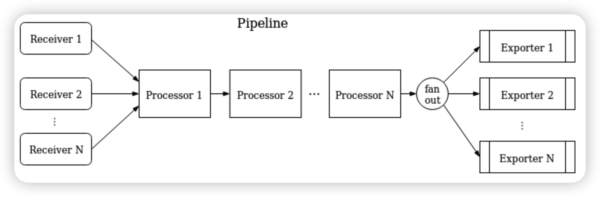

## 可观测性
### 什么是可观测性？

在计算机系统和软件领域，可观测性的含义是：可以从系统和应用对外输出的信息（指标、日志和链路），来帮助我们了解应用程序的内部系统状态和运行情况。

但可观测性并不只是简单的数据采集，它更强调对这些数据的**关联和分析**，这能够帮助我们**快速定位**，找到问题的根本原因。当然，最终的目的是**保障系统的可靠性，达到服务质量的目标**。

### 为什么需要可观测性？

软件架构从单体应用到三层架构（前端 Web，应用 App 层，以及后端的数据库），再到现在的微服务架构，无疑是越来越复杂了。分布式架构具有可扩展性、可维护性、灵活性等多种优点，但是这种部署方案也出现一些问题：

1、排查问题难度大，周期长
2、特定场景难复现
3、系统性能瓶颈分析较难

以前针对简单的系统架构，常用的维护手段还是建立监控，然后制作一些仪表盘来展示各个层面指标的情况，再加上一些告警对各种指标的阈值进行监控和通知，但是现在，不仅排查故障的难度越来越大，错误还有了更多潜在的组合，传统的排障方式越来越没有效率。所以复杂性的增加使得我们越来越有必要为系统和应用构建可观测性。

假设现在你运营一个分布式的电商平台下，这个项目的订单处理涉及多个微服务和数据库（用户服务、支付服务、购物车服务等等）。如果订单处理的调用链路上某个服务出现故障或者延迟，导致订单处理失败或者变慢，进而影响客户体验，那么这个问题究竟是出在哪个服务上呢？如果没有良好的观测机制，就无法追踪整个订单处理事务的全过程，因而很难定位到问题。

这种情况下，如果通过实时监控系统，就可以追踪到订单的处理流程，识别潜在的瓶颈或故障点，及时进行调整和修复。

### 可观测性=指标+日志+链路追踪？

指标（metrics），日志（logs）和链路追踪（Tracing）是可观测性的三大支柱，先来看看它们的含义：
#### Metrics

**是在⼀段时间内测量的数值**。它包括特定属性，例如时间戳、名称、键和值。和⽇志不同，指标在默认情况下是结构化的，这会让查询和优化存储变得更加容易。

例如：2022/05/20 12:48:22，CPU usage user，23.87%，它就表示 CPU 运行在用户态的时间占比在这一刻为 23.87%。
#### Logs

**日志：是对特定时间发生的事件的文本记录**。日志一般是非结构化字符串，会在程序执行期间被写入磁盘。每个请求会产生一行或者多行的日志，每个日志行可能包含 1-5 个维度的有用数据（例如客户端 IP，时间戳，调用方法，响应码等等）。当系统出现问题时，⽇志通常也是排错⾸先查看的地⽅。
#### Traces

**有时候也被称为分布式追踪（Distributed Tracing），表示请求通过分布式系统的端到端的路径**。当请求通过主机系统时， 它执⾏的每个操作被称为“跨度”（Span）。一个 Trace 是 Spans 的有向无环图。链路追踪一般会通过一个可视化的瀑布图展现出来。瀑布图展示了用于调试的请求的每个阶段，以及每个部分的开始时间和持续时长。

举个分布式调用的例子：客户端发起请求，请求首先到达负载均衡器，经过认证服务、系统服务，然后请求资源，最终返回结果。


##### Trace 实现的基本原理

想要实现调用链，就要为**每次调用做个标识**，然后**将服务按标识大小排列**，可以更清晰地看出调用顺序，我们暂且将该标识命名为 spanid


实际场景中，我们需要知道某次请求调用的情况，所以只有spanid还不够，得为**每次请求做个唯一标识**，这样才能根据标识查出本次请求调用的所有服务，而这个标识我们命名为 traceid。


现在根据spanid可以轻易地知道被调用服务的先后顺序，但无法体现调用的层级关系，正如下图所示，多个服务可能是逐级调用的链条，也可能是同时被同一个服务调用。例如：


所以应该每次都记录下是谁调用的，我们用parentid作为这个标识的名字。


到现在，已经知道调用顺序和层级关系了，但是接口出现问题后，还是不能找到出问题的环节，如果某个服务有问题，那个被调用执行的服务一定耗时很长，要想**计算出耗时**，上述的三个标识还不够，还需要加上**时间戳**，时间戳可以更精细一点，精确到微秒级。只记录发起调用时的时间戳还算不出耗时，要记录下服务**返回时的时间戳**，**才能算出时间差**


其实 span 除了上面说的这几个必选参数外，还可以记录一些其他信息，比如发起调用服务名称，被调用服务名称、返回结果、IP 等等。但是这些信息是在 span 内自己上报给 Collector 或者 Backend Server，而不会在链路上传递，在链路上传递的主要是 trace_id 和 span_id 等用于在跨度间建立关系的信息（也就是 [Span Context](https://opentelemetry.io/docs/concepts/signals/traces/#span-context)）。这样子，Collector 或者 Backend Server  就有了一个链路的很多 span，而这些 span 都有 span_id、trace_id，于是就可以通过这些信息构建出一个完整的调用链了。


然而，仅仅是收集这些数据类并不能保证系统的可观测性，尤其是当你彼此独⽴地使⽤它们时。**从根本上来说，指标、日志和链路追踪只是数据类型，与可观测性无关。**

可观测性应该是我们构建的系统的一种属性，就像可用性、高可用性和稳定性这些一样，能够帮助我们更好地理解和解释系统当前所处的任何状态，无论这种状态或者问题是否在之前出现过。这就要求我们的收集的数据支持高基数（值的唯一性高）和高维度（键的数量多）

## OpenTelemetry

### 什么是 OpenTelemetry？

OpenTelemetry 简称 OTel， 是 CNCF （ Cloud Native Computing Foundation，云原生计算基金会，是一个开源软件基金会，致力于云原生技术的普及和可持续发展） 的一个可观测性项目。

OpenTelemetry 旨在提供可观测性领域的标准化方案，解决遥测数据的数据建模、采集、处理、导出等标准化问题，并能够将这些数据发送到你选择的后端（开源或商业均可）。这样你就可以建立不被供应商锁定的可观测，灵活地更改后端，不需要再次更改代码，重新进行插桩（Instrument）了。

### OpenTelemetry 的简要历史

在 OpenTelemetry 出现之前，还出现过 OpenTracing 和 OpenCensus 两套标准。目前在应用性能监控有 Jaeger、Pinpoint、Zipkin 等多个开源产品，商业玩家也有很多，可谓竞争非常激烈。然而，这也带来了一个问题，那就是每一家都有一套自己的数据采集标准和 SDK，实现上各不相同，很难实现厂商或者技术中立。

OpenTracing 制定了一套与平台和厂商无关的协议标准，让开发人员能够方便地添加或更换底层 APM 的实现。

另一套标准 OpenCensus 是谷歌发起的，它和 OpenTracing 最大的不同之处在于，除了链路追踪，它还把指标也包括进来。这样就可以在 OpenCensus 上做基础的指标监控了。除此之外相较于 OpenTracing 制定规范，OpenCensus 不仅制定规范，还包含了 Agent 和 Collector。

OpenTracing 和 OpenCensus，这两套框架都有很多追随者，而且二者都想统一对方。但是从功能和特性上来看，它们各有优缺点，半斤八两。

于是就有了 OpenTelemetry，OpenTelemetry 可以同时兼容 OpenTracing 和 OpenCensus，开发人员再也无需在 OpenTracing 和 OpenCensus 之间进行选择。OpenTelemetry 提供一个统一的集合。

### OpenTelemetry 的核心组件


>Collector 收集器

OpenTelemetry 收集器是一个独立于供应商的代理，可接收、处理和导出遥测数据。它支持以多种格式接收遥测数据，以及在导出前对遥测数据进行处理和筛选。

>Language SDKs 语言 SDK

OpenTelemetry 语言 SDK 允许您使用 OpenTelemetry API 以某种语言生成遥测数据并将数据导出到后端。

>Instrument libraries 插桩库

OpenTelemetry 支持一系列广泛的组件，这些组件能够针对所支持的语言使用热门的库和框架生成相关的遥测数据，例如HTTP客户端、数据库驱动程序、消息队列等。

>Exporter 导出器

导出器能够将插桩与您的后端配置分离开，由于无需更改插桩设定，所以能更轻松地更改后端。导出器还能将遥测数据上传到不止一个后端。

>OpenTelemetry Protocol(OTLP) OpenTelemetry 协议

SDK 和 Collector 传递遥测信号使用的传输协议，用于将数据导出到后端或其他收集器。OTLP 可以使用 gRPC (OTLP/gRPC) 或 HTTP (OTLP/HTTP)。虽然在 Opentelemetry 的项目中组件支持了 Zipkin v2 或 Jaeger Thrift 的协议格式的实现，但是都是以第三方贡献库的形式提供的。只有 OTLP是 Opentelemetry 官方原生支持的格式。

1. `OTLP/HTTP` 使用 `HTTP POST` 请求将遥测数据从客户端发送到服务器。实现可以使用HTTP/1.1或HTTP/2传输，请求正文是可以是用 Protobuf 编码（proto3 标准）或者 JSON 格式（proto3 标准定义的 JSON Mapping）的 `ExportXXXServiceRequest` 消息，HTTP 默认端口为 4318，路径默认配置：
	- Trace：`v1/traces`
	- Metric：`v1/metrics`
	- Log：`v1/logs`
2. `OTLP/gRPC` 建立底层GRPC传输后，客户端开始使用`Export*ServiceRequest`消息，发送遥测数据，gRPC 默认端口为 4317
### OpenTelemetry Collector

OpenTelemetry Collector 是OpenTelemetry 项目中的一个代理软件，作为遥测数据的中转站，能够对遥测数据做一些预处理的逻辑

#### 部署模式

1. **不使用OpenTelemetry Collector**：OpenTelemetry Collector 并不是必须的，我们可以直接使用OpenTelemetry 客户端SDK发送遥测数据到监控组件中，比如将 trace 数据发送到 jaeger，发送 metric 数据到 prometheus


2. **Agent 模式**：在应用程序和后端监控组件（jaeger、prometheus）之间部署上OpenTelemetry Collector，OpenTelemetry Collector 和应用程序之间传输遥测数据（Collector 支持几个主流的开源协议），存在的问题是如果应用程序产生的遥测数据太多，一个OpenTelemetry Collector 已经不能满足快速处理数据的要求


3. **Gateway 模式**：通过在多个OpenTelemetry Collector 前面部署一个拥有负载均衡功能的OpenTelemetry Collector 来让分发发往整个集群的遥测数据。


#### Pipeline

Collector 采用 Pipeline 方式来接收、处理和导出数据，每个 Collector 可配置一个或多个 Pipeline，每个 pipeline 包含如下组件：
- receiver
- processor
- exporter

每个 receiver 可能被多个 pipeline 共用，多个 pipeline 也可能包含同一个 exporter

>pipeline

一个pipeline定义了一条数据流动的路径：从 Collector 数据接收开始，然后进一步的处理或修改，到最后通过exporter导出。

pipeline能够处理3种类型数据：trace、metric和logs。数据类型是需要pipeline配置的一个属性。在pipeline中receiver、processor和exporter必须支持某个特定的数据类型，一个 pipeline 可以表示为：



一个经典的 pipeline 配置如下：

```yaml
service:
  pipelines: # section that can contain multiple subsections, one per pipeline
    traces:  # type of the pipeline
      receivers: [otlp, jaeger, zipkin]
      processors: [memory_limiter, batch]
      exporters: [otlp, jaeger, zipkin]
```

这个例子定义了一个"trace"类型数据的pipeline，包含3个receiver、2个processor和3个exporter

>receiver

receiver 监听某个网络端口并且接收观测数据。通常会配置一个 receiver 将接收到的数据传送到一个 pipeline 中，当然也可能是同一个 receiver 将接收到的数据传送到多个 pipeline 中。

如上面的 `otlp` receiver 示例配置如下：

```yaml
receivers:
  otlp:
    protocols:
      grpc:
        endpoint: localhost:4317
```

>exporter

exporter 通常将收到数据发送到某个网络上地址。允许一个 pipeline 中配置多个同类型的 exporter

如上面的 `jaeger` exporter 的示例配置如下

```yaml
exporters:
  jaeger:
    protocols:
      grpc:
        endpoint: localhost:14250
```

>processor

一个 pipeline 可以包含多个**串联**的 processor。

processor能够在转发数据之前对其进行转换（例如增加或删除spans中的属性），也可以丢弃数据，也可以生成新数据

如上面的 `batch` processor 的示例配置：

```yaml
processors:
  batch:
    send_batch_size: 10000
    timeout: 10s
```

这段配置就描述了一个批处理 processor 的配置
## Jaeger

### 简介


[Jaeger](https://www.jaegertracing.io/)  是受到 ​ ​Dapper​​​ 和 ​ ​OpenZipkin​​​ 启发的由 ​ ​Uber Technologies​​ 作为开源发布的分布式跟踪系统，兼容 OpenTracing 以及 Zipkin 追踪格式，目前已成为 CNCF 基金会的开源项目。其前端采用React语言实现，后端采用GO语言实现，适用于进行链路追踪，分布式跟踪消息传递，分布式事务监控、问题分析、服务依赖性分析、性能优化等场景。

### 快速开始

> all-in-one Docker 镜像包含 **Jaeger UI**、**jaeger-collector**、**jaeger-query** 和 **jaeger-agent**，以及一个内存存储组件。适用于快速体验 Jaeger ，由于所有追踪数据存储在内存中，不适用于生产环境

```shell
docker run --rm --name jaeger \
  -e COLLECTOR_ZIPKIN_HOST_PORT=:9411 \
  -p 6831:6831/udp \
  -p 6832:6832/udp \
  -p 5778:5778 \
  -p 16686:16686 \
  -p 4317:4317 \
  -p 4318:4318 \
  -p 14250:14250 \
  -p 14268:14268 \
  -p 14269:14269 \
  -p 9411:9411 \
  jaegertracing/all-in-one:1.56
```

容器启动后，使用浏览器打开 [http://localhost:16686](http://localhost:16686/) 即可访问 Jaeger UI。

all-in-one 端口文档如下：

|Port|Protocol|Component|Function|
|---|---|---|---|
|6831|UDP|agent|accept `jaeger.thrift` over Thrift-compact protocol (used by most SDKs)|
|6832|UDP|agent|accept `jaeger.thrift` over Thrift-binary protocol (used by Node.js SDK)|
|5775|UDP|agent|(deprecated) accept `zipkin.thrift` over compact Thrift protocol (used by legacy clients only)|
|5778|HTTP|agent|serve configs (sampling, etc.)|
|||||
|16686|HTTP|query|serve frontend|
|||||
|4317|HTTP|collector|accept OpenTelemetry Protocol (OTLP) over gRPC|
|4318|HTTP|collector|accept OpenTelemetry Protocol (OTLP) over HTTP|
|14268|HTTP|collector|accept `jaeger.thrift` directly from clients|
|14250|HTTP|collector|accept `model.proto`|
|9411|HTTP|collector|Zipkin compatible endpoint (optional)|
## Prometheus
### 简介


[Prometheus](https://github.com/prometheus) 是由前 Google 工程师从 2012 年开始在 Soundcloud 以开源软件的形式进行研发的系统监控和告警工具包，自此以后，许多公司和组织都采用了 Prometheus 作为监控告警工具。Prometheus 的开发者和用户社区非常活跃，它现在是一个独立的开源项目，可以独立于任何公司进行维护。

Prometheus 的主要优势有：

- 由指标名称和和键/值对标签标识的时间序列数据组成的多维数据模型。
- 强大的[查询语言 PromQL](https://github.com/yangchuansheng/prometheus-handbook/tree/c6e1e12588ec63c20345090368b37654ef30922a/4-prometheus/basics.html)。
- 不依赖分布式存储；单个服务节点具有自治能力。
- 时间序列数据是服务端通过 HTTP 协议主动拉取获得的。
- 也可以通过中间网关来[推送时间序列数据](https://github.com/yangchuansheng/prometheus-handbook/tree/c6e1e12588ec63c20345090368b37654ef30922a/5-instrumenting/pushing.html)。
- 可以通过静态配置文件或服务发现来获取监控目标。
- 支持多种类型的图表和仪表盘。

### 快速上手

可以使用 Docker 快速部署

```shell
docker run -d -p 9090:9090 --name prometheus \
--restart=always \
-v /data/prometheus/data/:/data \
-v /home/prometheus/config/prometheus.yml:/data/prometheus.yml \
prom/prometheus:latest
```

容器启动后，使用浏览器打开 [http://localhost:9090](http://localhost:9090/) 即可访问 Prometheus UI，这时候就可以在网页上添加数据源

## 作业

**提交地址**： mull1on0910@gmail.com
**提交格式**：第十七次作业-学号-姓名
**截止时间**：下一次上课之前
### Lv1

按照官方文档的[快速上手](https://opentelemetry.opendocs.io/docs/instrumentation/go/getting-started/)教程，自己动手做一下，加深 OpenTelemetry 每个组件的理解
### Lv2

在完成快速上手 rolldice 服务的基础上，添加 exporter，将 trace 发送到 jaeger 和 prometheus，参照官方文档的 [exporter教程](https://opentelemetry.opendocs.io/docs/instrumentation/go/exporters/)

或者可以部署 OpenTelemetry Collector，通过 Collector 发送到 jaeger 和 prometheus
### Lv3

了解一下 ELK，最好可以自己尝试部署一个

## 参考链接

1. [什么是 OpenTelemetry](https://www.elastic.co/cn/what-is/opentelemetry)
2. [深入浅出可观测性](https://learn.lianglianglee.com/%e4%b8%93%e6%a0%8f/%e6%b7%b1%e5%85%a5%e6%b5%85%e5%87%ba%e5%8f%af%e8%a7%82%e6%b5%8b%e6%80%a7/00%20%e5%bc%80%e7%af%87%e8%af%8d%20%e5%8f%af%e8%a7%82%e6%b5%8b%e6%80%a7%ef%bc%8c%e8%ae%a9%e5%bc%80%e5%8f%91%e5%92%8c%e7%bb%b4%e6%8a%a4%e7%b3%bb%e7%bb%9f%e7%9a%84%e4%bd%a0%e6%af%8f%e6%99%9a%e9%83%bd%e8%83%bd%e7%9d%a1%e4%b8%aa%e5%a5%bd%e8%a7%89%ef%bc%81.md)
3. [李文周-Go OpenTelemetry快速指南](https://www.liwenzhou.com/posts/Go/openTelemetry-go/)
4. [OpenTelemetry Collector 简介](https://blog.csdn.net/u_geek/article/details/128389731)
5. [OpenTelemetry Collector 部署模式](https://www.cnblogs.com/hobbybear/p/18006757)
6. [微服务之链路追踪原理](https://developer.aliyun.com/article/1317806)


