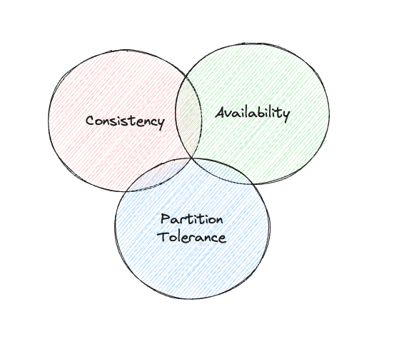
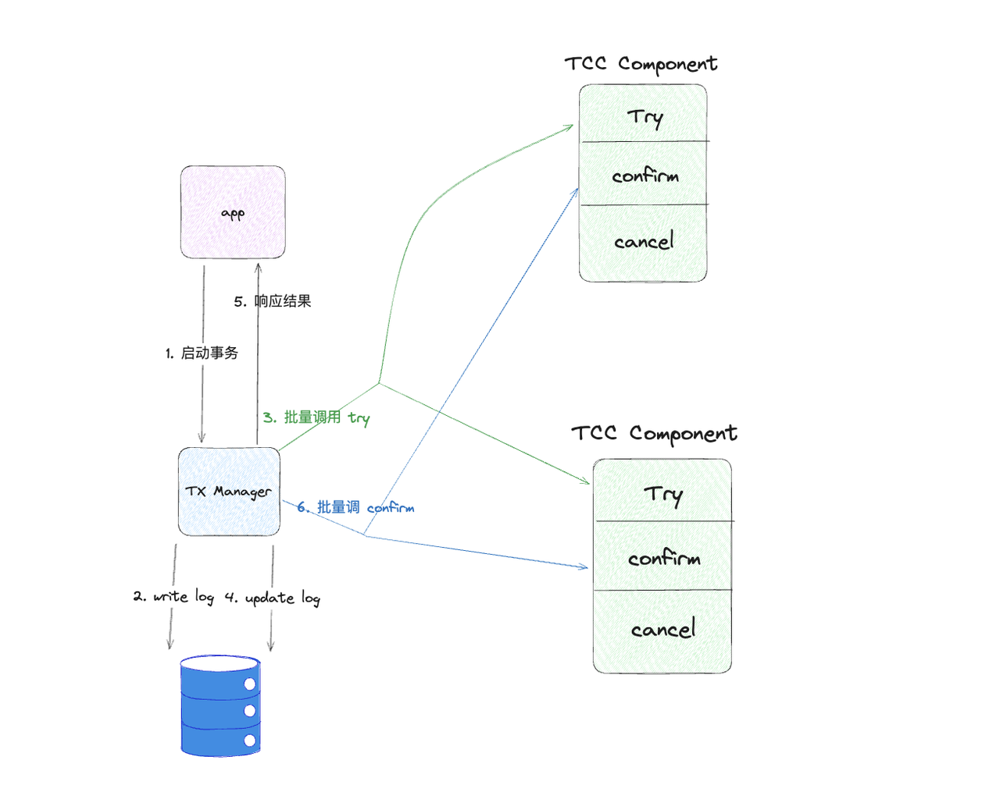
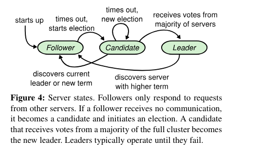

## 前置知识

### 什么是分布式系统

分布式就是一群独立的服务集合，相互协调，相互配合，共同对外提供服务

独立：服务与服务之间存在隔离，往往只通过网络进行通信与协调

### 分布式系统的特点

- 多进程

- **并发**

- 隔离：如操作系统隔离、网络隔离、时钟隔离....

### 为什么要分布式系统

- 高性能

- 可扩展

- 高可用

- 有些场景天然就是分布式的，比如跨行转账

### 分布式系统的挑战

20 世纪 90 年代，L. Peter Deutsch 等人总结出了分布式计算的谬论：

- **网络是可靠的**

- **延迟为 0**

- 带宽是无限的

- 网络是安全的

- 拓扑结构不会改变

- 传输成本为 0

- 网络是同构的

最本质的问题：

- 不可靠的网络：网络存在延时、丢包、乱序等问题

由网络引发的问题：

- 全局时钟难以定义
- 数据存在不一致的现象
- 并发变得更加复杂，难以控制

其他问题：

- 机器宕机

## 分布式理论

### CAP 理论

CAP 分为了三部分，分别代表了在一个分布式系统的三个指标

- **Consistency** (一致性)：强调数据的正确性，要求各节点提供的数据都是一致准确的
- **Availability** (可用性)：要求系统的可用性高，例如不能出现让用户长时等待的情况
- **Partition Tolerance** (分区容错性)：在发生分区时（如某一个节点网络连不上了），要求系统仍然能够正常运作

CAP 理论：在一个系统中，至多同时满足 CAP 中的两个。
对于分布式系统而言，P 是必须要保证的，所以分布式系统其实就分为了 CP，AP 两种类型

- CP：保证数据一致性的情况下可能牺牲系统的可用性
- AP：保证用户体验好，但可能出现数据不一致的情况



C A P 三者都完美满足的分布式系统是不存在的

网络分区是无法避免的，P 是分布式系统必须要保证的，故可以将分布式系统分为 CP、AP 两类

C 与 A 不是绝对的，应该是在具体的业务场景下，将 C 和 A 达到一个平衡的状态

### BASE 理论

**Basically Available, Soft state, Eventually consistent(基本可用、软状态、最终一致性)**

BA：分布式系统在出现不可预知故障的时候，允许损失部分可用性

S：允许系统中的数据存在中间状态，并认为该中间状态的存在不会影响系统的整体可用性，即允许系统在不同节点的数据副本之间进行数据同步的过程存在延时。

E：最终一致性强调的是系统中所有的数据副本，在经过一段时间的同步后，最终能够达到一个一致的状态。

## 分布式 ID

分布式 ID 要求集群内全局唯一，一般有以下解决方案

### UUID

UUID 不需要集群间的通信，性能较好且全局唯一，但是在一些业务场景不适合做 ID

### 数据库自增生成

1. 单数据库自增方案
   单独拿出一个数据库来作为 ID 数据库，当需要生成 ID 时通过自增的方式从数据库取
   缺点：在并发量上来的时候会成为性能瓶颈，可用性不高

2. 集群数据库子增方案
   部署多个 ID 数据库，每个数据库的 ID 自增方案为 ID += len(clusters)
   缺点：扩展性弱

3. 数据库号段模式
   每次从数据库取多一个范围的 ID 缓存在本地，使用时从缓存中取出

### 雪花算法


基于时间戳生成分布式 ID

1. 第一位为固定标识，一般为0

2. 41位时间戳基于毫秒级别，存储时间戳差值（当前时间戳-设置的开始时间戳）

3. 机器号为自己设定，可以设置1023个节点

4. 序列号使得同一毫秒的同一机器上可以生成 4k 个 ID

### Redis incr 命令子增生成 ID

与 Mysql 的机制类似，但需考虑持久化
RDB 持久化：如果在生成了一次快照后连续自增了几次还没进行下一次持久化，此时 Redis 挂了，会导致重复 ID 生产
AOF 持久化：Redis 挂掉后重启数据恢复时间过长

## 分布式锁

基本概念

锁的本质：用于对共享资源的一种保护机制，保证在同一时间只有一个线程或者进程能够对改资源进行操作，防止数据竞争

基本特性：

- **互斥**
- **可见性**：当锁被释放后，其他等待锁对进程或线程能够感知到锁已经被释放了

分布式锁在单机锁的基础上还应该具有以下性质：

- **应对死锁**：获取锁的线程即使崩溃无法自己释放锁，锁也要能够进行运作下去，不能死锁。通常通过超时机制保证
- **高可用**：使用集群服务防止单点故障
- **同源**：A 加的锁不能被 B 释放

锁模型，与单机锁相同：

- 客户端轮询型：
  
  - 优点：无需阻塞，短时间来看操作较轻
  - 缺点：消耗 CPU 时间
  - 适合锁竞争不太激烈的场景

- watch 回调型：如果没有成功获取到锁，通过 watcher 机制监视锁的释放这一事件，锁释放后再次发起取锁的动作
  
  - 优点：精准打击，不浪费 CPU 时间
  - 缺点：操作较重
  - 适合并发激烈的场景

在分布式锁的场景下，轮询取锁的操作成本往往高于单机锁，通常是网络 IO 请求，但是能够保持主动权，watch 机制需要建立长连接完成 watch 动作，也存在资源损耗，具体方案的选择应该根据业务场景来看。

### MySql 实现

基于唯一键约束可以实现分布式锁，但是 MySql 因为涉及 IO 操作，性能不太高

### Redis 实现

**setnx(set if not exist)** 命令实现分布式锁

获取锁：setnx key value

释放锁：del key

#### 死锁问题

一个获取到锁的程序，还未释放锁时挂掉了，会导致死锁

解决：**setnx key value ex {ttl}**，为锁添加一个过期时间，setnx 和 ex 必须是原子操作（也可以通过 lua 脚本实现），否则仍然有死锁风险。

#### 过期问题

问题：临界区执行时间过长，长于锁的 ttl，还未执行完锁就过期，其他线程获取锁，导致**临界区有多个线程进入**。

解决方案：**watch dog** 策略，获取锁的同时开启一个线程，每隔固定时间判断线程是否执行完了，如果未执行完就给锁续期

```go
func lock(){
  setnx key1 val1 ex {exTime}
  go func{
    for {
      // 判断是否是自己的锁
      v := get key1
        if v == val1{
          ex key1 {exTime}
        }
    }
  }()
}
```

问题：临界区执行时间过长，长于锁的 ttl，还未执行完锁就过期，其他线程上锁，锁过期的那个线程执行完临界区，执行释放锁操作，导致**释放其他线程的锁**。

解决方案：释放锁前**判断是否时自己加的锁**

```go
func unlock(){
  if getKey() == myVal{
    del key
  }
}
```

#### 分段

将锁的空间分成多个段，每个段对应一个独立的锁，可以减小锁的竞争范围，提高并发性能。

如一个商品有一百件库存，那么可以分为 100 把锁，key 为商品 ID + 序号。就可以同时有一百个线程拿到锁。

#### 高可用

单节点 redis 如果挂掉，所有服务都无法使用锁，为了提高可用性，redis 可以部署集群

问题：数据一致性问题，在 master 节点获取的锁还未同步到 slaver 中时，其他线程去 slaver 获取锁，也能获取到。

解决方案：Redlock 方案，redis 集群的实例都是独立的不进行数据同步，基本流程如下：

1. **获取锁**：
   - 当客户端尝试获取锁时，向集群中的多个 Redis 实例发送锁请求。
   - 每个请求包含一个唯一的锁标识符（例如，UUID）和一个过期时间。
   - 客户端尝试在所有实例上几乎同时获取锁。
2. **锁获取规则**：
   - 如果客户端在大多数（比如，N/2 + 1，其中 N 是总的实例数）的 Redis 实例上成功设置了锁，那么被认为成功获取了锁。
   - 如果客户端未能在大多数实例上获得锁，立即从那些设置了锁的实例上释放（删除）锁。
3. **锁的释放**：
   - 当锁的持有者完成其任务后，向所有实例发送解锁命令，释放锁。
4. **时间和时钟漂移**：
   - 重要的是要确保所有 Redis 实例的时钟尽可能同步。
   - 客户端应该考虑网络延迟和小的时钟漂移。

**优点**：

- **容错性**：由于锁不是由单个节点而是多个节点保持，因此即使部分节点失败，也不会影响锁的整体功能。
- **避免单点故障**：不依赖单个 Redis 实例，提高了系统的可靠性。

**缺点**：

- **复杂性**：实现和维护比单实例锁更复杂。
- **资源消耗**：需要更多的 Redis 实例和网络资源。
- **时钟同步**：要求服务器之间的时钟同步，否则可能导致锁提前过期或延迟过期的问题。

**红锁问题**：一个线程获取到了锁且只有刚好 N/2 + 1 的节点有记录，有一个有记录的节点宕机后恢复，数据全部丢失，此时又有一个线程来获取锁，获取成功。

**解决方案**：节点宕机后不要立即重启，等到锁都过期了再重启

### etcd 实现

使用 lease 解决死锁问题，类似 watch dog

1. 用户申请 lease
2. 异步开启续约线程
3. 将对应于锁的 kv 数据和租约进行关联绑定，使得锁数据和租约拥有相同的过期时间属性

etcd 的 watch 机制：针对指定范围的数据，通过与 etcd 建立 grpc 长连接的方式监听变更事件，实现 watch 模型的锁机制

**惊群效应**：倘若一把分布式锁的竞争比较激烈，那么锁的释放事件可能同时被多个的取锁方所监听，一旦锁真的被释放了，所有的取锁方都会一拥而上尝试取锁

- 对于同一把分布式锁，锁记录数据的 key 拥有共同的前缀 prefix，作为锁的标识
- 每个取锁方取锁时，会以锁前缀 prefix 拼接上自身的身份标识（租约 id），生成完整的 lock key. 因此各取锁方完整的 lock key 都是互不相同的（只是有着相同的前缀），理论上所有取锁方都能成功把锁记录数据插入到 etcd 中
- 每个取锁方插入锁记录数据时，会获得自身 lock key 处在锁前缀 prefix 范围下唯一且递增的版本号 revision
- 取锁方插入加锁记录数据不意味着加锁成功，而是需要在插入数据后查询一次锁前缀 prefix 下的记录列表，判定自身 lock key 对应的 revision 是不是其中最小的，如果是的话，才表示加锁成功
- 如果锁被他人占用，取锁方会 watch 监听 revision 小于自己但最接近自己的那个 lock key 的删除事件.

这样所有的取锁方就会在 revision 机制的协调下，根据取锁序号（revision）的先后顺序排成一条队列，每当锁被释放，只会惊动到下一顺位的取锁方，惊群问题得以避免.

### zookeeper 实现

1. **创建一个专用节点**：
   - 在 ZooKeeper 中，创建一个专用的锁目录（如 `/locks`）。
   - 每个想要获取锁的客户端都在这个目录下创建一个临时的顺序节点，如 `/locks/lock_`。
2. **节点的创建和检查**：
   - 当一个客户端试图获取锁时，它在锁目录下创建一个临时顺序节点。
   - 然后客户端获取 `/locks` 目录下的所有子节点，并检查自己创建的节点是否是序号最小的节点。
3. **锁的获取**：
   - 如果客户端创建的节点是最小的，那么它就成功获得了锁。
   - 如果不是，客户端就找到比自己序号小的那个节点，并在该节点上设置一个监听器（Watch），然后等待。
4. **锁的释放**：
   - 当持有锁的客户端完成其任务后，它将删除它创建的节点。
   - 删除操作会触发 ZooKeeper 向设置了监听器的下一个顺序节点的客户端发送通知。
5. **锁的等待与获取**：
   - 一旦前一个节点被删除，等待的客户端会收到通知。
   - 收到通知的客户端再次检查自己是否现在拥有了序号最小的节点。如果是，它获得锁；如果不是，重复监听前一个序号的节点。

#### 特点

- **公平性**：通过使用顺序节点，ZooKeeper 分布式锁保证了获取锁的顺序性，确保了锁的公平性。
- **可靠性**：由于 ZooKeeper 集群的高可用性，即使个别节点失败，锁服务也能保持正常工作。
- **死锁避免**：使用临时节点，确保了即使持有锁的进程崩溃或无法释放锁，锁也会因为会话超时而自动释放。

#### 注意事项

- **性能考虑**：由于每次锁操作都涉及到网络通信和 ZooKeeper 集群的协调，因此在高性能要求的场景下需要考虑这种锁机制带来的开销。
- **ZooKeeper集群的稳定性和可靠性**：ZooKeeper的稳定性和可靠性对于锁机制至关重要，因此需要确保 ZooKeeper 集群自身的高可用性和数据一致性。

## 分布式事务

银行跨行转账业务是一个典型分布式事务场景，假设A需要跨行转账给B，那么就涉及两个银行的数据，无法通过一个数据库的本地事务保证转账的ACID，只能够通过分布式事务来解决。

分布式事务就是指事务的发起者、资源及资源管理器和事务协调者分别位于分布式系统的不同节点之上。在上述转账的业务中，用户 A-100 操作和用户 B+100 操作不是位于同一个节点上。本质上来说，分布式事务就是为了保证在分布式场景下，数据操作的正确执行。

分布式事务可以分为两类：

- 第一类为：NewSQL的内部分布式事务，例如 TiDB 是一个款分布式数据库，但是在使用层面还是完整的支持了事务。
- 第二类为：跨数据库、跨服务的分布式事务，这类事务主要是业务上的事务。

### 数据库层面

以 Spanner、TiDB 为代表的 NewSQL，在内部集群多节点间，实现了 ACID 的事务，即提供给用户的事务接口与普通本地事务无差别，但是在内部，一个事务是支持多个节点多条数据的写入，此时无法采用本地 ACID 的 MVCC 技术，而是会采用一套复杂的分布式 MVCC 来做到 ACID。大多数的 NewSQL 分布式事务技术都采用这篇论文[Percolator](http://research.google.com/pubs/pub36726.html)介绍的核心技术。

参考 Tidb 事务实现原理：

- 乐观事务：[https://docs.pingcap.com/zh/tidb/stable/optimistic-transaction](https://docs.pingcap.com/zh/tidb/stable/optimistic-transaction)

- 悲观事物：[https://docs.pingcap.com/zh/tidb/stable/pessimistic-transaction](https://docs.pingcap.com/zh/tidb/stable/pessimistic-transaction)

### 业务层面

业务层面才是我们要重点关注的。

在分布式场景下，可能一个接口会涉及到很多个 RPC 调用，这些 RPC 调用可能会分别操作自己服务的数据库，因为网络的不可靠性，我们想要让几个相互隔离的数据库达成完美的原子性和一致性，是不可能的，我们要做的只是尽可能的到达最终一致性，让数据存在短暂的不一致时间。

#### SAGA 事务

核心思想是将长事务拆分为多个短事务，由 Saga 事务协调器协调，如果每个短事务都成功提交完成，那么全局事务就正常完成，如果某个步骤失败，则根据相反顺序一次调用补偿操作。

#### 本地事务表

将一个事务的执行过程拆分为状态机，拿转账举例：

1. 在本地扣减余额，写下一条事务记录，如：余额已扣减。

2. 通过某种方式通知对方的余额增加，如调别人的接口

3. 通过回调的方式，通知本地事务已经完成了，修改事务表中的状态

在全局会有一个监视器，基于某种策略，如定时多久就轮询一次事务表，查看未完成的事务，尝试重试。

带来的问题：事务可能是超时了而不是执行失败了，导致重复发起请求

解决：将接口设置为幂等的（还有很多其他方案，具体情况具体分析）

**事务消息**

上面提到的第二部是通知其他服务执行事务，此处可以引入 MQ，来看看 [RocketMQ](https://rocketmq.apache.org/zh/) 是怎么做的，我感觉是在本地事务表的思想上做了改进。

1. 生产者将消息发送至 Apache RocketMQ 服务端。

2. Apache RocketMQ 服务端将消息持久化成功之后，向生产者返回 Ack 确认消息已经发送成功，此时消息被标记为"暂不能投递"，这种状态下的消息即为半事务消息。

3. 生产者开始执行本地事务逻辑。

4. 生产者根据本地事务执行结果向服务端提交二次确认结果（Commit 或是Rollback），服务端收到确认结果后处理逻辑如下：
   
   - 二次确认结果为 Commit：服务端将半事务消息标记为可投递，并投递给消费者。
   
   - 二次确认结果为 Rollback：服务端将回滚事务，不会将半事务消息投递给消费者。

5. 在断网或者是生产者应用重启的特殊情况下，若服务端未收到发送者提交的二次确认结果，或服务端收到的二次确认结果为Unknown未知状态，经过固定时间后，服务端将对消息生产者即生产者集群中任一生产者实例发起消息回查。 **说明** 服务端回查的间隔时间和最大回查次数，

6. 生产者收到消息回查后，需要检查对应消息的本地事务执行的最终结果。

7. 生产者根据检查到的本地事务的最终状态再次提交二次确认，服务端仍按照步骤4对半事务消息进行处理。

#### TCC

参见：[https://www.bytesoft.org/tcc-intro/](https://www.bytesoft.org/tcc-intro/)

TCC，全称 Try-Confirm-Cancel，指的是将一笔状态数据的修改操作拆分成两个阶段：

- 第一个阶段是 Try，指的是先对资源进行锁定，资源处于中间态但不处于最终态

- 第二个阶段分为 Confirm 和 Cancel，指的是在 Try 操作的基础上，真正提交这次修改操作还是回滚这次变更操作

在 TCC 分布式事务架构中，包含三类角色：

- 应用方 Application：指的是需要使用到分布式事务能力的应用方，即这套 TCC 框架服务的甲方

- TCC 组件 TCC Component：指的是需要完成分布式事务中某个特定步骤的子模块. 这个模块通常负责一些状态数据的维护和更新操作，需要对外暴露出 Try、Confirm 和 Cancel 三个 API：
  
  - Try：锁定资源，通常以类似【冻结】的语义对资源的状态进行描述，保留后续变化的可能性
  
  - Confirm：对 Try 操作进行二次确认，将记录中的【冻结】态改为【成功】态
  
  - Cancel：对 Try 操作进行回滚，将记录中的【冻结】状消除或者改为【失败】态. 其底层对应的状态数据会进行回滚

- 事务协调器 TX Manager：负责统筹分布式事务的执行：
  
  - 实现 TCC Component 的注册管理功能
  
  - 负责和 Application 交互，提供分布式事务的创建入口，给予 Application 事务执行结果的响应
  
  - 串联 Try -> Confirm/Cancel 的两阶段流程. 在第一阶段中批量调用 TCC Component 的 Try 接口，根据其结果，决定第二阶段是批量调用 TCC Component 的 Confirm 接口还是 Cancel 接口



现在假设我们需要维护一个电商后台系统，需要处理来自用户的支付请求. 每当有一笔支付请求到达，我们需要执行下述三步操作，并要求其前后状态保持一致性：

- 在订单模块中，创建出这笔订单流水记录

- 在账户模块中，对用户的账户进行相应金额的扣减

- 在库存模块中，对商品的库存数量进行扣减

下面描述一下，基于 TCC 架构实现后，对应于一次支付请求的分布式事务处理流程：

- Application 调用 TX Manager 的接口，创建一轮分布式事务：

- Application 需要向 TX Manager 声明，这次操作涉及到的 TCC Component 范围，包括 订单组件、账户组件和库存组件

- Application 需要向 TX Manager 提前传递好，用于和每个 TCC Component 交互的请求参数（ TX Manager 调用 Component Try 接口时需要传递）

- TX Manager 需要为这笔新开启的分布式事务分配一个全局唯一的事务主键 Transaction ID

- TX Manager 将这笔分布式事务的明细记录添加到事务日志表中

- TX Manager 分别调用订单、账户、库存组件的 Try 接口，试探各个子模块的响应状况，比并尝试锁定对应的资源

- TX Manager 收集每个 TCC Component Try 接口的响应结果，根据结果决定下一轮的动作是 Confirm 还是 Cancel

- 倘若三笔 Try 请求中，有任意一笔未请求成功：

- TX Manager 给予 Application 事务执行失败的 Response

- TX Manager 批量调用订单、账户、库存 Component 的 Cancel 接口，回滚释放对应的资源

- 在三笔 Cancel 请求都响应成功后，TX Manager 在事务日志表中将这笔事务记录置为【失败】状态

- 倘若三笔 Try 请求均响应成功了：

- TX Manager 给予 Application 事务执行成功的 ACK

- TX Manager 批量调用订单、账户、库存 Component 的 Confirm 接口，使得对应的变更记录实际生效

- 在三笔 Confirm 请求都响应成功后，TX Manager 将这笔事务日志置为【成功】状态

## 一致性共识算法

常见的有 Paxos、Raft、Zab 算法，这里只说 Raft（~~我只会这个~~），其他大家自己了解。

论文：[https://pdos.csail.mit.edu/6.824/papers/raft-extended.pdf](https://pdos.csail.mit.edu/6.824/papers/raft-extended.pdf)

分布式一致性共识算法是指在一个分布式系统中，使得所有节点数据达成一致共识的算法。

在 A 方面，Raft 算法保证在系统节点半数以上存活时，系统稳定可靠，同时请求耗时取决于多数派的下限而全部节点的下限。

在 C 方面，标准的 Raft 算法保证了数据的最终一致性，而在实际落地时，可以对其改造达到强一致性。

### 多数派原则

Raft 算法中的各种决策、数据同步等等内容都是遵循多数派原则，与多数派决策不同的节点在感知到决策已经发生后也会遵循此决策。

### 一主多从、读写分离

- 一主多从：
  1. Raft 算法下节点分为 leader 和 follower
  2. leader 需要总览全局，统筹事务推进
  3. 多个 follower 在一起就是多数派，可以为系统做出决断，包括 leader 的选举，推翻等等
- 读写分离：
  1. 只有 leader 有写的权限，即使 follower 接收到了写请求也要提交给 leader 处理
     带来的问题：
     1. **若某一 follower 数据滞后了还未得到变更通知，此时用户请求 follower 可能读到老数据，因此在实际落地时也需要改进**
     2. 若 leader 宕机了，系统是不是就挂了，为此 Raft 建立了一套完整的选举机制以确保系统的高可用

### 预写日志（WAL）

状态机：存放 Raft 认可的数据。

预写日志：Raft 中的每一条命令都被抽象成一条日志，每次有新命令的时候都会追加写日志。

wal 的数据和状态机数据的关系是，被集群内多数节点认可的 wal，才有资格进入到状态机里面。

### 两阶段提交

一个写请求被真正应用到状态机的过程为两阶段提交，分为**提议（proposal）** 和**提交（commit）** 两阶段：

1. 提议：
   
   1. leader 接受到写请求
   2. leader 将写请求添加到本地的预写日志中，向集群广播变更通知

2. 提交
   
   1. follower 接收到同步请求，会校验此同步是否能够执行
   
   2. 遵循多数派原则，若多数节点校验通过，并返回 leader 答复（ack），此时 leader **提交**此次请求，响应客户端
   
   3. follower 在后面与 leader 的交互中感知到**提交**操作后也会在预写日志中提交此次请求

Q：follower 接收到写请求怎么办？

### 选举

leader 是集群的核心，如果 leader 出问题会导致集群不可用，raft 对此建立了一套完善的选举机制，来保证集群的高可用。

leader 的选举也要服从多数派原则。

需要解决的问题：

- 如何知道一个应该开启新一轮的选举
  
  - 心跳机制：leader 需要定期向 follower 发送心跳，如果 follower 一段时间没收到心跳包，视作 leader 挂了，自己成为 candidate 发起选举

- candidate 如何上任
  
  - 获得集群内半数以上票的 candidate 成为 leader

- 投票的依据是什么
  
  - 通俗来讲，看谁的日志更**新**

### 任期和日志索引

集群会有 leader 变更的情况，区分不同的 leader 是通过任期实现的，每次 leader 变更任期都会累加。

同时上面提到，日志都是追加写的，可以为日志添加一个 index 标识，这样 任期 + index 就可以标识唯一的一条日志。

### 角色流转

#### 角色定义

1. leader：leader 大概有两项工作：
   1. 在收到写请求时开启两阶段提交
   2. 周期性的向 follower 发送心跳，同时带上最新已提交日志的唯一标识（term + index 二元组）
      心跳请求是单向传输，follower 无需对 leader 的心跳请求进行回复
2. follower：
   1. 同步 leader 发送的写请求，参与 leader 广播的民主投票，若同步成功则响应 leader 成功，当 leader 同步请求满足多数派原则时会提交预写日志
   2. 接受 leader 心跳，对 leader 发送的已提交日志信息及时处理，这一步相当于做到了数据的备份，也为读请求最终一致性提供了保证
   3. 参与 candidate 的投票
   4. 在发现 leader 未及时发送心跳时成为 candidate 发起新一轮竞选
3. candidate：
   1. 每次有新 candidate 产生时任期 term 都会加一
   2. 广播发起选举并拉票
      1. 竞选超时前，赞成票达到多数派原则时就成为新 leader
      2. 竞选超时前，收到了任期大于等于自身 term 的 leader 的请求，则退回 follower
      3. 竞选超时，term 加一，发起新一轮竞选

#### 切换

角色的切换有以下五种情况：

1. leader -> follower
   若 leader 发现当前系统出现 term 更大的 leader，则自己退回为 follower，有三种情况会发生发现 term 大于自身 term：
   
   1. 向 follower 发送日志同步请求时发现响应中存在更大 term
   2. 收到了来自新 leader 的心跳或日志同步请求
   3. 收到了 candidate 的拉票请求

2. follower -> candidate
   follower 若在某一个规定时长内未收到 leader 的心跳，则自己变为 candidate，开始广播拉票

3. candidate -> follower
   
   1. 竞选超时前反对票满足多数派原则
   2. 收到了 term 大于自身的 leader 请求

4. candidate -> leader
   竞选超时前赞成票满足了多数派原则

5. candiate -> candidate
   竞选超时则 term 加一继续竞选 



### 集群变更

自行了解

## 配置中心

配置中心就是集中管理配置的工具，为什么需要配置中心：

1. **集中管理**：配置中心允许您集中管理所有应用程序、服务和环境的配置。这有助于保持配置的一致性，并避免了配置分散在各个角落的问题。

2. **动态更新**：配置中心通常支持在不重启应用程序的情况下动态更新配置。这意味着您可以在运行时更改应用程序的行为，而无需停机。

3. **版本控制和回滚**：配置中心通常提供版本控制功能，允许您跟踪配置更改、审查历史版本，并在出现问题时回滚到之前的配置。

4. **环境隔离**：您可以轻松地为不同的环境（如开发、测试、生产）管理不同的配置集，同时保持配置的共享和重用。

5. **安全性**：配置中心可以提供安全机制，如访问控制、加密传输和存储，确保配置信息的安全。

6. **审计和监控**：配置中心可以记录配置更改的历史，以及对配置的访问日志，这有助于审计和监控配置的变更。

7. **减少耦合**：通过配置中心，应用程序不需要硬编码配置信息，这减少了应用程序与配置之间的耦合，使得应用程序更加灵活和可移植。

8. **容错和灾难恢复**：配置中心通常设计为高可用性系统，确保配置数据的安全，并且在发生故障时能够快速恢复。

9. **支持多种编程语言和框架**：配置中心通常提供客户端库，支持多种编程语言和框架，使得集成到现有系统中变得更加容易。

10. **分布式系统的需求**：在分布式系统中，服务可能部署在多个节点上，配置中心提供了一个中心化的方式来管理这些服务的配置，确保它们都能够访问最新的配置信息。

常见的配置中心有：

- [Apollo](https://www.apolloconfig.com/#/zh/README)

- [Nacos](https://nacos.io/zh-cn/docs/what-is-nacos.html)

## 作业

- 实现一把你自己的分布式锁

- 阅读 Raft 论文

思考题：

- Raft 集群中，两个节点中分别存在 term 和 index 相同的日志，那这之前的日志也相同的吗？

- Raft 集群中，如何解决选举时每个 candidate 都刚好获取到一半的票？

- Raft 集群中，是否一条日志得到多数赞同就可以提交？

- Raft 集群中，为什么一个请求被多数节点赞同就能够具备最终一致性？
