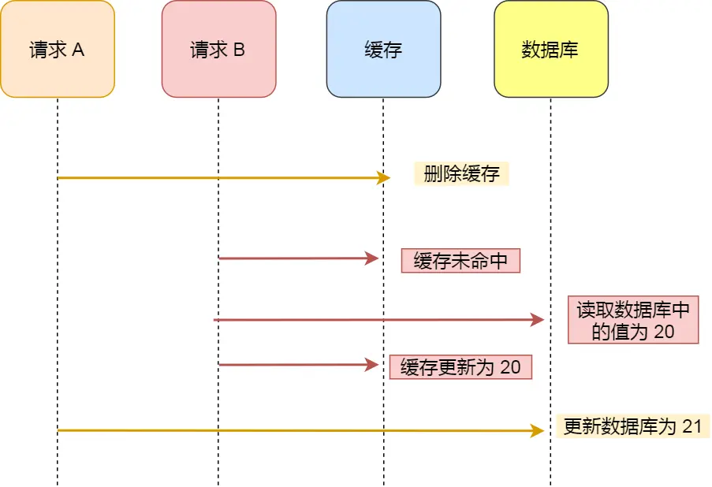

# lesson8：redis, mangodb

上节课讲了关系型数据库**mysql**，这节课我们来了解一下非关系型数据库**redis** 和 **mangodb**

## 非关系型数据库
NoSQL：非关系型数据库，主要指那些非关系型的、分布式的，且一般不保证ACID的数据存储系统，常见的有**Redis / HBase /MongoDB /CouchDB /Neo4J**
>**优点：**
>1、格式灵活：存储数据的格式可以是key,value形式、文档形式、图片形式。2、速度快：NoSQL可以使用硬盘或者随机存储器作为载体，而关系型数据库只能使用硬盘；3、高扩展性；4、成本低。
>
>**缺点：**
>1、一般而言没有太强的事务处理能力；2、数据结构相对复杂，复杂查询方面稍欠。

## Redis
Redis全称为：Remote Dictionary Server（远程数据服务），该软件使用C语言编写，Redis是一个key-value存储系统，其有以下特点。

- 1:性能高,单线程非常适合**读多写少**的场景,可以减轻数据库压力,
- 2.集群分布式存储,可以横向拓展,可以做到高可用.
- 3.数据结构类型丰富数据类型 
- 4.支持数据持久化
- 5.支持事务（一般不用）一般通过lua脚本去实现

## Redis数据类型和命令

Redis 目前有9种数据类型和

**5种常见类型：**String（字符串），Hash（哈希），List（列表），Set（集合）、Zset（有序集合）

**4种新增类型：**BitMap（2.2 版新增）、HyperLogLog（2.8 版新增）、GEO（3.2 版新增）、Stream（5.0 版新增）

### **基本命令**

`redis-cli` 进入Redis命令行界面

```
root@bc2c25de5155:/data# redis-cli
127.0.0.1:6379>
```
如果设置了密码需要auth认证
`auth [username] password ` 默认用户是`default`

```
127.0.0.1:6379> auth default 123456
OK
127.0.0.1:6379> auth 123456
OK
```

`dbsize` 查看数据库的key数量

```
127.0.0.1:6379> dbsize
(integer) 1
```

`select index`选择数据库 默认是0

```
127.0.0.1:6379> select 0
OK
```

`help @基本数据类型` 查看命令 

```
127.0.0.1:6379> help @string
```

`flushall` 删除所有key

`keys *`  查看所有的key

`exit` or ` quit`退出命令行

### 字符串 

String 是最基本的 key-value 结构，key 是唯一标识，value 是具体的值，value其实不仅是字符串， 也可以是数字（整数或浮点数），value 最多可以容纳的数据长度是 `512M`。

**底层实现：**String 类型的底层的数据结构实现主要是 int 和 SDS（简单动态字符串）。

#### 基本命令

##### SET

语法 (不强制大小写)

`SET key value [NX|XX] [GET] [EX seconds|PX milliseconds|EXAT unix-time-seconds|PXAT unix-time-milliseconds|KEEPTTL]`

**NX** ：当键k不存在时，设置键；设置成功返回ok，不成功时返回nil；和**SETNX**等价

**XX**： 与NX相反只在键已经存在时， 才对键进行设置操作

**GET**: 返回之前设的值

**EX**:表明过期时间，单位是秒 和 **setex** 相同

**PX**:单位毫秒

**EXAT**:设置时间到某个时间戳（秒级）  

**PXAT**:设置时间到某个时间戳（毫秒级）

```
127.0.0.1:6379> set zhangsan zs
OK
127.0.0.1:6379> get zhangsan
"zs"
```

>**ttl** 查看Key的过期时间(s)   -1是永久 -2是不存在或着已过期

```
127.0.0.1:6379> set lisi ls EX 10
OK
127.0.0.1:6379> ttl lisi
(integer) 5
127.0.0.1:6379> ttl lisi
(integer) -2
```

**XX与NX选项**: NX当键k不存在时，设置键 ;  XX则当这个k存在时设置

```
127.0.0.1:6379> set zhangsan ls nx
(nil)
127.0.0.1:6379> set wangwu ww nx
OK
127.0.0.1:6379> get zhangsan
"zs"
127.0.0.1:6379> set zhangsan ls xx
OK
127.0.0.1:6379> get zhangsan
"ls"
```

GET 会返回之前的value 如果key不存在返回nil

```
127.0.0.1:6379> set a b get
(nil)
127.0.0.1:6379> set a c get
"b"
127.0.0.1:6379> get a
"c"
```

##### SETEX

语法:`SETEX key seconds value`

和 set key value ex 一样


##### MSET 

语法：`MSET key value [key value ...]`

同时设置多个键值对 返回OK

```
127.0.0.1:6379> mset a 1 b 2 c 3
OK
```

##### MGET
同时获取多个值
```
127.0.0.1:6379> mget a b c
1) "1"
2) "2"
3) "3"
```

##### GET

语法：`GET key`

````
127.0.0.1:6379> GET a
"1"
````


##### GETEX

 语法：`GETEX key [EX seconds|PX milliseconds|EXAT unix-time-seconds|PXAT unix-time-milliseconds|PERSIST]`

- 用于获取key的值，并设置或者移除过期时间，参数类似于set
- EX,PX,EXAT,PXAT 和set的相同
- PERSIST移除k的过期时间

相当于或值并且重新设置过期时间

```
127.0.0.1:6379> getex a ex 50
"b"
127.0.0.1:6379> ttl a
(integer) 48
127.0.0.1:6379> getex a persist
"b"
127.0.0.1:6379> ttl a
(integer) -1
```

##### GETSET

语法 `GETSET key value`

和 set key value get 相同


##### GETRANGE

语法：`GETRANGE key start end`

截取字符串 下标从0开始

```
127.0.0.1:6379> set abcdef ghijk
OK
127.0.0.1:6379> getrange abcdef 0 3
"ghij"
```


##### STRLEN

语法 `STRLEN key`

strlen key 返回键key存储的值的长度，**不存在的k返回0**

```
127.0.0.1:6379> strlen abcdef
(integer) 5
```

##### INCR

语法`INCR key`

incr  对key的值加1，并返回加1后的结果；如果k的值是字符串，无法加1，则提示错误

```
127.0.0.1:6379> set k 1
OK
127.0.0.1:6379> incr k
(integer) 2
127.0.0.1:6379> set k wx
OK
127.0.0.1:6379> incr k
(error) ERR value is not an integer or out of range
```

##### INCRBY

语法 `INCRBY key increment`

类似 INCR 只不过可以设置任意数

```
127.0.0.1:6379> get k
"8"
127.0.0.1:6379> incrby k  2
(integer) 10
```

##### DECR

语法 `DECR key`

值减一 类似incr


##### DECRBY

语法 : `DECRBY key decrement`

自定义减值 类似incrby


##### APPEND

语法 `append key value`

```
127.0.0.1:6379> set k 12
OK
127.0.0.1:6379> append k 345
(integer) 5
127.0.0.1:6379> get k
"12345"
```

**DEL**

语法 `del key` 删除值

```
127.0.0.1:6379> del k
(integer) 1
127.0.0.1:6379> get k
(nil)
```

#### 应用场景

##### 缓存对象

使用 String 来缓存对象有两种方式：

- 直接缓存整个对象的 JSON，命令例子： `SET user:1 '{"name":"zhangsan", "age":18}'`。
- 采用将 key 进行分离为 user:ID:属性，采用 MSET 存储，用 MGET 获取各属性值，命令例子： `MSET user:1:name zhangsan user:1:age 18 user:2:name lisi user:2:age 18`。

##### 常规计数

因为 Redis 处理命令是单线程，所以执行命令的过程是原子的。因此 String 数据类型适合计数场景，比如计算访问次数、点赞、转发、库存数量等等。

##### 分布式锁

SET 命令有个 NX 参数可以实现「key不存在才插入」，可以用它来实现分布式锁：

- 如果 key 不存在，则显示插入成功，可以用来表示加锁成功；
- 如果 key 存在，则会显示插入失败，可以用来表示加锁失败。

### 列表

List 列表是简单的字符串列表，**按照插入顺序排序**，可以从头部或尾部向 List 列表添加元素。

列表的最大长度为 `2^32 - 1`，也即每个列表支持超过 `40 亿`个元素。

#### 内部实现

List 类型的底层数据结构是由**双向链表或压缩列表**实现的：

- 如果列表的元素个数小于 `512` 个（默认值，可由 `list-max-ziplist-entries` 配置），列表每个元素的值都小于 `64` 字节（默认值，可由 `list-max-ziplist-value` 配置），Redis 会使用**压缩列表**作为 List 类型的底层数据结构；
- 如果列表的元素不满足上面的条件，Redis 会使用**双向链表**作为 List 类型的底层数据结构；

但是**在 Redis 3.2 版本之后，List 数据类型底层数据结构就只由 quicklist（快速表） 实现了，替代了双向链表和压缩列表**。


#### 基本命令


##### LPUSH

语法： ` LPUSH key element [element ...]`

当key存在但是却不是列表会返回错误

````
127.0.0.1:6379> lpush lanshan 1 2 3 4 5 6
(integer) 6
````

##### LRANGE

语法： `LRANGE key start stop`

-1是倒数第一个 依次类推

````
127.0.0.1:6379> lrange lanshan 0 -1
1) "6"
2) "5"
3) "4"
4) "3"
5) "2"
6) "1"
````


##### LPOP

语法：`LPOP key [count]`

移除列表key的表头元素，出队列 counts是出队次数

```
127.0.0.1:6379> lpop lanshan 1
1) "6"
127.0.0.1:6379> lpop lanshan 2
1) "5"
2) "4"
```


##### RPOP

语法：`RPOP key [count]`

移除列表key的尾元素，出队列 counts是出队次数

```
127.0.0.1:6379> lrange lanshan 0 -1
1) "3"
2) "2"
3) "1"
127.0.0.1:6379> rpop lanshan 1
1) "1"
127.0.0.1:6379> lrange lanshan 0 -1
1) "3"
2) "2"
```


##### LSET

语法： `lset key index element`

通过索引设置列表元素的值 

```
127.0.0.1:6379> clear
127.0.0.1:6379> lrange lanshan 0 -1
1) "3"
2) "2"
3) "a"
4) "b"
5) "c"
127.0.0.1:6379> lset lanshan 1 niu
OK
127.0.0.1:6379> lrange lanshan 0 -1
1) "3"
2) "niu"
3) "a"
4) "b"
5) "c"
```

##### LLEN

语法：`LLEN key`

获取列表长度

```
127.0.0.1:6379> llen lanshan
(integer) 3
```

##### BLPOP

语法： `blpop key [key ...] timeout`

移出并获取列表的第一个元素， 如果列表没有元素会阻塞列表直到等待超时或发现可弹出元素为止

```
127.0.0.1:6379> lrange lanshan 0 -1
1) "3"
2) "niu"
3) "a"
4) "b"
5) "c"
127.0.0.1:6379> blpop lanshan 10
1) "lanshan"
2) "3"
```

应用场景
消息队列 以后会学 现在不讲

### 哈希

Hash 是一个键值对（key - value）集合，其中 value 的形式入： `value=[{field1，value1}，...{fieldN，valueN}]`。Hash 特别适合用于存储对象。

#### 内部实现

Hash 类型的底层数据结构是由**压缩列表或哈希表**实现的：

- 如果哈希类型元素个数小于 `512` 个（默认值，可由 `hash-max-ziplist-entries` 配置），所有值小于 `64` 字节（默认值，可由 `hash-max-ziplist-value` 配置）的话，Redis 会使用**压缩列表**作为 Hash 类型的底层数据结构；
- 如果哈希类型元素不满足上面条件，Redis 会使用**哈希表**作为 Hash 类型的 底层数据结构。

**在 Redis 7.0 中，压缩列表数据结构已经废弃了，交由 listpack (紧凑列表)数据结构来实现了**。


#### 基本命令

##### HSET

语法 `HSET key field value [field value ...]`

一个key的可以有多个field-value对

```
127.0.0.1:6379> hset zhangsan name zs age 18
(integer) 2
```


##### HSETNX

语法 `hsetnx key field value`

设置哈希的一个字段，当指定的字段不存在时才会被设置

```
127.0.0.1:6379> hset zs age 18
(integer) 1
127.0.0.1:6379> hsetnx zs age 18
(integer) 0
127.0.0.1:6379> hsetnx zs weight 70
(integer) 1
1234
```

在上面的命令中，age 字段已经存在于 zs这个 key 中，因此 hsetnx 命令的执行并没有添加或修改 age，而 weight 在 zs这个 key 中是不存在的，因此 weight 被添加到 zs中。


##### HMSET
与hset没有区别

语法： `hmset key field value [field value ...]`

```
127.0.0.1:6379> hset zhangsan name zs age 18
(integer) 2
```


##### HGET
获取相应feild的value

语法： ` hget key field`

```
127.0.0.1:6379> hget zhangsan age
"18"
```

##### HGETALL

获取哈希的所有字段的值，该命令的用法如下：

`hgetall key`

```
127.0.0.1:6379> hgetall zhangsan
1) "name"
2) "zs"
3) "age"
4) "18"
```

前一个是field 后面是value

##### HKEYS

语法：`hkeys key`

该命令的作用是：获取哈希的所有字段，但是不获取值

```
127.0.0.1:6379> hkeys zhangsan
1) "name"
2) "age"
```

##### HEXISTS

语法：`hexists key field`

该命令的作用是：判断字段是否存在于指定哈希中 

```
127.0.0.1:6379> hexists zhangsan name
(integer) 1
127.0.0.1:6379> hexists zhangsan sex
(integer) 0
```

##### HLEN 

语法： `hlen key`

获取指定哈希中字段的数量

```
127.0.0.1:6379> hlen zhangsan
(integer) 2
```

##### HMGET

语法 ： ` hmget key field [field ...]`

获取指定哈希中的多个字段

```
127.0.0.1:6379> hmget zhangsan name age
1) "zs"
2) "18"
```

##### HVALS

语法： `hvals key`

该命令的作用是：获取指定哈希的所有值，不获取字段名称

```
127.0.0.1:6379> hvals zhangsan
1) "zs"
2) "18"
```

##### HINCRBY

语法： `hincrby key field increment`

和 incryby类似 将指定哈希中的指定字段的值加一个指定的整型值


##### HDEL

语法: `HDEL key field [field ...]`

删除哈希中指定一个或多个字段

#### 应用场景


##### 缓存对象

Hash 类型的 （key，field， value） 的结构与对象的（对象id， 属性， 值）的结构相似，也可以用来存储对象。

| id   | name | age  |
| ---- | ---- | ---- |
| 1    | zhangsan | 18   |
| 2    | li       | 18   |
| 3    | wangwu   | 18   |

我们可以这样来存储对象 
```
 HSET uid:1 name lmj age 18
 HSET uid:2 name wx  age 18
 HSET uid:2 name yxh age 18
 
```

### 集合

Set 类型是一个无序并唯一的键值集合，它的存储顺序不会按照插入的先后顺序进行存储。

一个集合最多可以存储 `2^32-1` 个元素。概念和数学中个的集合基本类似，可以交集，并集，差集等等，所以 Set 类型除了支持集合内的增删改查，同时还支持多个集合取交集、并集、差集。

Set 类型和 List 类型的区别如下：

- List 可以存储重复元素，Set 只能存储非重复元素；
- List 是按照元素的先后顺序存储元素的，而 Set 则是无序方式存储元素的。


#### 内部实现

Set 类型的底层数据结构是由**哈希表或整数集合**实现的：

- 如果集合中的元素都是整数且元素个数小于 `512` （默认值，`set-maxintset-entries`配置）个，Redis 会使用**整数集合**作为 Set 类型的底层数据结构；
- 如果集合中的元素不满足上面条件，则 Redis 使用**哈希表**作为 Set 类型的底层数据结构。


#### 基本命令

##### SADD

语法：`SADD key member [member ...]`

 往集合key中存入元素，元素存在则忽略，若key不存在则新建

```
127.0.0.1:6379> sadd house zhangsan lisi wangwu
(integer) 3
127.0.0.1:6379> sadd house zhangsan
(integer) 0
```

##### SREM 

语法：`SREM key member [member ...] `

从集合key中删除元素

```
127.0.0.1:6379> srem house zhangsan
(integer) 1
127.0.0.1:6379> srem house zhangsan
(integer) 0
```


##### SMEMBERS 

语法：`SMEMBERS key`

查看所有的members

```
127.0.0.1:6379> smembers house
1) "lisi"
2) "wangwu"
```

##### SCARD

语法：`SCARD key`

查看元素个数

```
127.0.0.1:6379> scard house
(integer) 2
```

##### SISMEMBER 

语法：`SISMEMBER key member`

判断元素是否是在集合中

```
127.0.0.1:6379> sismember house zhangsan
(integer) 0
```

##### SRANDMEMBER 

语法： `SRANDMEMBER key [count]`

从集合key中随机选出count个元素，元素不从key中删除

```
127.0.0.1:6379> srandmember house 2
1) "lisi"
2) "zhangsan"
127.0.0.1:6379> srandmember house 2
1) "wangwu"
2) "zhangsan"
```


##### SPOP

 语法： ` SPOP key [count]`

从集合key中随机选出count个元素，元素从key中删除

```
127.0.0.1:6379> spop house 2
1) "lisi"
2) "zhangsan"
```


##### SINTER

语法： `SINTER key [key ...]`

交集运算返回两个set的交集

```
127.0.0.1:6379> smembers house1
1) "zhangsan"
2) "lisi"
3) "wangwu"
127.0.0.1:6379> smembers house2
1) "zhangsan"
2) "a"
3) "b"
127.0.0.1:6379> sinter house1 house2
1) "zhangsan"
```


##### SINTERSTORE 

语法： `SINTERSTORE destination key [key ...]`

将交集结果存入新集合destination中

```
127.0.0.1:6379> sinterstore house3 house1 house2
(integer) 1
127.0.0.1:6379> smembers house3
1) "zhangsan"
```

##### SUNION

语法： `SUNION key [key ...]`

并集运算

##### SUNIONSTORE

语法： `SUNIONSTORE destination key [key ...]`

将并集结果存入新集合destination中


##### SDIFF 

差集运算 `SDIFF key [key ...]` 


##### SDIFFSTORE 

将差集结果存入新集合destination中 `SDIFFSTORE destination key [key ...]`

#### 应用场景

集合的主要几个特性，无序、不可重复、支持并交差等操作。

因此 Set 类型比较适合用来数据去重和保障数据的唯一性，还可以用来统计多个集合的交集、错集和并集等，当我们存储的数据是无序并且需要去重的情况下，比较适合使用集合类型进行存储。

但是有一个潜在的风险。**Set 的差集、并集和交集的计算复杂度较高，在数据量较大的情况下，如果直接执行这些计算，会导致 Redis 实例阻塞**。

在主从集群中，为了避免主库因为 Set 做聚合计算（交集、差集、并集）时导致主库被阻塞，我们可以选择一个从库完成聚合统计，或者把数据返回给客户端，由客户端来完成聚合统计。

##### 点赞

Set 类型可以保证一个用户只能点一个赞，这里举例子一个场景，key 是文章id，value 是用户id。

`uid:1` 、`uid:2`、`uid:3` 三个用户分别对 article:1 文章点赞了。

```
127.0.0.1:6379> SADD article:1 uid:1
(integer) 1
127.0.0.1:6379> SADD article:1 uid:2
(integer) 1
127.0.0.1:6379> SADD article:1 uid:3
(integer) 1
127.0.0.1:6379> SCARD article:1
(integer) 3
127.0.0.1:6379> SREM article:1 uid:1
(integer) 1
127.0.0.1:6379> SCARD article:1
(integer) 2
```


##### 共同关注

Set 类型支持交集运算，所以可以用来计算共同关注的好友、公众号等。

key 可以是用户id，value 则是已关注的公众号的id。

`uid:1` 用户关注频道号 id 为 1、5、6、7、8、9，`uid:2` 用户关注 频道号id 为 2、7、8、9、10、11。

````
127.0.0.1:6379> SADD uid:1 5 6 7 8 9
(integer) 5
127.0.0.1:6379> SADD uid:2 7 8 9 10 11
(integer) 5
````

我们可以查看 `uid:1` 和 `uid:2` 共同关注的频道

可以向`uid:2`推荐 `uid:1` 的频道等等... 


##### 抽奖活动

存储某活动中中奖的用户名 ，Set 类型因为有去重功能，可以保证同一个用户不会中奖两次。

key为抽奖活动名，value为员工名称，把所有员工名称放入抽奖箱 

再利用 `SRANDRM `或者是 `SPOP `

### 有序集合

Zset 类型（有序集合类型）相比于 Set 类型多了一个排序属性 score（分值），对于有序集合 ZSet 来说，每个存储元素相当于有两个值组成的，一个是有序结合的元素值，一个是排序值。

有序集合保留了集合不能有重复成员的特性（分值可以重复），但不同的是，有序集合中的元素可以排序。


##### 内部实现

Zset 类型的底层数据结构是由**压缩列表或跳表**实现的：

- 如果有序集合的元素个数小于 `128` 个，并且每个元素的值小于 `64` 字节时，Redis 会使用**压缩列表**作为 Zset 类型的底层数据结构；
- 如果有序集合的元素不满足上面的条件，Redis 会使用**跳表**作为 Zset 类型的底层数据结构；

**在 Redis 7.0 中，压缩列表数据结构已经废弃了，交由 listpack 数据结构来实现了。**

#### 基本命令

##### ZADD

语法 ：`ZADD key [NX|XX] [GT|LT] [CH] [INCR] score member [score member ...]`

往有序集合key中加入带分值元素 ,core必须是浮点数或者整型，添加成功后返回被成功添加的新成员的数量

```
127.0.0.1:6379> zadd people 10 zhangsan 9.1 lisi
(integer) 2
```

##### ZREM

语法 ：` ZREM key member [member...] `

往有序集合key中删除元素

```
127.0.0.1:6379> ZREM people lisi
(integer) 1
```


##### ZSCORE

语法： `ZSCORE key member`

返回有序集合key中元素member的分值

```
127.0.0.1:6379> zscore people zhangsan
"10"
```

##### ZCARD

语法： `ZCARD key `

返回有序集合元素个数

```
127.0.0.1:6379> zcard people
(integer) 3
```

##### ZINCRBY

`ZINCRBY key increment member `

为有序集合key中元素member的分值加上increment

````
127.0.0.1:6379> zincrby people 1 zhangsan
"11"
````


##### ZRANGE

`ZRANGE key start stop [WITHSCORES]`

正序获取有序集合key从start下标到stop下标的元素(zhangsan最大)

````
127.0.0.1:6379> zrange people 0 -1
1) "wangwu"
2) "lisi"
3) "zhangsan"
````


##### ZREVRANGE

`ZREVRANGE key start stop [WITHSCORES]`

倒序获取有序集合key从start下标到stop下标的元素(zhangsan最大)

```
127.0.0.1:6379> zrevrange people 0 -1
1) "zhangsan"
2) "lisi"
3) "wangwu"
```


##### ZRANGENYSCORE

`ZRANGEBYSCORE key min max [WITHSCORES] [LIMIT offset count]`

返回有序集合中指定分数区间内的成员，分数由低到高排序。

```
127.0.0.1:6379> zrangebyscore people 0 100
1) "wangwu"
2) "lisi"
3) "zhangsan"
```


##### ZREVRANGEBYSCORE 

`ZREVRANGEBYSCORE key max min [WITHSCORES] [LIMIT offset count]`

返回有序集合中指定分数区间内的成员，分数由高到低排序。

```
127.0.0.1:6379> zrevrangebyscore people 15 0
1) "zhangsan"
2) "lisi"
3) "wangwu"
```


#### 应用场景

Zset 类型（Sorted Set，有序集合） 可以根据元素的权重来排序，我们可以自己来决定每个元素的权重值。比如说，我们可以根据元素插入 Sorted Set 的时间确定权重值，先插入的元素权重小，后插入的元素权重大。

在面对需要展示最新列表、排行榜等场景时，如果数据更新频繁或者需要分页显示，可以优先考虑使用 Sorted Set。

##### 排行榜

有序集合比较典型的使用场景就是排行榜。例如学生成绩的排名榜、游戏积分排行榜、视频播放排名、电商系统中商品的销量排名等。

##### 电话、姓名排序

使用有序集合的 `ZRANGEBYLEX` 或 `ZREVRANGEBYLEX` 可以帮助我们实现电话号码或姓名的排序，我们以 `ZRANGEBYLEX` （返回指定成员区间内的成员，按 key 正序排列，分数必须相同）为例。


### 位图

Bitmap，即位图，是一串连续的二进制数组（0和1），可以通过偏移量（offset）定位元素。BitMap通过最小的单位bit来进行`0|1`的设置，表示某个元素的值或者状态，时间复杂度为O(1)。

由于 bit 是计算机中最小的单位，使用它进行储存将非常节省空间，特别适合一些数据量大且使用**二值统计的场景**。


#### 内部实现

Bitmap 本身是用 String 类型作为底层数据结构实现的一种统计二值状态的数据类型。

String 类型是会保存为二进制的字节数组，所以，Redis 就把字节数组的每个 bit 位利用起来，用来表示一个元素的二值状态，你可以把 Bitmap 看作是一个 bit 数组。


#### 常用命令

略


#### 应用场景

1.签到统计 2.判断用户登陆态 3.连续签到用户总数  等等


### GEO

Redis GEO 是 Redis 3.2 版本新增的数据类型，主要用于存储地理位置信息，并对存储的信息进行操作。

在日常生活中，我们越来越依赖搜索“附近的餐馆”、在打车软件上叫车，这些都离不开基于位置信息服务（Location-Based Service，LBS）的应用。LBS 应用访问的数据是和人或物关联的一组经纬度信息，而且要能查询相邻的经纬度范围，GEO 就非常适合应用在 LBS 服务的场景中


#### 内部实现

GEO 本身并没有设计新的底层数据结构，而是直接使用了 Sorted Set 集合类型。

GEO 类型使用 GeoHash 编码方法实现了经纬度到 Sorted Set 中元素权重分数的转换，这其中的两个关键机制就是「对二维地图做区间划分」和「对区间进行编码」。一组经纬度落在某个区间后，就用区间的编码值来表示，并把编码值作为 Sorted Set 元素的权重分数。

这样一来，我们就可以把经纬度保存到 Sorted Set 中，利用 Sorted Set 提供的“按权重进行有序范围查找”的特性，实现 LBS 服务中频繁使用的“搜索附近”的需求。


#### 应用场景

1.查找附加的人 车 物品

### 设计和使用规范

#### 键值对设计

在Redis中，良好的键值设计可以达成事半功倍的效果，而不好的键值设计可能会带来Redis服务停滞，网络阻塞，CPU使用率飙升等一系列问题，下面来给大家介绍键值对的设计

##### key 命名规范

Redis的Key虽然可以自定义，但最好遵循下面的几个最佳实践约定：

- **遵循基本格式**：`[业务名称]:[数据名]:[id]` 或 `[业务名称]:[数据名]:[id]:[字段名]`

  各个命名域之间一般使用冒号做分割符，这是不成文的规矩。

  例如我们的登录业务，需要保存用户信息，其key可以设计成如下格式：

  ```
  login:user:10
  ```

- **Key的长度不超过44字节**

  无论是哪种数据类型， key都是string类型，string类型的底层编码包含int、embstr和raw三种。如果key中全是数字，那么就会直接以int类型去存储，而int占用的空间也是最小的，当然出于业务需求，我们不可能将key设计为一个全数字的，而如果不是纯数字，底层存储的就是SDS内容，如果小于44字节，就会使用embstr类型，embstr在内存中是一段连续的存储空间，内存占用相对raw来说较小，而当字节数大于44字节时，会转为raw模式存储，在raw模式下，内存空间不是连续的，而是采用一个指针指向了另外一段内存空间，在这段空间里存储SDS内容，这样空间不连续，访问的时候性能也就会收到影响，还有可能产生内存碎片

  需要注意的是，如果你的redis版本低于4.0，那么界限是39字节而非44字节

- **Key中不包含一些特殊字符**

  包含空格、换行、单双引号以及其他转义字符

##### value 设计

▐ **拒绝 Big Key ！！！**

BigKey顾名思义就是一个很大的Key-value，这里的大并不是指Key本身很大，而是指包括这个Key的Value在内的一整个键值对很大

BigKey通常以Key-Value的大小或者Key中成员的数量来综合判定，例如：

- 字符串类型：它的big体现在**单个value值很大**，一般认为超过10KB就是bigkey
- 非字符串类型：哈希、列表、集合、有序集合，它们的big体现在**元素个数太多（5000以上）**

▐ **Big Key 的危害**

- **网络阻塞**

  bigkey也就意味着每次获取要产生的网络流量较大，假设一个bigkey为1MB，客户端每秒访问量为1000，那么每秒产生1000MB的流量，对于普通的千兆网卡（按照字节算是128MB/s）的服务器来说简直是灭顶之灾，而且一般服务器会采用单机多实例方式来部署，也就是说一个bigkey可能会对其他实例造成影响，其后果不堪设想。

- **数据倾斜**

  集群环境下，由于所有插槽一开始都是均衡分配的，因此BigKey所在的Redis实例内存使用率会远超其他实例，从而无法使数据分片的内存资源达到均衡，最后不得不手动重新分配插槽，增加运维人员的负担

- **阻塞工作线程**

  对元素较多的hash、list、zset等做运算会耗时较久，而且由于Redis是单线程的，在运算过程中会导致服务阻塞，无法接收其他用户请求，例如：使用 del 删除大 key 时，会阻塞工作线程，这样就没办法处理后续的命令

- **CPU压力**

  对BigKey的数据进行序列化或反序列化都会导致CPU的使用率飙升，影响Redis实例和本机其它应用

▐ **Big Key 产生**

一般来说bigkey的产生都是由于程序设计不当，或者对于数据规模预料不清楚造成的

▐ **发现 Big Key**

利用以下命令，可以遍历分析所有key，并返回Key的整体统计信息与每种数据类型中Top1的BigKey

```
redis-cli -a 密码 --bigkeys
redis-cli -h 127.0.0.1 -p 6379 -a 密码 -- bigkeys
```

那么如何判断元素的大小呢？redis中为我们提供了相应的命令，语法如下：

```
memory usage 键名
```

这条命令会返回一条数据占用内存的总大小，这个大小不仅包括Key和Value的大小，还包括数据存储时的一些元信息，因此可能你的Key与Value只占用了几十个字节，但最终的返回结果是几百个字节

但是我们一般不推荐使用memory指令，因为这个指令对CPU的占用率是很高的，实际开发中我们一般只需要衡量Value的大小或者Key中的成员数即可

例如如果我们使用的数据类型是String，就可以使用以下命令，返回的结果是Value的长度

```
strlen 键名
```

如果我们使用的数据类型是List，就可以使用以下命令，返回的结果是List中成员的个数

```
llen 键名
```

▐ **删除 Big Key**

BigKey内存占用较多，因此即便我们使用的是删除操作，删除BigKey也需要耗费很长时间，导致Redis主线程阻塞，引发一系列问题。

如果redis版本在4.0之后，我们可以通过异步删除命令unlink来删除一个BigKey，该命令会先把数据标记为已删除，然后再异步执行删除操作。

如果redis版本在4.0之前，针对集合类型，我们可以先遍历BigKey中所有的元素，先将子元素逐个删除，最后再删除BigKey。至于如何遍历，针对不同的集合类型，可以参考以下不同的命令：

- HSCAN，SCAN，SSCAN，ZSCAN

[命令参考](http://redisdoc.com/index.html)

▐ **优化 Big Key**

找出BigKey中，我们应该如何对BigKey进行优化呢？

- 选择合适的数据类型

  例如：实体类型（要合理控制和使用数据结构，但也要注意节省内存和性能之间的平衡）

  反例：

  ```
  set user:1:name zhangsan
  set user:1:age 20
  set user:1:favor pingpong
  ```
 正例：

  ```
  hmset user:1 name zhangsan age 19 favor pingpong
  ```

- 控制 key 的生命周期

  建议使用expire设置过期时间（条件允许可以打散过期时间，防止集中过期）。

- 拆

  - 字段打散

    将对象的不同属性存储到不同的key中

    | key         | value |
    | ----------- | ----- |
    | user:1:name | Jack  |
    | user:1:age  | 21    |

    优点：可以灵活访问对象任意字段

    缺点：由于每条数据都会有一些元信息需要存储，因此将一个Key分成多个Key进行存储，占用的内存会变的更大，且由于字段分散，当我们需要做统一控制时会变得很困难

  - hash

    使用hash结构来存储对象，对象的一个属性对应集合中的一个成员

    | user:1 | name | jack |
    | ------ | ---- | ---- |
    | age    | 21   |      |

##### 反例

- 反例1：

  ```
  redis> SET registryservice:userid:string:100123 "zhangsan"
  ```

  key 太长，这个key的长度甚至大于value长度，优点是描述信息很明确，缺点就是浪费内存

- 反例2：

  ```
  SET 6B1B0C32-C2C5-4E48-B6BC-DEFA25E41919 "zhangsan"
  ```

  在反例1的基础上，KEY本身是个UUID，缺点：key 太长、含义无可读性，无法scan

- 反例3：

  ```
  SET "!@#/:$%^&*()+100123" "zhangsan"
  ```

  在反例2的基础上，增加了特殊字符，缺点：无可读性，部分场景下会引发业务异常

- 反例4：

  ```
  SET "a b c d 100123" "sometext"
  ```

  key 中包含了空格，缺点：无可读性，部分场景下引发业务歧义

### 缓存策略

常见的缓存更新策略。

- Cache Aside（旁路缓存）策略；

- Read/Write Through（读穿 / 写穿）策略；

- Write Back（写回）策略

实际开发中，Redis 和 MySQL 的更新策略用的是 Cache Aside，另外两种策略应用不了。

#### Cache Aside（旁路缓存）策略

Cache Aside（旁路缓存）策略是最常用的，应用程序直接与「数据库、缓存」交互，并负责对缓存的维护，该策略又可以细分为「读策略」和「写策略」。


   
  

**写策略的步骤：**

- 先更新数据库中的数据，再删除缓存中的数据。

**读策略的步骤：**

- 如果读取的数据命中了缓存，则直接返回数据；
- 如果读取的数据没有命中缓存，则从数据库中读取数据，然后将数据写入到缓存，并且返回给用户。

为什么写策略要先更新数据库再删除缓存呢，我们来探讨下面两个场景。

**先删除缓存再更新数据库**

假设某个用户的年龄是 20，请求 A 要更新用户年龄为 21，所以它会删除缓存中的内容。这时，另一个请求 B 要读取这个用户的年龄，它查询缓存发现未命中后，会从数据库中读取到年龄为 20，并且写入到缓存中，然后请求 A 继续更改数据库，将用户的年龄更新为 21。

  

最终，该用户年龄在缓存中是 20（旧值），在数据库中是 21（新值），缓存和数据库的数据不一致。


**先更新数据库再删除缓存**

假如某个用户数据在缓存中不存在，请求 A 读取数据时从数据库中查询到年龄为 20，在未写入缓存中时另一个请求 B 更新数据。它更新数据库中的年龄为 21，并且清空缓存。这时请求 A 把从数据库中读到的年龄为 20 的数据写入到缓存中。最终，该用户年龄在缓存中是 20（旧值），在数据库中是 21（新值），缓存和数据库数据还是不一致。


**但是在实际中，这个问题出现的概率并不高**。
**因为缓存的写入通常要远远快于数据库的写入！**所以在实际中很难出现请求 B 已经更新了数据库并且删除了缓存，请求 A 才更新完缓存的情况。而一旦请求 A 早于请求 B 删除缓存之前更新了缓存，那么接下来的请求就会因为缓存不命中而从数据库中重新读取数据，所以不会出现这种不一致的情况。

所以说在A写入缓存18的速度 远远快于 B写入数据库19的速度。


Cache Aside 策略适合**读多写少**的场景，不适合写多的场景，因为当写入比较频繁时，缓存中的数据会被频繁地清理，这样会对缓存的命中率有一些影响。如果业务对缓存命中率有严格的要求，那么可以考虑两种解决方案：

- 一种做法是在更新数据时也更新缓存，只是在更新缓存前先加一个分布式锁，因为这样在同一时间只允许一个线程更新缓存，就不会产生并发问题了。当然这么做对于写入的性能会有一些影响；
- 另一种做法同样也是在更新数据时更新缓存，只是给缓存加一个较短的过期时间，这样即使出现缓存不一致的情况，缓存的数据也会很快过期，对业务的影响也是可以接受。


其他缓存策略自行了解............................

## mongodb
### 数据存储结构
在MongoDB中数据存储的基本概念是数据库、集合、文档。

文档（document）是MongoDB中数据的基本存储单元，非常类似与关系型数据库管理系统中的行，但更有表现力。

集合（collection）可以看作是一个拥有动态模式（dynamic schema）的表。

MongoDB的一个实例可以拥有多个相互独立的数据库（database），每一个数据库都拥有自己的集合。

MongoDB 将数据存储为一个文档，数据结构由键值(key=>value)对组成。MongoDB 文档类似于 JSON 对象。字段值可以包含其他文档，数组及文档数组。

| SQL术语/概念 | MongoDB术语/概念 | 解释/说明 |
| --- | --- | --- |
| database | database | 数据库 |
| table | collection | 数据库表/集合 |
| row | document | 数据记录行/文档 |
| column | field | 数据字段/域 |
| index | index | 索引 |
| table joins |  | 表连接,MongoDB不支持 |
| primary key | primary key | 主键,MongoDB自动将_id字段设置为主键 |

#### 数据库

在MongoDB中，多个文档组成集合，而多个集合可以组成数据库，一个MongoDB实例可以建立多个数据库。

有一些数据库名是保留的，可以直接访问这些有特殊作用的数据库。

* admin： 从权限的角度来看，这是"root"数据库。要是将一个用户添加到这个数据库，这个用户自动继承所有数据库的权限。一些特定的服务器端命令也只能从这个数据库运行，比如列出所有的数据库或者关闭服务器。
* local: 这个数据永远不会被复制，可以用来存储限于本地单台服务器的任意集合
* config: 当Mongo用于分片设置时，config数据库在内部使用，用于保存分片的相关信息。

**show dbs** 命令可以显示所有数据的列表。

执行 **db** 命令可以显示当前数据库对象或集合。

运行**use**命令，可以连接到一个指定的数据库。
```
test> show dbs
admin   40.00 KiB
config  72.00 KiB
local   40.00 KiB
test> db
test
test> use local
switched to db local
local> db
local
```

#### 集合（collection)
集合就是 一组文档，类似于 RDBMS （关系数据库管理系统：Relational Database Management System)中的表格。

集合是动态模式的，也就意味着集合没有固定的结构，集合可以插入不同格式和类型的数据，但通常情况下我们插入集合的数据都会有一定的关联性。

#### 3.文档（Document）

文档MongoDB核心概念。文档就是键值对的一个有序集合。MongoDB 的文档不需要设置相同的字段，并且相同的字段不需要相同的数据类型，这与关系型数据库有很大的区别，也是 MongoDB 非常突出的特点。

一个简单的文档例子如下：
```
{"zhangsan":"hello","lisi":3}
```
文档中的键是字符串，文档中的值可以是多种不同的数据类型，甚至可以是一个完整的内嵌文档。

MongoDB的文档不能有重复的键。

MongoDB不但区分类型，而且区分大小写。
```
{"Foot":"3"}
{"foot":"3"}
{"foot": 3 }
 
这三个文档是不同的
```
### MongoDB 数据类型

在概念上MongoDB的文档与JavaScript中的对象相近，因而可以认为它类似与JSON。MongoDB在JSON六种数据类型（null，布尔，数字、字符长、对象和数组）的基础上上添加了一些其他数据类型，以实现对时间、浮点数、正则函数等的操作。

| 数据类型 | 例子 | 描述 |
| --- | --- | --- |
| String | { "x" : "foot" } | 字符串。存储数据常用的数据类型。在 MongoDB 中，UTF-8 编码的字符串才是合法的。 |
| Integer | { "x" : 1 } | 整型数值。用于存储数值。根据你所采用的服务器，可分为 32 位或 64 位。 |
| Boolean | { "x" : true } | 布尔值。用于存储布尔值（真/假）。 |
| Double | { "x" : 3.14 } | 双精度浮点值。用于存储浮点值。 |
| Array | { "x" : [ "a" , "b" ] } | 用于将数组或列表或多个值存储为一个键。 |
| Timestamp |  | 时间戳。记录文档修改或添加的具体时间。 |
| Object | { "x" : { "y" : "foot" } } | 用于内嵌文档。 |
| Null | { "x" : null } | 用于创建空值。 |


## Go 操作Redis


我这里使用的是 `github.com/go-redis/redis/v8` 这个库

当然也可以用 ` github.com/gomodule/redigo/redis` 


### 链接


连接池以及链接设置

```go
var Rdb *redis.Client

func InitRedis() {
	Rdb = redis.NewClient(&redis.Options{
		//连接信息
		Network:  "tcp",            //网络类型，tcp or unix，默认tcp
		Addr:     "127.0.0.1:6379", //主机名+冒号+端口，默认localhost:6379
		Password: "123456",         //密码
		DB:       0,                // redis数据库index

		//连接池容量及闲置连接数量
		PoolSize:     15, // 连接池最大socket连接数，默认为4倍CPU数， 4 * runtime.NumCPU
		MinIdleConns: 10, //在启动阶段创建指定数量的Idle连接，并长期维持idle状态的连接数不少于指定数量；。

		//超时
		DialTimeout:  5 * time.Second, //连接建立超时时间，默认5秒。
		ReadTimeout:  3 * time.Second, //读超时，默认3秒， -1表示取消读超时
		WriteTimeout: 3 * time.Second, //写超时，默认等于读超时
		PoolTimeout:  4 * time.Second, //当所有连接都处在繁忙状态时，客户端等待可用连接的最大等待时长，默认为读超时+1秒。

		//闲置连接检查包括IdleTimeout，MaxConnAge
		IdleCheckFrequency: 60 * time.Second, //闲置连接检查的周期，默认为1分钟，-1表示不做周期性检查，只在客户端获取连接时对闲置连接进行处理。
		IdleTimeout:        5 * time.Minute,  //闲置超时，默认5分钟，-1表示取消闲置超时检查
		MaxConnAge:         0 * time.Second,  //连接存活时长，从创建开始计时，超过指定时长则关闭连接，默认为0，即不关闭存活时长较长的连接

		//命令执行失败时的重试策略
		MaxRetries:      0,                      // 命令执行失败时，最多重试多少次，默认为0即不重试
		MinRetryBackoff: 8 * time.Millisecond,   //每次计算重试间隔时间的下限，默认8毫秒，-1表示取消间隔
		MaxRetryBackoff: 512 * time.Millisecond, //每次计算重试间隔时间的上限，默认512毫秒，-1表示取消间隔

		//可自定义连接函数
		Dialer: func(ctx context.Context, network, addr string) (net.Conn, error) {
			netDialer := &net.Dialer{
				Timeout:   5 * time.Second,
				KeepAlive: 5 * time.Minute,
			}
			return netDialer.Dial("tcp", "127.0.0.1:6379")
		},

		//钩子函数
		OnConnect: func(ctx context.Context, conn *redis.Conn) error { //仅当客户端执行命令时需要从连接池获取连接时，如果连接池需要新建连接时则会调用此钩子函数
			fmt.Printf("conn=%v\n", conn)
			return nil
		},
	})

	_, err := Rdb.Ping(context.Background()).Result()
	if err != nil {
		log.Print(err)
	}
	fmt.Println("redis 链接成功")
}
```

一般这样就行

```
	Rdb = redis.NewClient(&redis.Options{
		Addr:     "127.0.0.1:6379",
		Password: "123456", 
		DB:       0,        
	})
```


### 字符串


````go
func GetRedisValue(ctx context.Context, key string) (string, error) {
	GetKey := Rdb.Get(ctx, key)
	if GetKey.Err() != nil {
		return "", GetKey.Err()
	}
	return GetKey.Val(), nil
}

func SetRedisValue(ctx context.Context, key string, value string, expiration time.Duration) error {
	SetKV := Rdb.Set(ctx, key, value, expiration)
	return SetKV.Err()
}

````


### 集合

```GO
type RedisSet struct {
	Id      int64
	Object  string
	Conn    *redis.Client
	Context context.Context
}

func NewRedisSet(context context.Context, Objet string, Id int64, Conn *redis.Client) *RedisSet {
	return &RedisSet{
		Id:      Id,
		Object:  Objet,
		Conn:    Conn,
		Context: context,
	}
}


func Set() {
	rs := NewRedisSet(context.Background(), "article:1", 1, Rdb)
	_, err := rs.Conn.SAdd(rs.Context, rs.Object, rs.Id).Result()
	if err != nil {
		fmt.Println(err)
	}
}

```

## Go操作mongodb

go操作mongodb离不开BSON

BSON是JSON的二进制格式。

在Go中mongo-driver/bson包下，有一个bson.go，里面描述了MongoDB中关于BSON得几种格式。

* 第一种：bson.D：D（Document）格式代表了一个BSON文档。也是使用比较多的一种格式。
```
bson.D{
    {"foo", "bar"},
    {"hello", "world"},
    {"pi", 3.14159},
}
```
* 第二种：bson.E：E（Element）格式代表了一个BSON文档的一个元素，通常在D内进行使用。
```
bson.D{
  bson.E{Key: "foo", Value: "bar"},
  bson.E{Key: "hello", Value: "world"},
  bson.E{Key: "pi", Value: 3.14159},
}
```
* 第三种：bson.M：M（Map）格式也代表了一个BSON文档，与D不同的是，D是有序的，M是无序的（可以理解为Map）。
```
bson.M{
  "foo": "bar",
  "hello": "world", 
  "pi": 3.14159,
}
```
* 第四种：bson.A：A（Array）格式代表了一个BSON数组。
```
bson.A{
  "bar",
  "world",
  3.14159,
  bson.D{{"qux", 12345}},
}
```

安装MongoDB的Go驱动
```
go get go.mongodb.org/mongo-driver/mongo
go get go.mongodb.org/mongo-driver/bson
```

创建一个MongoDB客户端实例
```
package main

import (
	"context"
	"go.mongodb.org/mongo-driver/mongo"
	"go.mongodb.org/mongo-driver/mongo/options"
	"log"
)

func main() {
	client, err := mongo.Connect(context.TODO(), options.Client().ApplyURI("mongodb://localhost:27017"))
	if err != nil {
		log.Fatalln(err)
	}
}

验证身份
client, err := mongo.Connect(context.TODO(),
                         		 options.Client().
                                 // 连接地址
                             		 ApplyURI("mongodb://root:123456@ip:port"))

```

创建一个MongoDB集合实例

连接到MongoDB数据库后，你需要从client 实例中创建一个Collection 实例，你将使用它来执行查询。

```
collection := client.Database("test").Collection("people")
```
这段代码从我们本地MongoDB数据库的"testing" 数据库中检索"users" 集合。如果在检索数据库或集合之前不存在，MongoDB将自动创建它。

#### 在MongoDB中创建新文档

为了在MongoDB集合中创建新文档，数据库客户端提供了一个`InsertOne()` 方法，允许插入单个文档，以及一个`InsertMany()` 方法来插入多个文档。
```
插入单个文档
	user := bson.D{{"Name", "zhangsan"}, {"age", 30}}
	res, err := collection.InsertOne(context.Background(), user)
	if err != nil {
		log.Fatalln(err)
	}
	fmt.Println(res.InsertedID)


插入多个文档
	users := []interface{}{
		bson.D{{"Name", "lisi"}, {"age", 25}},
		bson.D{{"Name", "wangwu"}, {"age", 20}},
		bson.D{{"Name", "zhaoliu"}, {"age", 28}},
	}
	result, err := collection.InsertMany(context.Background(), users)
	if err != nil {
		log.Fatalln(err)
	}
	fmt.Println(result.InsertedIDs)
```

#### 从MongoDB读取文档

为了从MongoDB集合中检索文档，数据库客户端提供了一个Find() 方法，用于返回符合搜索过滤器的所有文档，以及一个FindOne() 方法，仅返回符合过滤器的第一个文档。
```
	// 建立查询 （无查询条件）
	cursor, err := collection.Find(context.Background(), bson.D{})
	if err != nil {
		log.Println(err)
		return
	}
	var results []bson.M
	if err = cursor.All(context.TODO(), &results); err != nil {
		panic(err)
	}

	for _, result := range results {
		fmt.Println(result)
	}

filter := bson.D{
        {"$and",
                bson.A{
                        bson.D{
                                {"age", bson.D{{"$gt", 25}}},
                        },
                },
        },
}

cursor, err := usersCollection.Find(context.TODO(), filter)
```


## 作业

### Lv0

将课上的redis 命令 和代码 自己敲一遍

### Lv1

结合Gin 的作业

写一个获取用户信息的接口 做简单的缓存处理

### Lv2

结合gin redis 写一个点赞功能的接口（只能点赞一次）


### Lv3

结合Gin 的作业, 写一个获取用户信息的接口 做缓存层的处理在

结合场景思考这里的缓存适合什么策略。

1.缓存策略  2.数据一致性


 ### 提交作业

**格式** `第八次作业-学号-姓名-Lv？` 

发送到邮箱 2147584810@qq.com 
